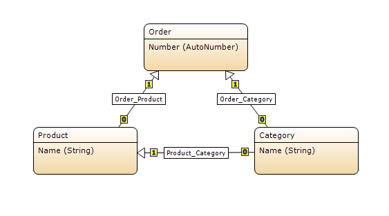
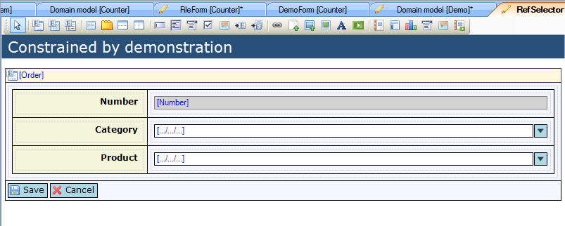
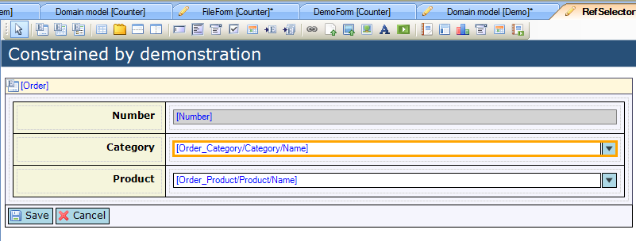
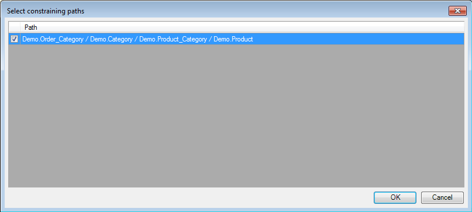

## Description

This section describes how to use the 'Constrained by' functionality of the reference selector to determine the selectable objects in a reference selector.

## Instructions

 **Create the domain model with the associations that allow for constraint paths.**

For example in the above screenshot you can use the associations to constrain the 'Product' objects you can choose from based on their 'Category'.

 **Create the form and add the reference selector. If you do not know how to add documents to a project please refer to [this](add-documents-to-a-module) article; if you do not know how to add widgets to a form, please refer to [this](add-a-widget-to-a-form) article.**

In this case two reference selectors were added, with one to choose the product category, which is then used to constrain the product choice to only products from that category.

 **Connect an attribute of an entity which is associated with the data view or template grid entity to the reference selector . You can do this by selecting the reference selector and then dragging this attribute from the Connector window to the reference selector. Another option is to right-click on the reference selector and choose 'Select attribute...' or click the '...' button next to 'Attribute path' in the Properties window, and then in the menu that appears select the attribute.**

In the screenshot, the first reference selector has been connected to 'Name' of 'Category', whereas the second is connected to 'Name' of 'Product'.

 **Select the reference selector you want to use the constraining functionality on, and click the '...' button next to 'Constrained by' in the Properties window.**

 **In the menu that appears, choose the constraining path from the available choices.**

