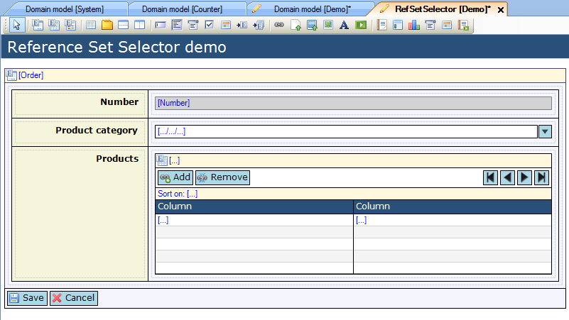

## Description

This section describes how to configure 'Constrained by' functionality to determine the selectable objects in a reference set selector.

## Instructions

 **Create the domain model with the associations that allow for constraint paths.**

For example in the above screenshot you can use the associations to constrain the 'Product' objects you can choose from based on their 'Category'.

 **Create the form with data view or template grid containing the reference set selector. If you do not know how to add documents to a project please refer to [this](add-documents-to-a-module) article; if you do not know how to add widgets to a form, please refer to [this](add-a-widget-to-a-form) article.**

In this example the form has a reference selector to choose the product category, and reference set selector to choose multiple products from the chosen category.

 **Connect an entity which is associated with the data view or template grid entity to the reference set selector. You can do this by selecting the reference set selector and then dragging this entity from the Connector window to the yellow header of the reference set selector. Another option is to right-click on the reference selector and choose 'Select entity...' or click the '...' button next to 'Entity path' in the Properties window, and then in the menu that appears select the entity.**

Note that the association between the data view or template grid entity and the entity connected to the reference set selector should be of type reference set. In this example, the reference selector is connected to the 'Name' attribute of 'Category', whereas the reference set selector is connected to the 'Product' entity.

 **Connect a form to the 'Add' button which will be used to choose from the list of objects. The easiest way to do this is to right-click on the add button and choose 'Generate select form...'. This will bring up a prompt to enter a name for this form, after which it will be generated. Alternatively you can use 'Select form...' or click '...' next to 'Form' in the Properties window to choose an existing form you prepared for this.**

 **Select the reference set selector and click the '...' button next to 'Constrained by' in the Properties window.**

 **In the menu that appears, choose the constraining path you want to use from the available choices.**

