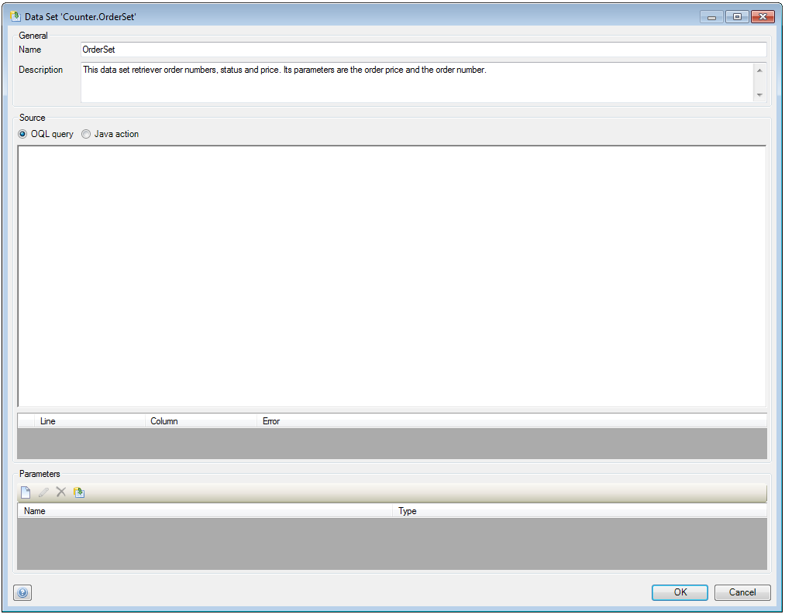
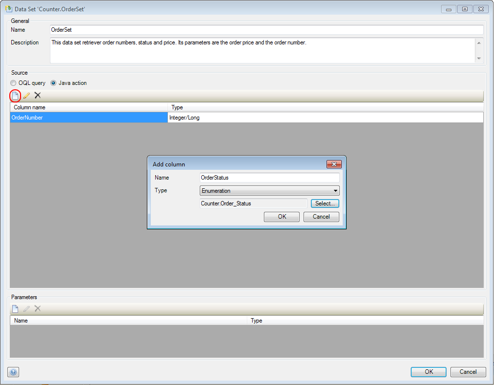
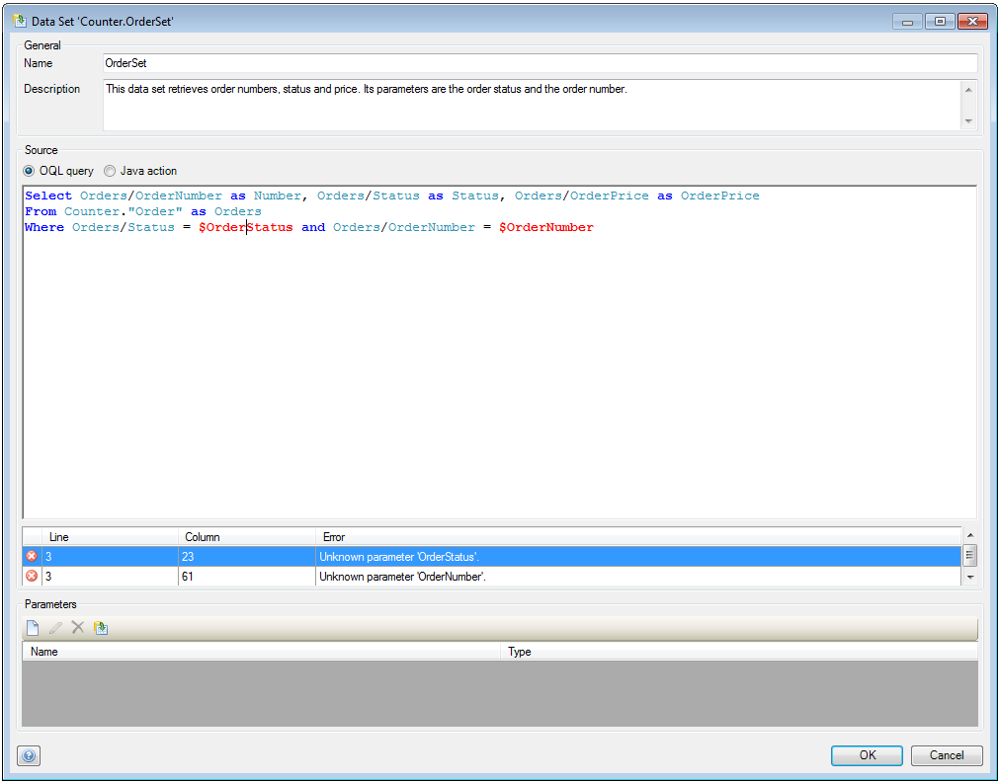
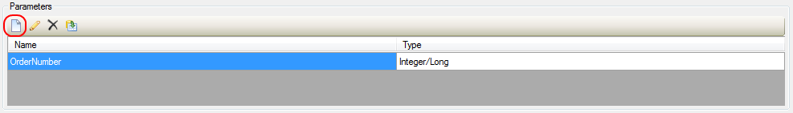
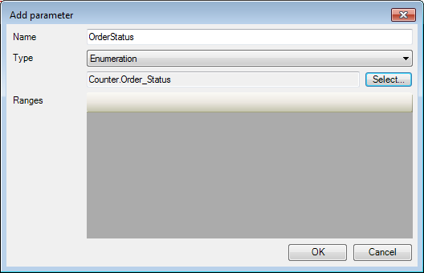
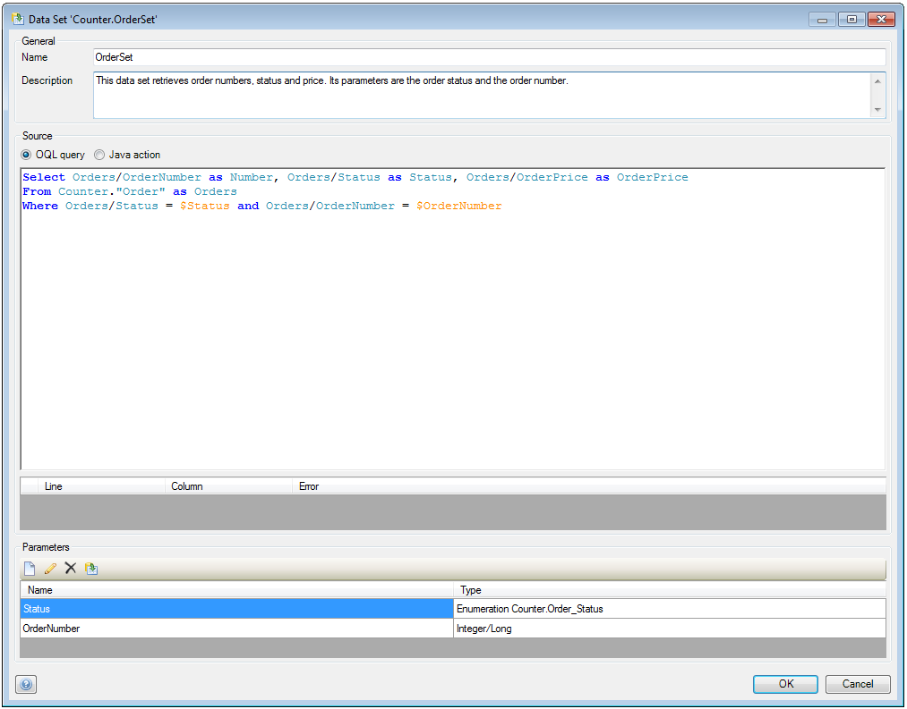

## Description

This section describes how to create a dataset and add parameters to it.

## Instructions

 **If it does not exist yet, create the dataset. If you do not know how to add documents to your project, please refer to [this](add-documents-to-a-module) article.**

 **Open the Data Set menu by double-clicking on the dataset in the Project Explorer.**

 **At 'Name' you can change the name of the dataset, whereas at 'Description' you can optionally enter text describing the purpose of the dataset.**

 **At 'Source' you can choose the source of the dataset, which has to be either an OQL Query or a Java action.**

 **If you chose to use a Java action as source, you have to specify the columns of the dataset and their type. When you deploy your project, a Java action will be generated which you can edit using Eclipse.**

You can press the 'New' button to bring up a window allowing you to add new columns to the dataset. For more information on configuring Java actions using Eclipse, please refer to [this](configure-java-actions-using-eclipse) article.

 **If you chose to use an OQL statement as source, enter this statement in the 'Source' area.**

The statement in the screenshot looks up 'Order' objects and defines 'Number', 'Status' and 'OrderPrice' as columns of the dataset. The 'Where' clause allows for filtering of the dataset based on parameters, in this case 'OrderNumber' and 'OrderStatus'. Currently errors are shown since the parameters have not been added to the dataset yet, something which will be done in the next step.

 **In the 'Parameter' section of the menu, press the 'New' button to add a parameter to the dataset.**

 **In the new menu, enter a name for the parameter, choose its type and the object or variable you want to filter or constrain by. Depending on the type of parameter you will then be able to enter ranges or XPath constraints to filter the data.**

 **Make sure all parameters from the OQL statement are added to the dataset.**

