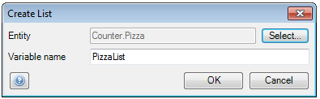

## Description

This section describes how to create a list in a microflow.

## Instructions

 **Open the microflow, or if necessary create a new one. If you do not know how to add documents to your project, please refer to [this](add-documents-to-a-module) article.**

 **Add a 'Create list' activity to the microflow and double-click on it. If you do not know how to add activities to a microflow please refer to [this](add-an-activity-to-a-microflow) article.**

 **In the menu that appears, you can specify the entity of which this will be an object list, as well as the variable name which will be used to identify the list in the microflow.**

 **The list created by the 'Create list' activity is empty; you will need to utilize other list activities to add objects to it.**
