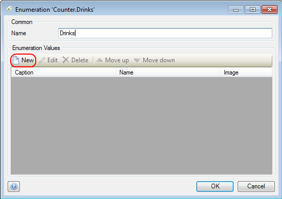
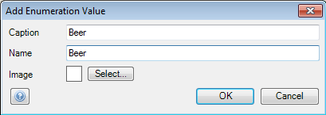
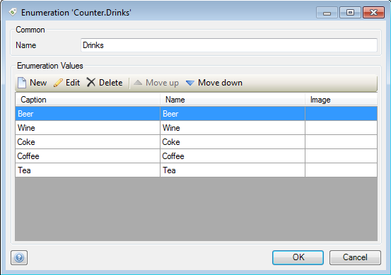
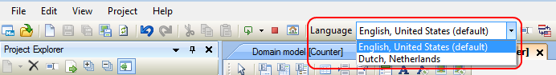
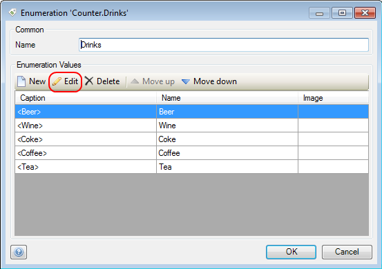
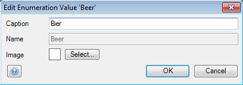

## Description

This section describes how to create an enumeration in multiple languages.

## Instructions

 **If it does not exist yet, create the enumeration and give it a name. If you do not know how to add documents to your project, please refer to [this](add-documents-to-a-module) article.**

 **Open the enumeration by double-clicking on it in the Project Explorer.**

 **You can add values to the enumeration by pressing the 'New' button.**

 **In the menu that appears, you can enter the caption and name of the enumeration value. The caption is the text that will be displayed in the application, whereas the name is the property by which the enumeration value is identified by the client. Finally you can add a picture for the enumeration value, which can be used for display in data grids.**

 **Once you have added all enumeration values, you can close the enumeration menu by pressing the 'OK' button. You have now created the enumeration with its values in the default language of your project.**

 **If the second language has not been added to the project yet, do so know. If you do now know how to do this, refer to [this](add-a-new-language-to-your-project) article.**

 **Switch to the new language using the drop down menu in the toolbar.**

 **If you now open the enumeration again, you will notice that the captions from the default language are displayed in the '<Caption>' format.**

 **Press the 'Edit' button while highlighting the caption that needs to be changed, or double-click on it. In the edit menu that appears, you can now replace the caption from the default language with a translated caption in the new language.**

 **Do this for all entries; whenever you switch to the second language, these new captions will now be used. Note that when switching languages, only captions are changed, whereas the names for enumeration values remain the same.**

