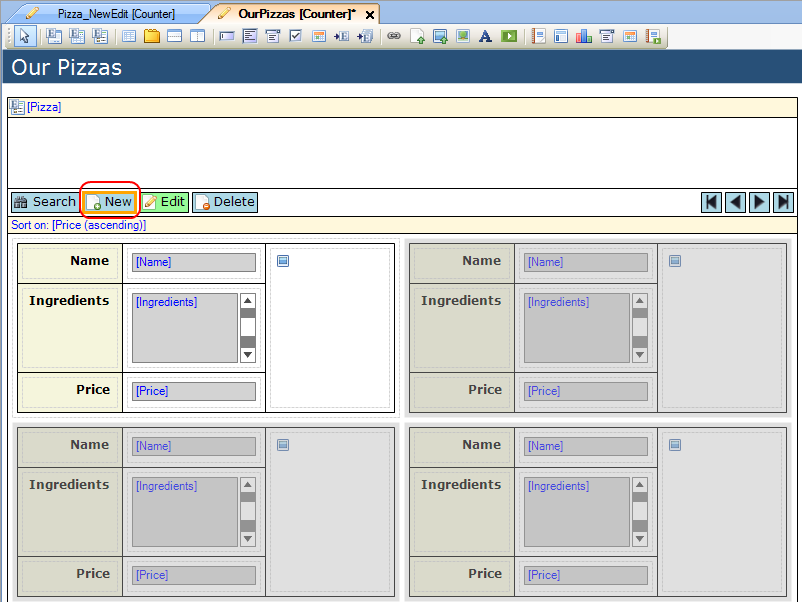

## Description

This section describes how to configure a data or template grid such that when you want to create a new object of the grid entity, you can press a button to create the new object, create an associated image object and open the form which allows you to set the attributes. This how-to assumes the reader has a basic understanding of building forms and microflows. If you do not have this knowledge yet, please refer to the how-to articles explaining how to build a [form](create-and-build-a-form) and [microflow](add-an-activity-to-a-microflow) first.

## Instructions

 **Create the domain model, with the grid entity and associated image entity. The image entity should be System.Image or a specialization of it.**

 **Create the new/edit form for the grid entity. The easiest way to add the image at the same time is by adding a nested data view with image uploader which is connected to the image entity using the entity path.**

 **You now have the ability to edit the attributes of the object and associated image object. To upload an image however, the associated image object does need to exist when the image uploader is used. As a result of this, you need to replace the 'New' button on the grid with a custom button which is connected to a microflow.**

 **Select the 'New' button on the grid and remove it by pressing the 'Delete' button on your keyboard.**

 **Right-click on the control bar and choose 'Add button' and choose the 'Microflow' button option.' You can change the text on the button by altering the 'Caption' property in the Properties window.**

Alternatively you can add the button in a different position by right-clicking on another button and choosing 'Add button left' or 'Add button right'.

 **Right-click on the button and choose 'Select microflow...'. Alternatively you can press the '...' button next to 'On click' in the Properties window.**

 **In the new menu, choose 'New' and enter the name for the new microflow.**

 **Right-click on the button again and choose 'Edit microflow settings'. Alternatively you could click on the '...' button next to 'On click settings' in the Properties window.**

 **In this menu, set 'Pass template/data grid object' to 'Nothing'.**

In this case you are using a microflow to create a new object, and no object needs to be passed to the microflow for this.

 **Open the microflow by double-clicking on it in the Project Explorer.**

 **Add a 'Create object' activity and configure it to create a new object of the grid entity.**

 **Add another 'Create object' activity, this time to create a new object of the associated image entity.**

 **Add a 'Change object' activity. For the object to be changed, select the variable identifying the new grid entity. Set 'Commit' to 'Yes'. (Depending on whether the entity has event handlers, choose to run these or not.) Then press the 'New' button to add a new member action change.**

 **In the menu that appears set the attribute to be changed to be the association between grid entity and image entity, and set the value to the variable name of the new image entity.**

 **Add an 'Show form' activity. Set 'Form' to the new/edit form you want to open and set the form object to be the newly created grid entity.**

Optionally you can choose to display a custom form title.

 **You now have a microflow which when you press the button will create a new object of the grid entity, create a new object of the image entity, set the association between the two new objects and open the new/edit form which allows you to enter the attributes and upload the image.**
