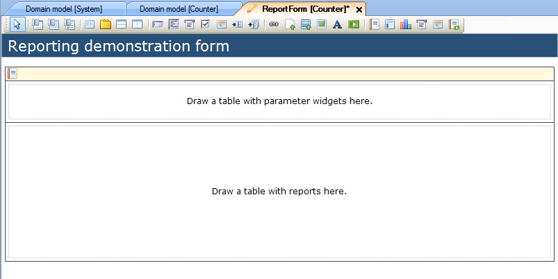
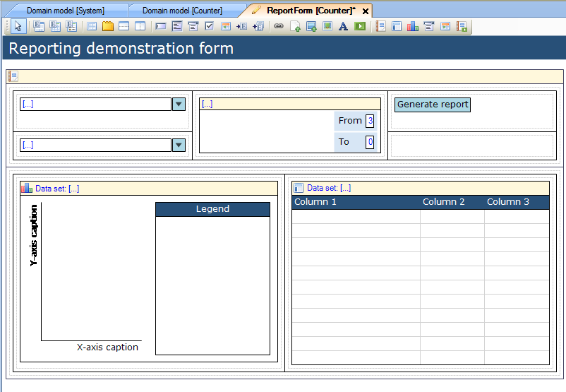

## Description

This section describes how to create a report and then add reporting widgets to it.

## Instructions

 **Create the form which will contain the report. If you do not know how to add documents to a project please refer to [this](add-documents-to-a-module) article.**

 **Add a Report Pane to the form. If you do not know how to add widgets to a form, please refer to [this](add-a-widget-to-a-form) article.**

 **Add a table containing parameter widgets to the top half of the report pane.**

If you add parameter widgets to the report pane, there should be a generate report button, as well as a combination of drop downs and date range selectors.

 **Add a table containing reporting widgets to the bottom half of the report pane.**

This should be a combination of basic reports and report charts.
