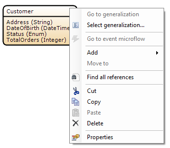
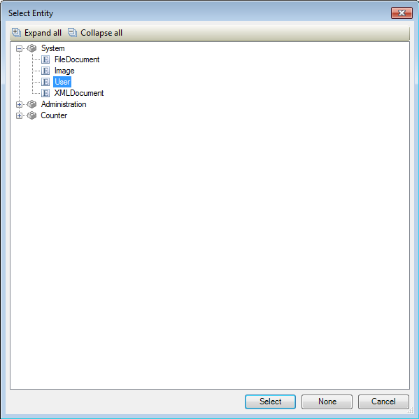
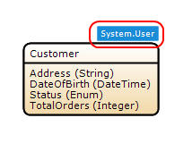

## Description

This section describes how to configure an entity to be a specialized version of a general entity.

## Instructions

 **Create and setup the entity you intend to use for the specialization. Note that any attributes, associations, events, etcetera you add will be properties specific to the specialized entry, not shared with the generalization.**

 **Right-click on the entity and choose 'Select generalization'. Another option is to click the '...' button next to 'Generalization' in the Properties menu.**

 **In the new menu, select the entity you would like to use as generalization and press 'Select'.**

 **The generalization will now be indicated in the domain model.**

