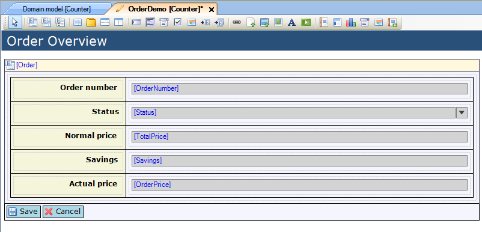

## Description

This section describes how to add a new form and then build it with the available widgets. To demonstrate this, an example is given of a form showing information about a pizza order, and the customer who placed the order.

## Instructions

 **Add a new form to your project. If you do not know how to add documents to your project, please refer to [this](add-documents-to-a-module) article.**

 **Build the form using the widgets available to you. If you do not know how to add widgets to a form, please refer to [this](add-a-widget-to-a-form) article.**

 **Connect the widgets in the form to the entities from your domain model. If you do not know how to do this, you can find articles on how to connect entities to [data grids](connect-an-entity-to-a-data-grid) and [data views](connect-an-entity-to-a-data-view) in this how-to section, as well as articles on how to connect attributes of an entity to a [search field](connect-an-attribute-to-a-search-field) or [data grid column](connect-an-attribute-to-a-column).**

## Example: Pizza order information form

 **In this example, a new form will be created which will display information about the order which has been placed, as well as list the pizzas that have been ordered and provide information on the customer who placed the order.**

 **Start off by creating the form. Open it by double-clicking on it in the Project Explorer. Edit the title of the form by changing the 'Title' property in the Properties window, and add a data view to the form.**

 **Select the data view, then connect it to the 'Order' entity by dragging the 'Order' entity from the Toolbox to the yellow header of the data view. You will get a prompt asking if you want the Mendix Desktop Modeler to fill the data view with labels and fields automatically, based on the attributes of the entity. Choose 'Yes'.**

 **While the attributes stored in the database were added automatically, the attributes which are computed by a microflow were not, so these need to be added manually. Add three more rows to the data view by clicking on one of the bottom cells and choosing 'Add row below' three times. Fill the cells in the left column with labels, and the right columns with text boxes.**

 **Change the labels to reflect the contents of the text boxes in the right column. Connect the text boxes in the right column to the attributes from 'Order' they should display by clicking on them and then dragging the attributes from the Toolbox. Finally, the Status field should not be editable, as this is handled by microflows in another form. To make this field not editable, use the drop down menu in the Properties window to set the 'Editable' property to 'Never'.**

 **Right-click while having one of the bottom cells selected to add another row to the form. Merge the two new cells by right-clicking on the left bottom cell and choosing 'Merge with right'. In the merged cell, add a tab container. Change the names of the tabs by selecting them and then changing the 'Caption' in the Properties window.**

 **Add a reference set selector to the first tab. Connect it to the 'Pizza' entity, which is associated to 'Order' through the 'Order_Pizza' association (a reference set). Do this by choosing 'Order' > 'Order_Pizza' > 'Pizza' in the Toolbox and dragging it to the header of the reference set selector. Since this form is for display purposes only, set the 'Show control bar' to 'False'.**

 **Add a new data view to the second tab page. After adding the data view, connect it to the 'Customer' entity using the 'Order_Customer' association (a reference), similarly to how the reference set selector was connected to the 'Pizza' entity. In this case decline the option to automatically fill the fields, since the 'Customer' object, being a specialization of the 'System.User' entity, has a lot of attributes which should not be displayed in the form. Instead, add a 5x2 table to the data view.**

 **Fill the left column of the table with labels. For the right column, the top two cells should be filled with text boxes, whereas the third should be filled with a data picker (to display the customer's date of birth), the fourth should be filled with a drop down (to show the customer's status) and finally the fifth cell should be filled with a text box. The sizes of the columns can be changed by selecting the table and changing the 'Weight' property in the Properties window, for example to '25;75'.**

 **Finally, change the labels to reflect the contents of the cells in the right column. Connect the widgets in the right column to their corresponding attributes by dragging those from the Toolbox. For the widgets in the right column, set the 'Editable' property to 'Never' in the Properties window, as these attributes are not intended to be edited in this form.**

 **If you now open the form in your application, the end result will look like the pictures below.**

