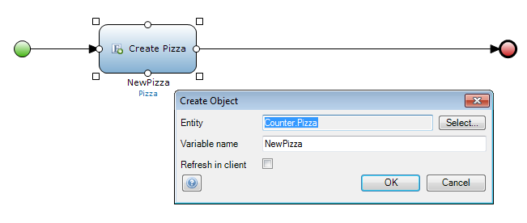
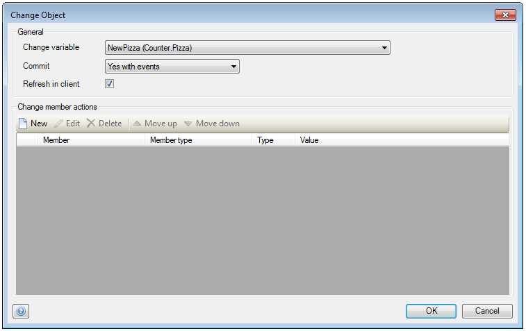
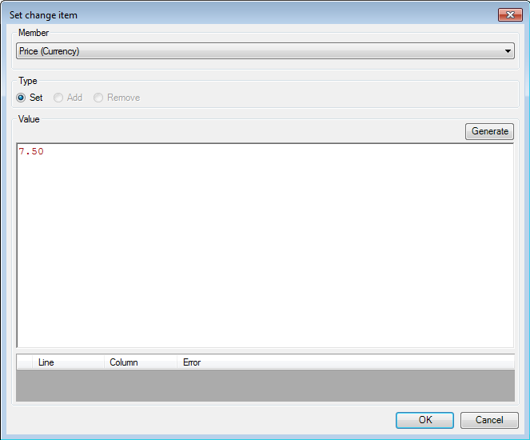

## Description

This section describes how to create and change an object in a microflow. The related reference guide article can be found [here](/refguide4/create-object) and [here](/refguide4/change-object).

## Instructions

 **Open the microflow, or if necessary create a new one. If you do not know how to add documents to your project, please refer to [this](add-documents-to-a-module) article.**

 **Add a 'Create object' activity to the microflow. If you do not know how to add activities to a microflow please refer to [this](add-an-activity-to-a-microflow) article.**

 **Double-click on the 'Create object' activity. In the menu that appears you can specify of which entity the object should be at 'Entity', as well as the variable name which will identify it in the microflow at 'Variable name'.**

 **Add a 'Change object' activity to the microflow, and double-click on it.**

 **The new menu allows you to choose which object you want to change at 'Change variable'. Changing the 'Commit' option allows you to choose if this change should be immediately committed to the database (with or without the event handlers), or if the change will not be committed until the user presses the 'Save' button in the form. Choosing to turn on 'Refresh in client' will mean that all forms showing this object will be refreshed when the microflow is executed.**

 **In the 'Change member actions' part of the menu you can press the 'New' button to add a new change operation.**

 **In the menu that appears, you will be able to specify the member (attribute or association) you want to change, and enter its new value with the use of microflow expressions.**

