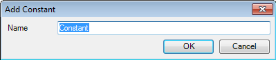
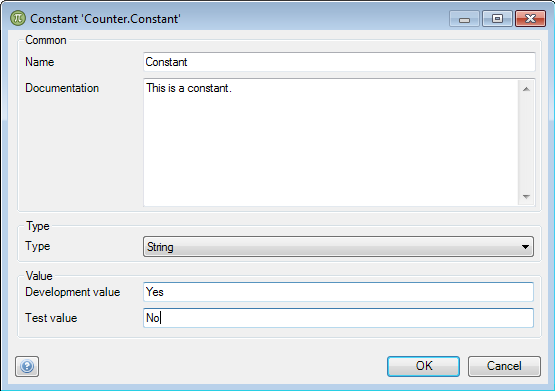

## Description

This section describes how to add a constant to your module and configure it.

## Instructions

 **Add a constant to the module of your choice. If you do not know how to add documents to a project, please refer to [this](add-documents-to-a-module) article.**

 **Enter a name for the new constant.**

 **In the new menu, you can optionally add documentation describing the constant, choose its type, and choose its values, depending on the configuration.**

For example you might want a constant which contains the location of a Web Service, having different values depending on whether the application is run in a development or test configuration.
