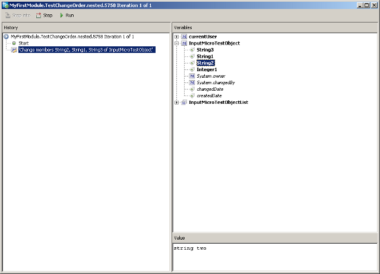

## Description

This section describes how to use the Microflow debugger in Mendix 4.2 and earlier. For the 4.3 and later guide, see [Debugging](debugging)

## Instructions

For a guide on how to set breakpoints, please refer to the 4.3 and later guide [here](debugging)

When a breakpoint is encountered during the execution of a microflow, the debugger will launch:

{}

The microflow debugger.

{}

As you can see, the debugger is split into two panes. The left-hand pane displays the activities from the currently debugging microflow.
The right-hand pane displays the variables that are currently in scope. Note that you can double-click on Entities, these will expand so that you can view the individual attributes. Whenever you click on a variable (or attribute), the current value will be displayed in the bottom right text area.
The variables always display the current value, _before_ the execution of the last microflow activity visible in the left pane.

{}

Showing the value of string2.

{}

### Buttons

*   By clicking the 'Step' button the microflow will execute the current activity and proceed to the next activity.
*   By clicking the 'Run' button the microflow will continue. If another breakpoint is encountered in the same microflow, the execution will break again.
*   If the current activity is either a nested loop or a microflow call, you can click the "Step into" button to debug that specific microflow. That activity will then expand, allowing you to step through that loop or microflow.

{}

The current activity is a microflow, so the "Step into" button is enabled and we can debug the subflow as well.

{}

### Keyboard Shorcuts

There are three keyboard shortcuts to match the buttons:

*   F6 maps to the 'Step' button.
*   F5 maps to the 'Step into' button.
*   F8 maps to the 'Run' button.
