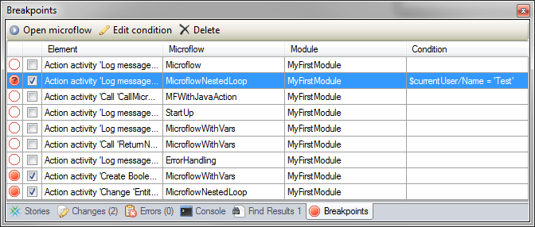

## Description

This section describes how to use the microflow debugger. In Mendix 4.3 we introduced a new way of debugging the microflows in your Mendix application. Debugging is now fully integrated in the Modeler and you can now debug a Mendix application on a remote server.

## Instructions

There are three dockable windows associated with debugging: Debugger, Breakpoints and Variables. You can find these windows under 'View -> 'Debug windows' in the menu.

### Debugging a Locally Running Application

When running an application locally from the Modeler, the debugger is automatically connected.

### Connecting Manually

You can also manually connect to a server. When you have the 'Debugger' window opened and press connect, you will get the option to connect to a local server or a remote server. You can also connect the debugger using the option 'Connect debugger' in the 'Run' menu.

### Enabling the Debugger in the Cloud

When an application is running in the cloud, you can enable the debugger in your environment details under actions.

After clicking this button, you will get a popup with relevant connection details and you can then connect to this application by entering the URL of your application in the debugger.

When you are done debugging your application, you can disable the debugger again in the same location.

**Local server**

When connecting manually to a local server, the Modeler will automatically enable all currently active breakpoints on the server. You can immediately start debugging.

**Remote server**

This works in the same way as local debugging. However, to make sure you do not add (unconditional) breakpoints on a heavily used microflow in production, all breakpoints are automatically disabled upon connecting. When adding a breakpoint, it will initially be disabled so you have the option to add conditions for breaking before making it active.

The password you will need to connect is the one you set when calling the M2EE command to enable to debugger.

### Setting Breakpoints

Breakpoints are points in a microflow where execution will be halted. You can then inspect the values of the variables that are in scope.

Setting a breakpoint is easy: simply right-click a microflow activity and select "Set breakpoint".

An example of a breakpoint on an activity:

Breakpoints can be made conditional. This can be achieved by right-clicking the activity (that should already have a breakpoint set) and selecting "Edit breakpoint condition...". This expression is evaluated every time the microflow is executed, and the debugger will only break if the expression evaluates to true.

In the image below is a breakpoint condition. In this case, the debugger will only break when Integer1 has the value 10.

An example of a conditional breakpoint:

Once you have set a breakpoint, it will show up in the Breakpoints window.

### Debugging Your Application

**Hitting a breakpoint**

When you have a breakpoint in a microflow and this breakpoint is triggered, it will appear in the debugger window.

You can then click on a breakpoint to jump to its location in your model and to perform debug commands on this paused microflow.

The microflow activity where execution is paused is highlighted in red.

**Step over**

To simply go to the next activity in your microflow, click the 'Step over' button in your debugger window. The application will then perform the current activity and break again on the next activity.

**Step into**

When your application is paused on a nested loop or a 'Microflow call' activity, you can also step use the 'Step into' button. This means that you will enter the nested loop or submicroflow and break there on the first activity. If you would use step over here then it would simply move on to the next activity after the microflow call or nested loop.

This is what it would look like when breaking on a nested loop.

After stepping into the loop.

{}

When you cannot step into something, so for activities other than microflow calls and nested loop, step into will simply perform a step over.

{}

**Step out**

Step out for a nested loop means that you will exit the current nested loop and will move on to the next activity after the loop. For a submicroflow, it means you will move to the next activity after the microflow call in the calling microflow.

If step out is used outside of a nested loop and there is no microflow calling the current flow, it will simply continue executing the microflow as it would with the continue command.

Something to keep in mind is that the application will always break on a breakpoint, so when you use step out in a nested loop as in the image below, you will break again if there is another iteration.

**Continue**

When the continue command is given, the microflow will simply continue executing the current microflow until it finishes or hits another breakpoint.

### Inspecting Variables

When debugging a microflow you can inspect the variables that are in the scope of the microflow using the 'Variables' window.

Full information about objects or lists is only retrieved from the server when expanding the view on these variables. This is especially important for remote debugging because the contents of a very large list could mean that quite a large amount of data needs to be sent to the debugger.

An expanded object view looks like this:

An expanded list view looks like this:

This list can be further expanded to show the objects in the same way as expanding an object view.

When the value of a certain attribute is too large to display in the variables window, you can also double click it and it will open a detail window. You can also use this to copy values to your clipboard.

As you can see, a nice extra for DateTime variables is that it will also display the time of the session the microflow is executed with.
