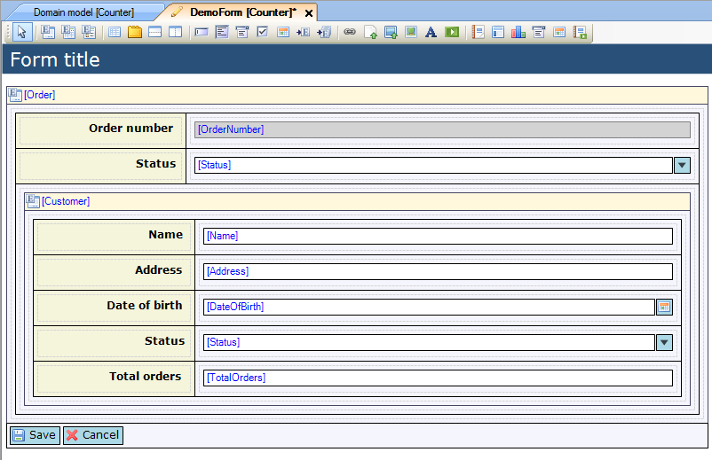
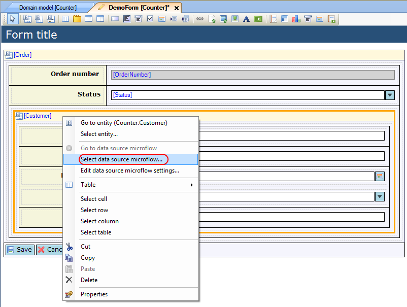
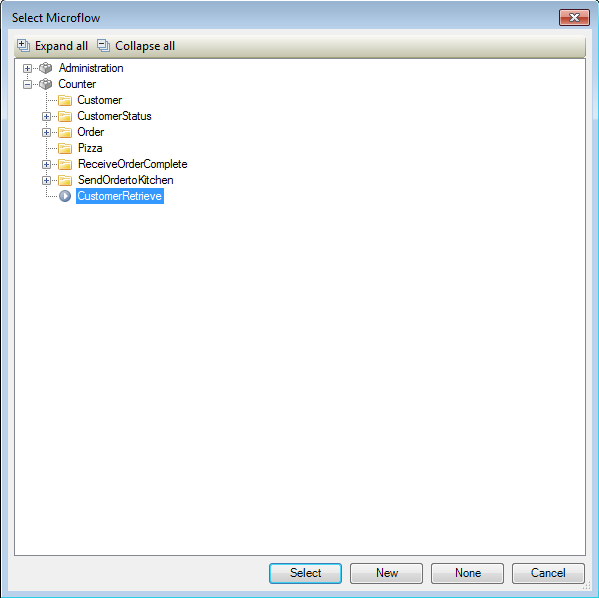
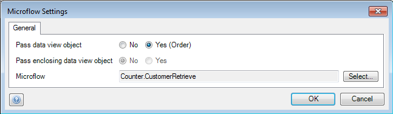

## Description

This section describes how you can use a microflow to determine the contents of a nested data view. The related reference guide article can be found [here](/refguide4/data-view).

## Instructions

 **Create the form with the nested data view. If you do not know how to create and build forms, please refer to [this](create-and-build-a-form) article.**

As the 'Customer' object for the nested data view will be returned by the microflow, the data view is connected to simply the 'Customer' entity, rather than using an entity path that leads to it from 'Order'.

 **Select the nested data view and right-click on it. In the menu choose 'Select data source microflow...'. Alternatively you could click on the '...' button next to 'Microflow' in the Properties window.**

 **In the menu that appears, choose the microflow which returns the object the nested data view should display, and press 'Select'.**

 **If you want to change settings for the microflow, right-click on the nested data view and choose 'Edit data source microflow settings...' or click the '...' button next to 'Microflow settings' in the Properties window. In the menu that appears, you can change settings on which objects should be passed to the microflow, as well as change the microflow which is used to determine the contents of the nested data view.**

