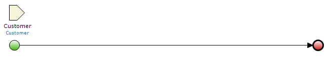
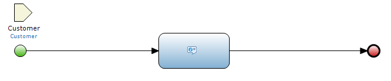
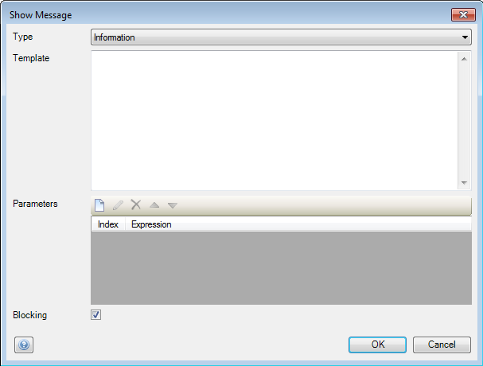
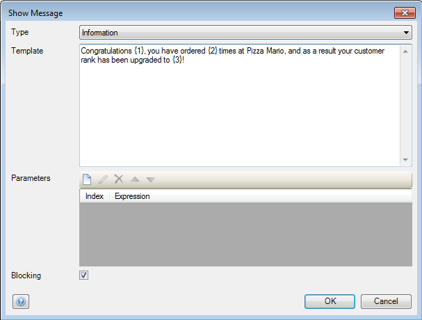
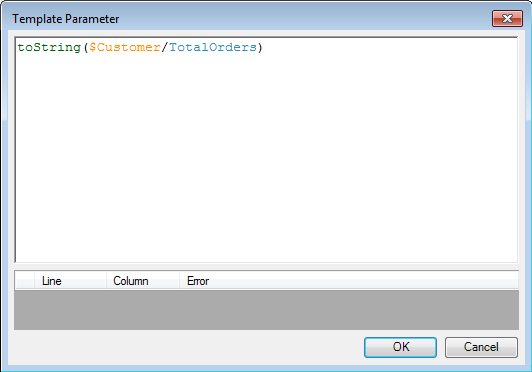
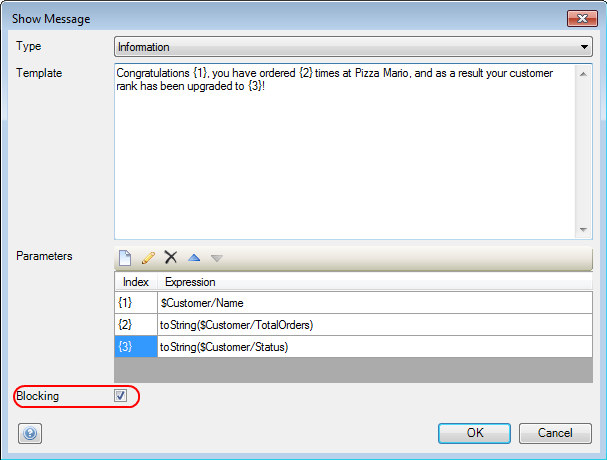

## Description

This section describes how to show a message to the user with a microflow.

## Instructions

 **Open the microflow, or if necessary create a new one. If you do not know how to add documents to your project, please refer to [this](add-documents-to-a-module) article.**

The microflow in the screenshot has a 'Customer' object passed to it, as several of the attributes of the 'Customer' object will be used as parameters in the message.

 **Add a 'Show message' activity to the microflow. If you do not know how to add activities to a microflow please refer to [this](add-an-activity-to-a-microflow) article.**

 **Double-click on the 'Show message' activity to start configuring it.**

 **Use the drop-down menu at 'Type' to choose what type of message you want to show to the user.**

 **You can enter the message template with parameters in the 'Template' area.**

You can enter parameters in the template with the use of braces; these will be filled in by the microflow when it generates the message.

 **You can add new parameters to the message using the 'New' button in the 'Parameters' area. Pressing this button will bring up a new window which lets you enter the microflow expression, of which the value will be inserted into the message at the parameter position.**

If you have variables or attributes which are not strings, you can use the 'toString' expression to convert them.

 **Finally you can choose whether or not the message should be blocking by adding or removing a check mark at 'Blocking'**

The end result in this screenshot is a blocking information message to a user congratulating them with a customer status upgrade, with customer specific information added through parameters.
