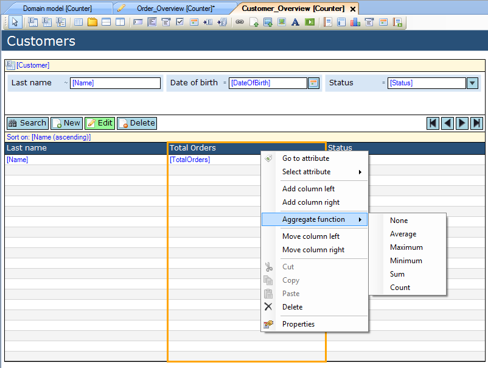
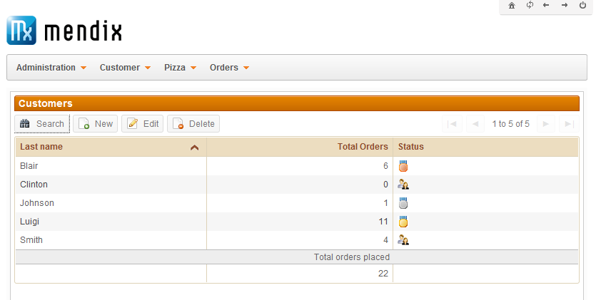

## Description

This section describes how to use aggregate functionality to display the sum of a data grid column. The related reference guide article can be found [here](/refguide4/columns).

## Instructions

 **Select the column you want to use a aggregate function for.**

 **Right-click on the column, choose the type of aggregate function you would like to use in the 'Aggregate function' menu. Alternatively you can do this by using the drop down menu for the 'Aggregation function' property in the Properties window.**

 **You can add a caption to the aggregate function by editing the 'Aggregation caption' property in the Properties window.**

 **The column will now display the chosen aggregate function in the client.**

