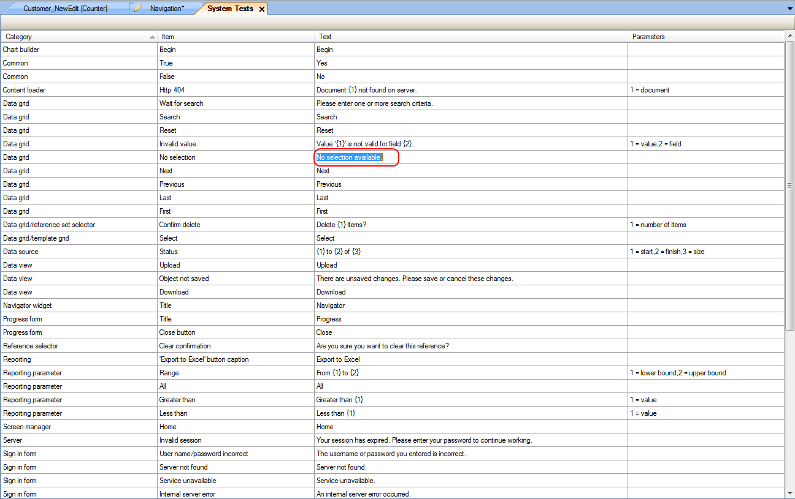

## Description

This section explains how to edit system texts for your project.

## Instructions

 **Open the System Texts menu by double-clicking on 'System Texts' in the Project Explorer**

 **Look for the system text you would like to change, and click in the 'Text' column to edit it.**

