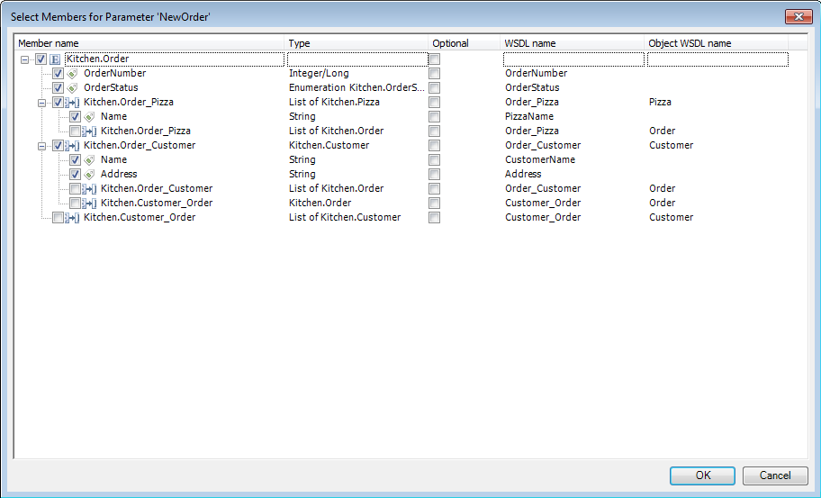

## Description

This section describes how to expose a Web Service in your project. The related reference guide article can be found [here](/refguide4/published-web-services).

## Instructions

 **Create the microflow you want to use for the Web Service, and define its input parameters and return type and variable. If you do not know how to do this, please refer to [this](add-an-activity-to-a-microflow) article.**

The simple microflow in the screenshot above receives the number of an order as parameter, uses this number to retrieve the order object and returns the order status.

 **Add a Published Web Service to your project. If you do not know how to add documents to your project, please refer to [this](add-documents-to-a-module) article.**

 **Double-click on the published Web Service in the Project Explorer to start configuring it.**

 **You can change the name of the published Web Service at 'Name', whereas 'Documentation' allows input of text describing the goal of the Web Service.**

 **Now click on the 'New' button to add an actual operation to the Web Service. The 'Name' and 'Documentation' options in the menu that pops up again allow you to enter a name and an explanation of what the operation does.**

 **Click the 'Select' button next to 'Microflow' to select the microflow the Web Service operation should execute.**

 **The parameter area will now fill with the input parameters which should be passed to the microflow. You can put a check mark in the 'Optional' column to indicate if the parameter is required or not for the microflow to function. 'WSDL Name' allows you to change the name under which the parameter is known in the Web Service call.**

If the parameters and return are not primitive but objects or lists of objects instead, please refer to the 'Advanced' section of this how-to for additional explanation.

 **In the 'Return value' section you can change the name under which the return value is known in the Web Service call at 'WSDL name'.**

 **If you now run your application, you can find the Web Service documentation at [localhost:8080/ws-doc/](http://localhost:8080/ws-doc/) (provided the application is run locally).**

 **To allow the use of your published Web Service, add Web Service users to your application. If you do not know how to do this, please refer to [this](add-web-service-users) article.**

### Advanced

 **If the parameters and return values for your published Web Service are not primitive but objects or lists of objects instead, additional configuration is required.**

 **If the parameters the Web Service requires are (lists of) domain model objects, you can click the 'Edit' button next to the parameter to select which attributes of the entity, as well as associated entities and their attributes, should be passed to the Web Service.**

 **If the return of the published Web Service is an object or a list of objects, you can also press the 'Edit' button in the 'Return value' section to bring up a window which allows you to select which attributes of the entity you want to return, as well as associated entities and their attributes.**

