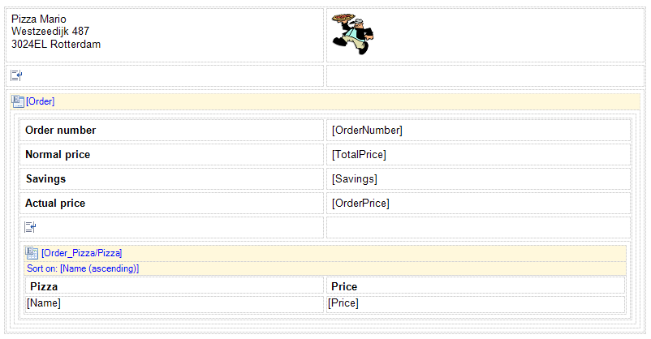
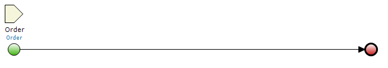
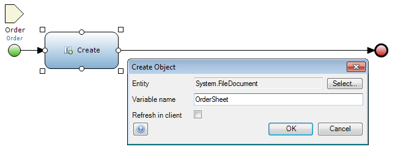
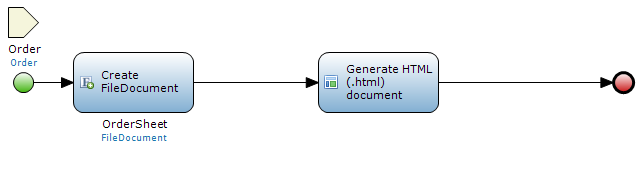
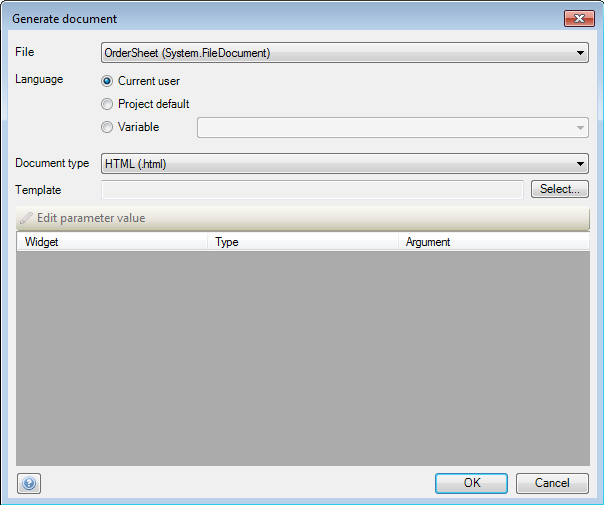
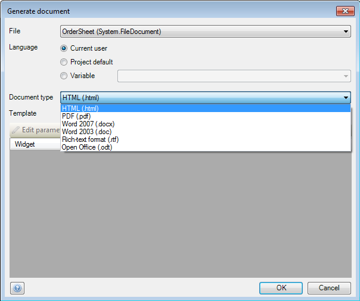
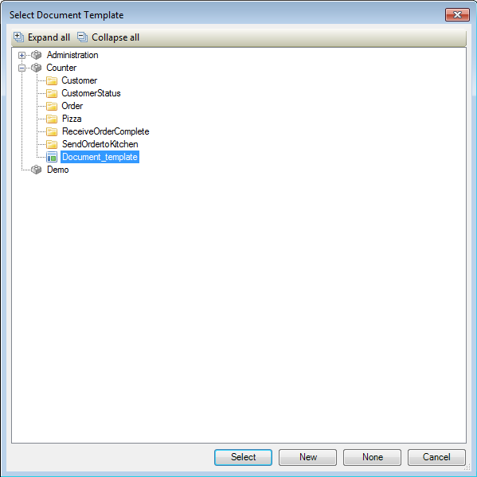
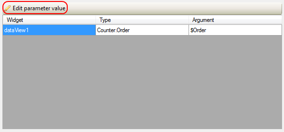
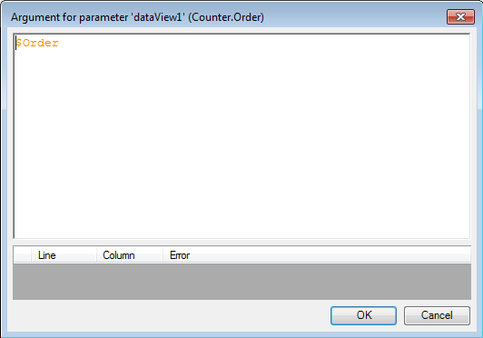
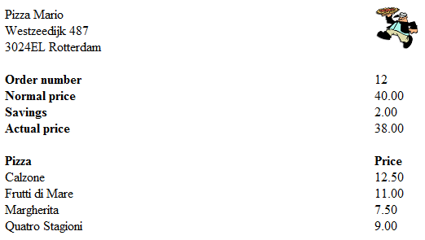

## Description

This section describes how to generate a document with a microflow using a previously designed document template.

## Instructions

 **Create the document template you intend to use. If you do not know how to do this, please refer to** **[this](create-and-build-a-document-template)** **article.**

 **Open the microflow, or if necessary create a new one. If you do not know how to add documents to your project, please refer to** **[this](add-documents-to-a-module)** **article.**

Make sure that the object which is connected to the document template you intend to use is passed to the microflow.

 **Use a 'Create object' activity to create a new object of the System.FileDocument entity or a specialization of it. If you do not know how to use the 'Create object' activity, please refer to** **[this](create-and-change-an-object)** **article.**

This object will be used to store the document in.

 **Add a 'Generate document' activity to the microflow and double-click on it.**

 **Use the drop-down menu at 'File' to select the file object which is created in the microflow.**

 **At 'Language' you can use the radio buttons to select the language the form should be generated in.**

You can choose either the language of the current user, the default project language, or a language stored in a variable.

 **Use the drop-down at 'Document type' to select which of the available formats should be used for the generated document.**

 **Press the 'Select' button next to 'Template' to bring up a new menu allowing you to choose the document template you want to use.**

 **The parameter area will now be filled with the parameters needed for the document template. Select one of these parameters and click on the 'Edit parameter value'.**

 **In the new window you can specify the variable you want to pass to the document template with the use of a microflow expression.**

 **The microflow should now be fully configured to generate a document when it is executed.**

 **To enable viewing of the generated document, add a download form with file manager, or add a 'Download' activity to the microflow that generated the document.**

If the document is not intended to be kept after the initial download, you can add a 'Change' activity to the microflow that generated the document to set the 'DeleteAfterDownload' flag of the document to 'true'.
