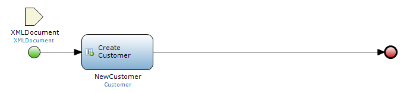
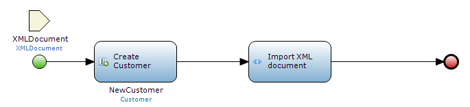
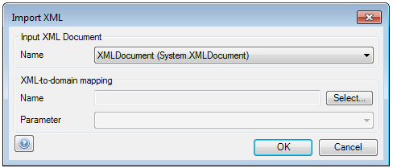
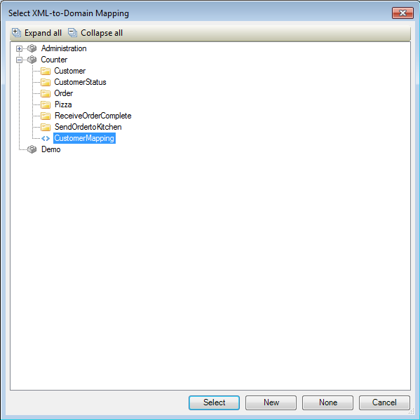
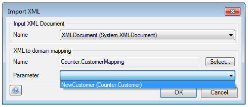

## Description

This section describes how to map an XML document to a domain model entity with the help of an XML-to-domain mapping in a microflow.

## Instructions

 **Create the XML-to-Domain mapping. If you do not know how to do this, please refer to [this](configure-an-xml-to-domain-mapping) article,**

 **Open the microflow, or if necessary create a new one. If you do not know how to add documents to your project, please refer to [this](add-documents-to-a-module) article.**

Make sure that the XML document and (if necessary) the object that has to be passed to the XML-to-domain mapping as parameter are either created in the microflow or passed to it.

 **Add an 'Import XML' activity to the microflow and double-click on it. If you do not know how to add activities to a microflow please refer to [this](add-an-activity-to-a-microflow) article.**

 **In the menu that appears, select the XML document you want to map from using the drop-down menu at 'Input XML document'.**

 **At 'XML-to-domain mapping' you can press the 'Select' button next to 'Name' to bring up a new menu you can use to select the mapping you want to use.**

 **At 'Parameter' use the drop down menu to select the object you want to pass to the XML-to-domain mapping, if necessary.**

