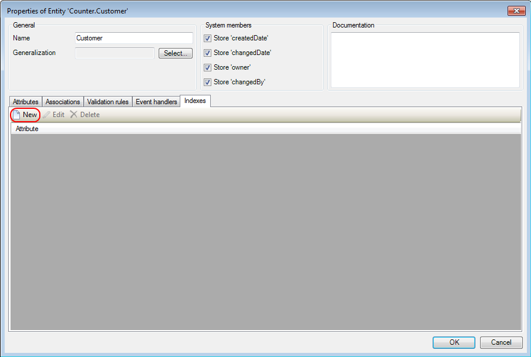
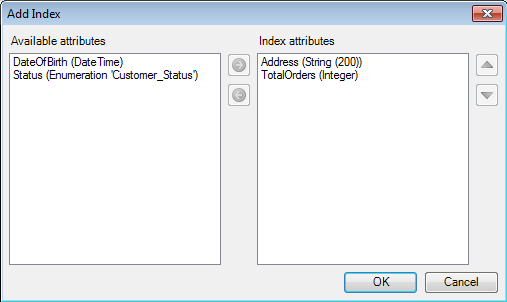

## Description

This section describes how to improve your search performance by adding indexes to your entities.

## Instructions

 **Double-click on the entity.**

 **Go to the Index tab and press the 'New' button.**

 **Add the desired attributes to the 'Index attributes' list and finish by pressing 'OK'.**

Note that you will only see a performance gain if the attributes added are used in a search, and are searched for in the order they are sorted. If this is not the case you are likely to see a performance reduction since change and delete actions on objects of which the entity has an index take longer.
