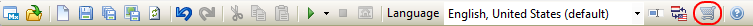
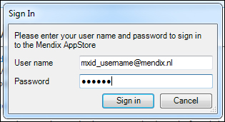
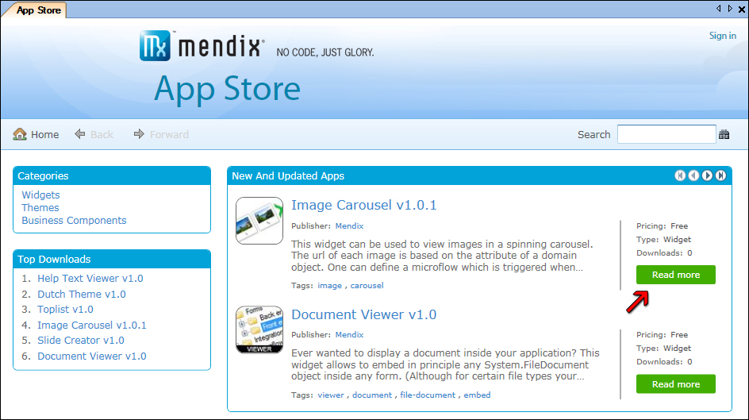
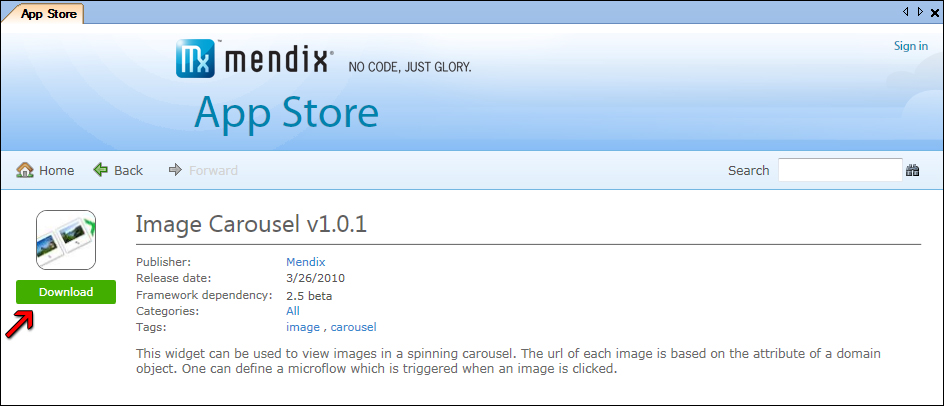
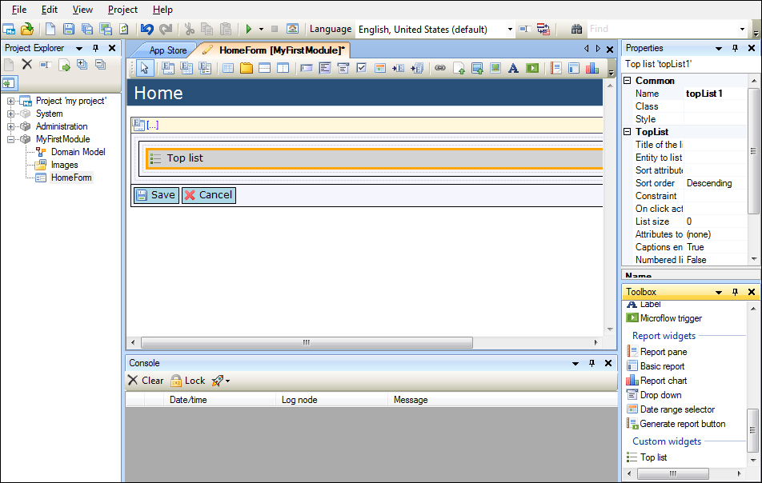
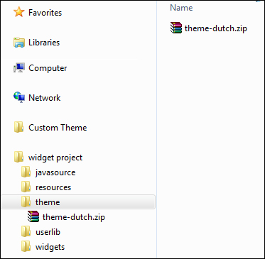
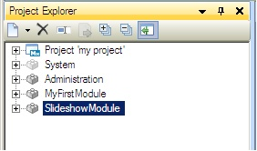

## Description

This section describes how to download an application and add it to your project using the Mendix Business Modeler and the App Store. Tutorials related to this subject can be found [here](custom-widgets).

## Instructions

 **Open your project.**

Open your project in the Mendix Business Modeler, version 2.5 or higher.

 **Open the App Store.**

You can open the App Store in the Modeler by clicking on the icon in the toolbar.

 **Log in to the App Store.**

Log in to the App Store using your Mendix Community login name and password.

 **Find the App.**

Once inside the App Store you can browse and find the application you want to use in your project. You can use the search bar to find a specific App or browse using the categories to get a more general overview. You can press 'Read More' to see more information about an application.

 **Download the App.**

Once you've found the correct application, you can press the 'Download' button, found in the 'Read More' page. This will download the App straight into your project.

 **Where is my App?**

Your App is now stored in your project. There are different types of applications, which are sent to different places in your project. The next paragraphs will explain where widgets, themes and modules are placed after downloading.

 **Where is my widget?**

A widget will be stored in the 'MyProject/widgets' folder. In the Modeler it can be found in the bottom of the Toolbox and in the toolbar at the top of every form.

 **Where is my theme?**

A theme will be stored in the 'MyProject/theme' folder. Next time you deploy, the theme will be applied to your application.

 **Where is my module?**

A module will be placed directly into your project. You should see it appear directly in your Project Explorer.

