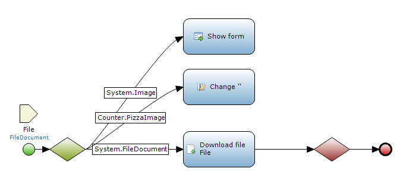
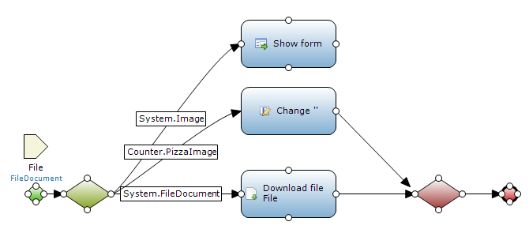
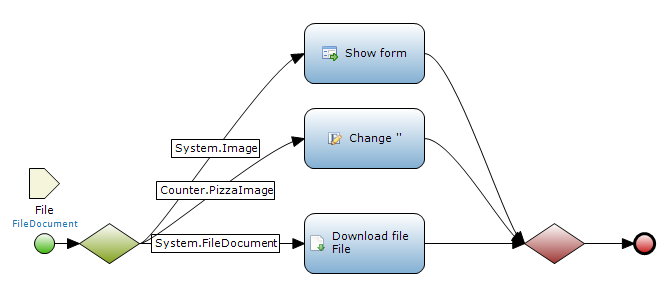

## Description

This section describes how to merge multiple sequence flows in a microflow.

## Instructions

 **Create the microflow with multiple sequence flows using inheritance or exclusive splits. If you do not know how to add documents to your project, please refer to [this](add-documents-to-a-module) article; if you do not know how to add activities to a microflow, please refer to [this](add-an-activity-to-a-microflow) article.**

 **Add a merge gateway to the sequence flow in the location where you want to merge the separate flows into one.**

 **Drag new sequence flow from the circles around the edge of the last activity in the separate paths to the circles around the edge of the merge gateway.**

 **Connect all separate sequence flows you want to merge to the merge gateway.**

