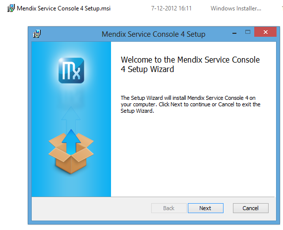
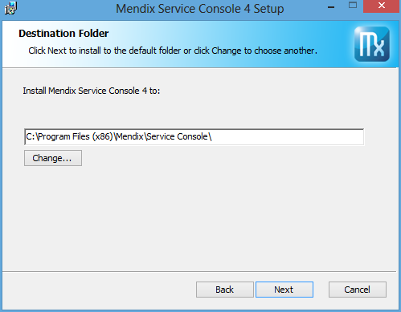
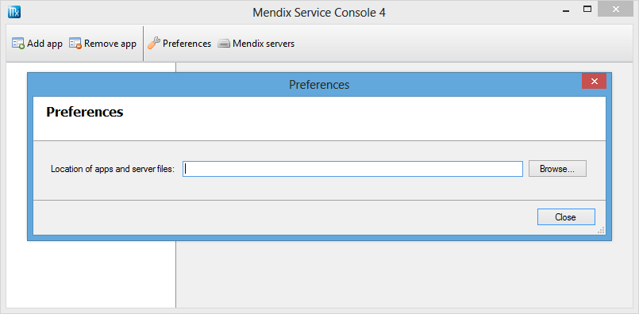
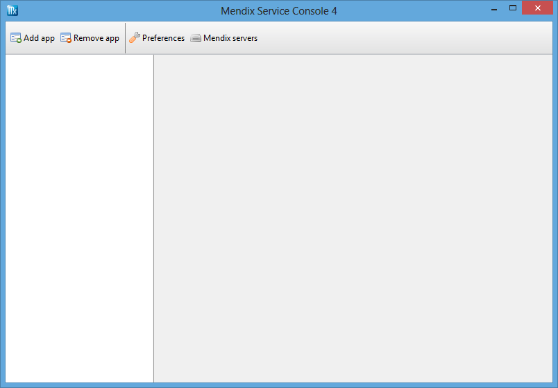

## Description

This section describes the preparation to deploy your Mendix 3 and 4 apps as Windows services.

## Instructions

### Environment

This how-to requires Windows 2003 or higher with Microsoft .NET 4.0 or 3.5 SP1 and Java 6 (JRE, standard edition) installed. From Java only the JRE is necessary, not the JDK.

If Internet Information Services will be used as separate web server, then ASP.NET 2.0 SP1 or higher is required. If 3.5 SP1 is installed, then you automatically have version 2.0\. However, make sure that ASP.NET also is installed and configured for usage in IIS.

You have to define the Windows user that must be used to run the Mendix service and application. This must be a user without administrative rights. We recommend to restrict this user as much as possible and to give the user only rights to access the folders of the Mendix application and to write to the folders for uploaded and temporary files.

The following components must be downloaded:

*   Mendix Windows Service (see Mendix App Store, Business Modeler, Other downloads)
    Current version: 4.2 - [How to upgrade](upgrading-the-mendix-service-console)
    This program is needed to install the application as a Windows service, to configure and to test them.
*   ASP.NET URL Rewriter
    This component is needed to let Internet Information Services and Mendix communicate with each other.
    More instructions on downloading this item can be found in [this article](set-up-internet-information-services).

### Database

Before you can run the application, make sure the database is accessible via TCP/IP from this server. It is also recommended to create an empty database in advance with the correct security settings. The Mendix application must have enough rights to check the database scheme. If you are also allowing the Mendix application to create or to change tables (or other items), then bear in mind that the Mendix application must be able to log in with a user that has with sufficient rights.

### Installation of the Mendix Service Console

Execute the downloaded installer of the Mendix Service Console.

 

In most cases, the suggested installation folder (C:\Program Files\Mendix\Service Console) satisfies your needs. This is not the location the apps will be placed.

Start the Mendix Service Console after the installation. The first time you launch the application, a preferences dialog will be shown.

This dialog will always be shown if no valid location is configured for all the apps and server files. Do not choose a location within the system's Program Files folder, but choose a folder like D:\Mendix where you can easily control the Windows security rights.
When you are ready, you will see the following window, with a clear white bar on the left side.

At the top of the Mendix Service Console, there is a main toolbar with four buttons. Use Add app and Remove app to add and remove apps. Use the Preferences button to change the location where the Mendix Service Console searches for apps and where new apps will be placed. With Mendix versions, it's possible to extend the available Mendix runtime server versions on the machine or to remove unnecessary ones.
