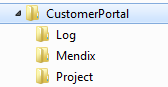

## Description

This section describes the prerequisites to deploy your Mendix application as a Windows service.

## Instructions

### Environment

This how-to requires Windows 2003 or higher with Microsoft .NET 3.5 SP1 and Java 6 (JRE, standard edition) installed. From Java only the JRE is necessary, not the JDK.

If Internet Information Services will be used as separate web server, then ASP.NET 2.0 SP1 is required. If 3.5 SP1 is installed, then you automatically have version 2.0\. However, make sure that ASP.NET also is installed and configured for usage in IIS.

You have to define the Windows user that must be used to run the Mendix service and application. This must be a user without administrative rights. We recommend to restrict this user as much as possible and to give the user only rights to access the folders of the Mendix application. These folders will be created next.

The following components must be downloaded:

*   Mendix Windows Service
    Current version: 3.0 - [How to upgrade](update-a-mendix-application)
    This program is needed to install the application as a Windows service, to configure and to test them.
*   ASP.NET URL Rewriter
    This component is needed to let Internet Information Services and Mendix communicate with each other.
    More instructions on downloading this item can be found in [this article](set-up-internet-information-services).

### Database

Before you can run the application, make sure the database is accessible via TCP/IP from this server. It is also recommended to create an empty database in advance with the correct security settings. The Mendix application must have enough rights to check the database scheme. If you are also allowing the Mendix application to create or to change tables (or other items), then bear in mind that the Mendix application must be able to log in with a user that has with sufficient rights.

### Folder Creation

Define the folder that is to be used in order to keep the Mendix application in. For example, our application is named 'CustomerPortal', and our server has two partitions, C and D. C is the system partition, so we choose to use the folder D:\CustomerPortal for our application.

Create three folders under the root application folder D:\CustomerPortal: Project, Log and Mendix.

         
The Project folder will contain the same content as the deployment folder on your local computer when you deploy and run in the Modeler.

The Log folder will contain log output while running the application.

The Mendix folder will contain the Mendix server and the Windows service to run the application. This folder should have mainly the same content for all projects, regardless of which project runs. In the root of the folder will be one file which will specific for a project and which contains project settings.

### Putting the Service Files In the Right Location

Unzip the Mendix Service package you have downloaded and place the contents of the ZIP file to the Mendix folder. Now you have a Service folder within CustomerPortal\Mendix.

### Other Folders

There are two other folders needed to run the application. See the following table for the default locations:

| Meaning | Default location |
| --- | --- |
| Temporary folder
 | CustomerPortal\Project\data\tmp
 |
| Uploaded files folder
 | CustomerPortal\Project\data\files
 |

Step 2 will show you how to define other locations for these folders. If you choose to use the default location, then make sure these locations exist before running the application!
