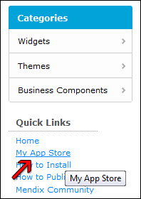
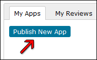
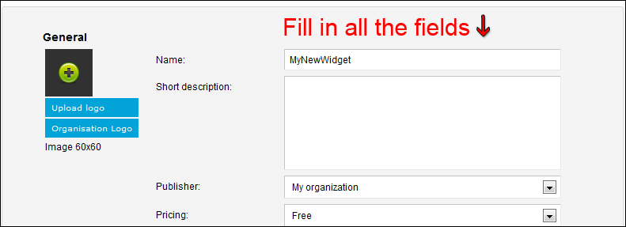
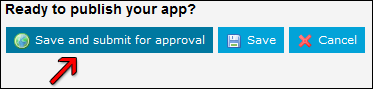

## Description

This section describes how to publish an application you created in the App Store. Tutorials related to this subject can be found [here](custom-widgets).

## Instructions

 **Save your application.**

Read the App Store Approval Guidelines to make sure your App is ready to be submitted. Also make sure you save your App as an .mpk file.

 **Log in to the App Store.**

Log in to the [App Store](https://appstore.mendix.com) on the website using your MxID account.

 **Go to 'My App Store'.**

Click on 'My App Store' to open your own overview.

 **Press 'Publish New App'.**

Press the 'Publish New App' button to create a new App.

 **Fill in all the fields.**

Fill in all the fields. Consider what you put here as this is what other users will judge your App by. Make sure you inform them of all the features and restrictions. Decide if you want to publish your App yourself or from your Organization.

 **Press 'Save and submit for approval'.**

Your App is now in the approval process!

