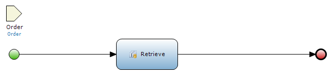
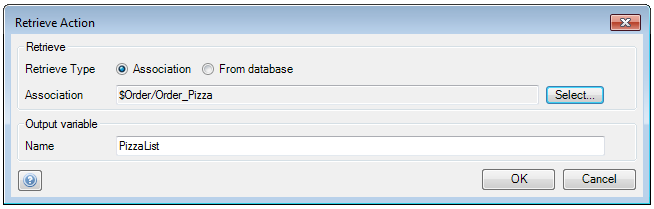
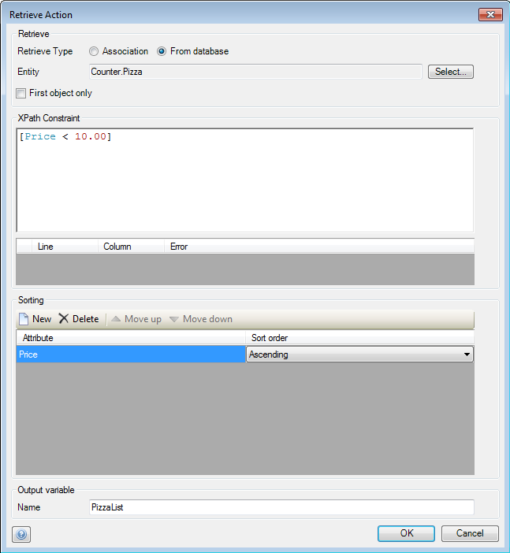
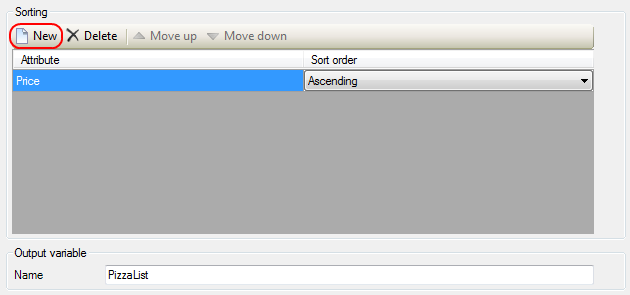
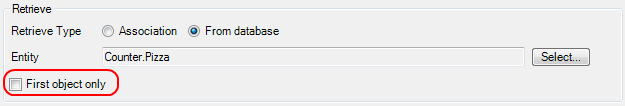

## Description

This section describes how to retrieve an object or a list of objects in a microflow.

## Instructions

 **Open the microflow, or if necessary create a new one. If you do not know how to add documents to your project, please refer to [this](add-documents-to-a-module) article.**

 **Add a 'Retrieve' activity to the microflow, and double-click on it. If you do not know how to add activities to a microflow please refer to [this](add-an-activity-to-a-microflow) article.**

The microflow in the screenshot has an 'Order' object passed to it as parameter.

 **If you choose 'Association' as retrieve type, the activity will retrieve objects by following the specified association. You can select this association by pressing the 'Select' button next to 'Association' and then choose the right association in the menu that pops up. In the case of a reference, the 'Retrieve' activity will return an object, whereas in the case of a reference set it will return a list of objects.**

The 'Order' object passed to the microflow makes it possible to retrieve 'Pizza' objects through the 'Order_Pizza' association. Since this is a reference set, the 'Retrieve' activity will return a list of 'Pizza' objects.

 **If you choose 'From database' as retrieve type, you will need to specify the entity of which you want to retrieve objects, and then provide an XPath expression to constrain the objects which are retrieved.**

If you do not provide an XPath expression, the 'Retrieve' activity will return a list of all the objects of the chosen entity.

 **In the 'Sorting' area of the menu, you can specify attributes you want to sort the list on and then use the drop-down menu to set the sorting to ascending or descending.**

You can add new attributes to sort on by pressing the 'New' button.

 **When you choose the 'From database' option, you can choose to have the 'Retrieve' activity only return the first object, rather than a list of objects by putting a check mark next to 'First object only'.**

This can be used if you want it to return a specific object you need for the microflow, rather than a list. However be aware that your XPath expression will need to return the one needed object, or the sorting needs to ensure that the object is the first object on the list for this to work.

 **For both retrieve methods, you can alter the 'Output variable' to change the variable name which will be used to the returned object or object list in the microflow.**
