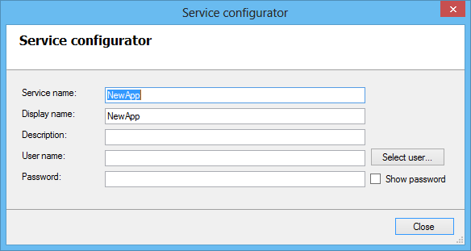
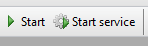

This form is important, especially for a correct installation of the Windows service for this app.



#### Service Name

This name must be unique within all existing Windows services. A list of names of all currently existing services on your system can be retrieved by executing the following command line utility:

```
sc query | findstr SERVICE_NAME
```

#### Display Name

This is the visible name of the app in the left bar of the Mendix Service Console and in the list of Windows services.

#### Description

This is the description of the app, which is visible as tooltip of the app in the left bar of the Mendix Service Console or visible as column in the list of Windows services.

#### User Name and Password

The app will always run under the user account given here. The service will be installed with this user account configured.
The Mendix Service Console gives two options to start the app.



The Start button starts the application directly from the Mendix Service Console.
To use the second Start service button, the app has to be installed as Windows service first. The button starts the app as a Windows service. Both buttons start the app at a different way, but in both cases, the app runs under the user account (and his privileges) configured here.
