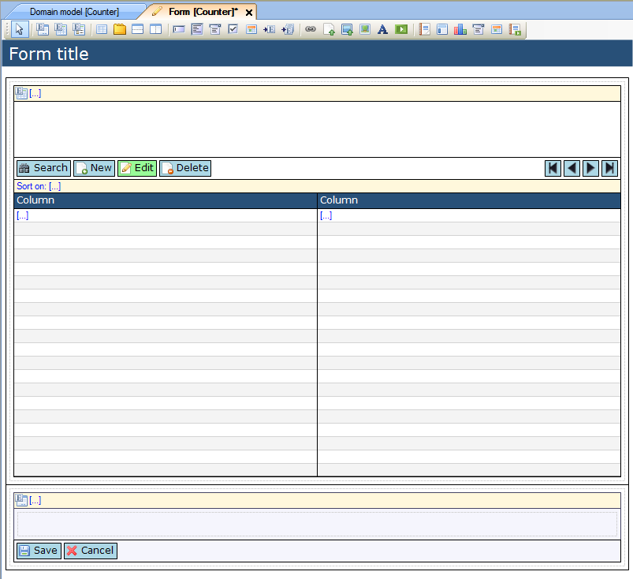
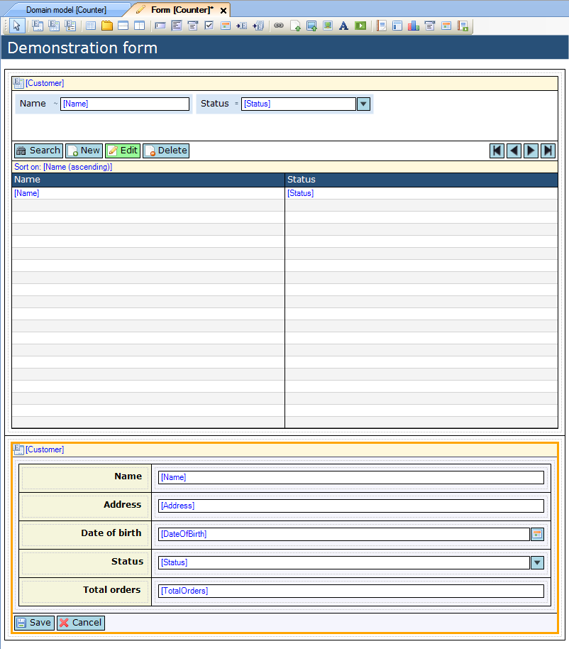
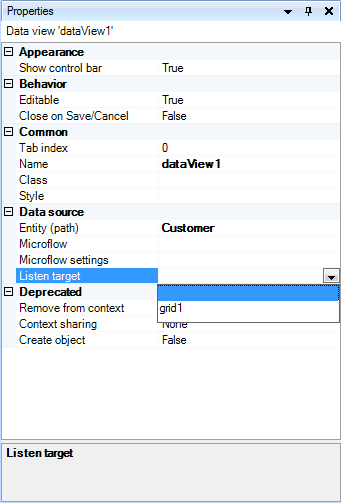
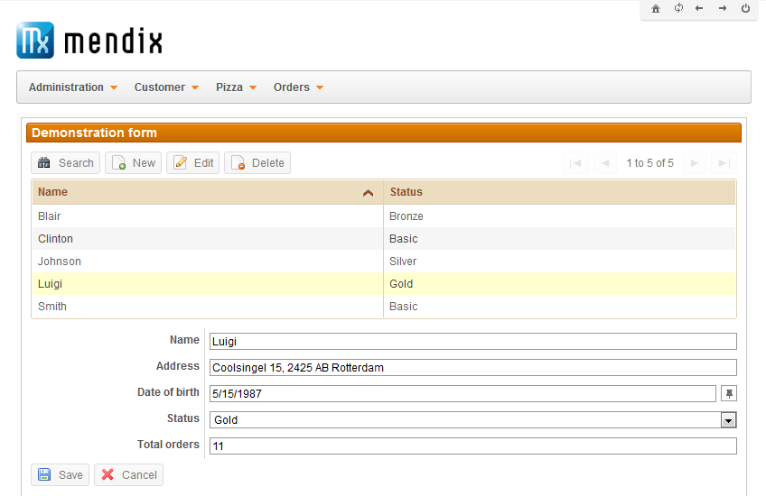

## Description

This section describes how to configure a listen target for a data view. This allows a data view to show information about the object being selected in a data grid in the same form.

## Instructions

 **Create the form, containing both the data grid and data view. If you do not know how to add widgets to a form, please refer to [this](add-a-widget-to-a-form) article.**

 **Connect the data grid and data view to the entity and set up the widgets so they display the desired attributes. Note that the data view must be connected to the same entity as the data grid, or a generalization of it. If you do not know how to connect entities to widgets, you can find articles about how to do this for [data grids](connect-an-entity-to-a-data-grid) and [data views](connect-an-entity-to-a-data-view) in this how-to database.**

 **Select the data view. Now look up the 'Listen target' property in the Properties window and use the drop down menu to select the data grid, in this case called 'grid1'.**

 **Your form is now configured to let the data view show more detailed information about a selected object from the data grid, as shown in the picture below.**

