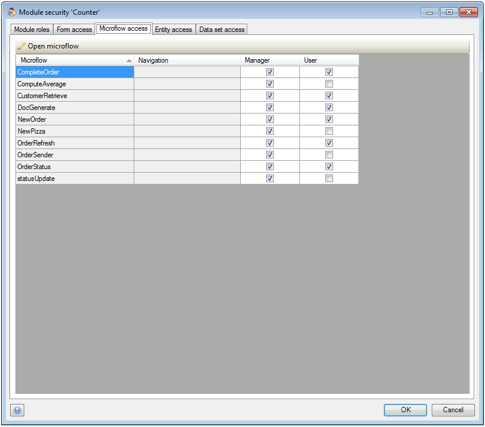

## Description

This section describes how to configure the access rules for the forms, microflows and entities in your project.

## Instructions

 **Verify that your project security status is set to 'Production'. You can check this by double clicking on 'Security' in the Project Explorer and setting the security level to 'Production'.**

 **Now open up the module security window for the module you want to configure. You can do this by double-clicking on 'Security' under the module in the Project Explorer.**

 **In the 'Form Access' tab, grant or deny module roles access to forms from the module using check marks.**

The 'Navigation' column indicates how forms may be reached using the navigation menus.

 **In the 'Microflow Access' tab, grant or deny module roles access to microflows from the module using check marks.**

 **Add access rules for the module's entities by pressing the 'New' button in the 'Entity Access' tab. In the new menu that opens you can then choose to add rules for one entity at once, or set identical rules for multiple entities. Place check marks next to the entities you want to configure and press 'OK'.**

 **If you selected only one entity in the previous menu, you will now get a new menu where you can set up read and write permissions per attribute.**

Additionally you can add documentation for this access rule, select which module roles the rule applies to, and (dis)allow creation and deletion of objects of this entity. It's also possible to add an XPath constraint to limit the objects for which the rule applies.

 **If you selected multiple entities, you will get a slightly different menu.**

You can only set read and write permissions for all objects of all the entities you selected. Permissions for individual attributes or XPath constraints to limit the objects for which the rule applies are not possible in this case.

 **Finally, you can configure data set access rules in the 'Data set access' tab of the Module security window.**

You can do this by clicking on the cell which forms the intersection of the data set and module role you want to configure. This will bring up a window which allows you to configure the allowed parameter values per module role.
