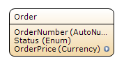

## Description

This section describes how to set up an attribute of which the value is calculated by a microflow.

## Instructions

 **If the attribute does not exist yet, create it. If you do not know how to do this, please refer to [this](add-an-attribute) how-to.**

### Method 1

 **Right-click on the attribute and in the menu choose 'Select microflow...', or click on the '...' button next to 'Microflow' in the Properties window.**

 **Select the microflow you want to use to calculate the attribute value and click on 'Select'.**

Note that the microflow should return a value of the same type as the attribute.

 **The domain model will now indicate that the attribute is calculated by a microflow.**

### Method 2

 **Double-click on the attribute.**

 **Change the source of the attribute to 'Microflow'. Press the 'Select...' button on the new line that appears.**

 **Select the microflow you want to use to calculate the attribute value and click on 'Select'.**

Note that the microflow should return a value of the same type as the attribute.

 **The domain model will now indicate that the attribute is calculated by a microflow.**

