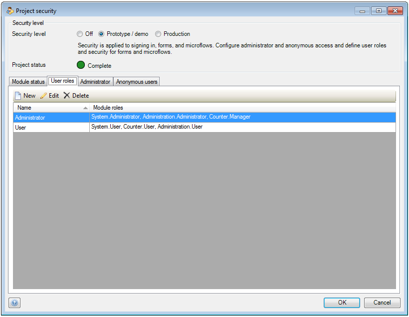
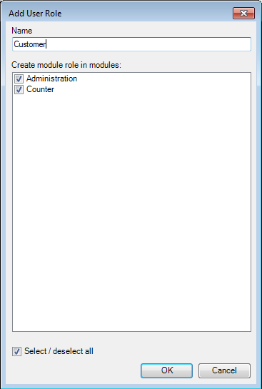
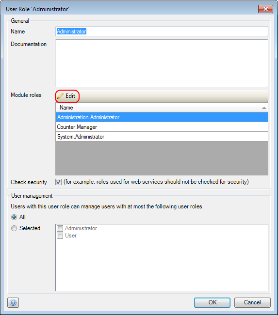
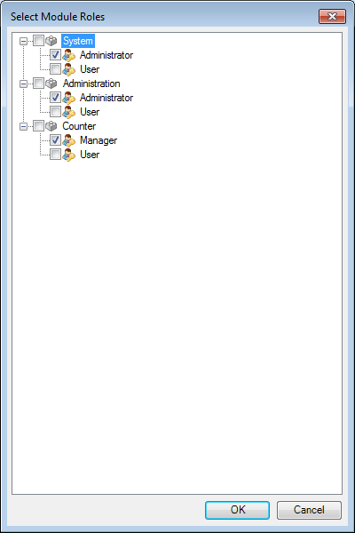

## Description

This section explains how you can configure module roles for a project user role. The related reference guide article can be found [here](/refguide4/user-role).

## Instructions

 **Open the Project Security window by double-clicking on 'Security' in the Project Explorer.**

 **Go to the 'User Roles' tab. If you need to create a new project user role, press the 'New' button and enter the name for this new role.**

In this menu you can also select in which modules you want to grant this project user role a module user role by adding or removing check marks next to the module names.

 **Highlight the project user role you want to configure and press the 'Edit' button.**

 **Press the 'Edit' button in the 'Module roles' section of the new menu.**

 **The new menu will list the module roles per module. Add check marks to the module roles you would like to assign to the project user role and finish by pressing the 'OK' button.**

