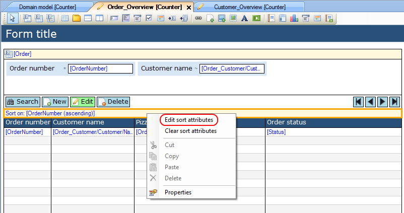
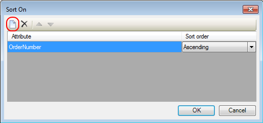
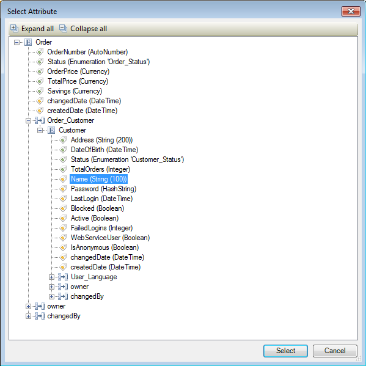

## Description

This section describes how to define multiple sorting priorities for a data grid.

## Instructions

 **Open the form containing the data grid. Right click on the sort bar and choose 'Edit sort attributes'. Alternatively you could click the '...' button next to 'Sort on' in the Properties window.**

 **In the new menu that appears, you can add attributes to sort on by pressing the new button.**

 **In the next menu, you can then select an attribute of the grid entity or of an associated entity of the grid entity to sort on.**

 **Once you have added the attributes you want to sort on, you can select whether to sort ascending or descending for an attribute using the drop down menu to the right of the attribute. You can also change the sorting priority of an attribute by moving it up and down the list with the blue arrow buttons.**

