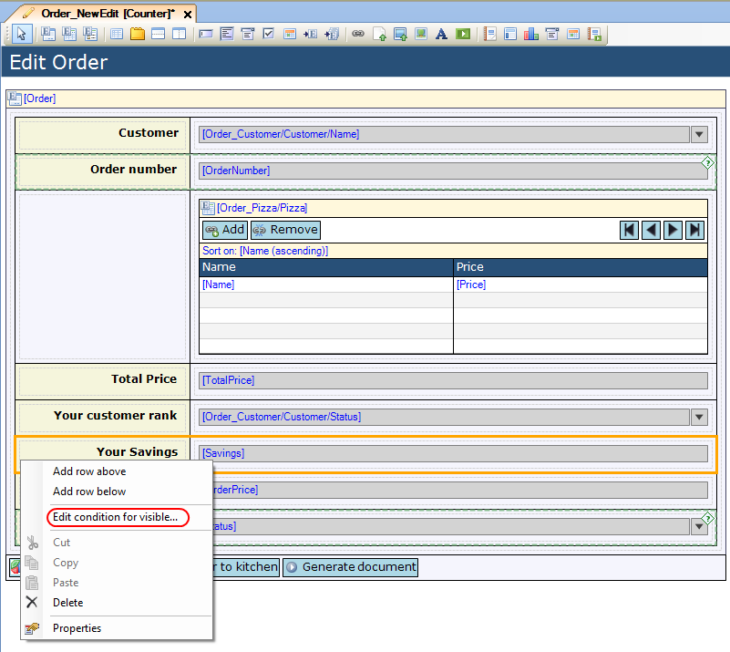
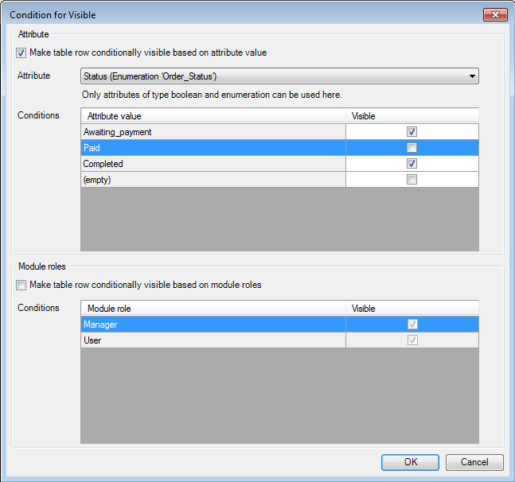

## Description

This section describes how you can configure widgets to be visible or editable based on the value of an enumeration attribute.

## Instructions

 **Select the row for which you want to set the conditional visibility or the widget for which you want to set the conditional editability.**

 **Right-click on the row or widget, and choose 'Edit condition for visible...' or 'Edit condition for editable...'. Alternatively you could click the '...' button next to 'Visible' or 'Editable' in the Properties window.**

 **In the menu that appears, put a check mark next to 'Make table row conditionally visible based on attribute value' or 'Make <widget> conditionally editable based on attribute value'.**

 **Choose the enumeration you want to use to configure the visibility or editability using the drop-down menu next to 'Attribute'.**

 **You will now be able to put check marks next to all the values of the enumeration indicating whether or not the row/widget should be visible/editable if the attribute has that enumeration value.**

