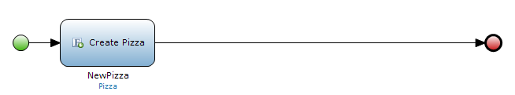
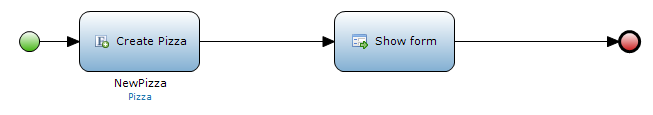
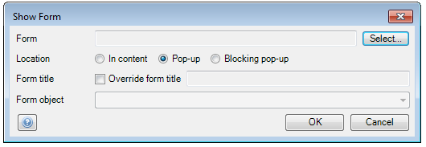
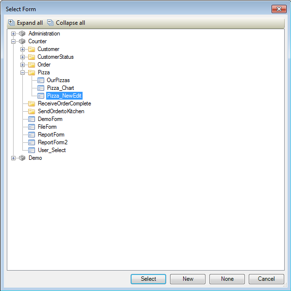
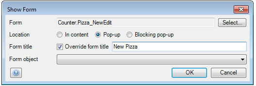
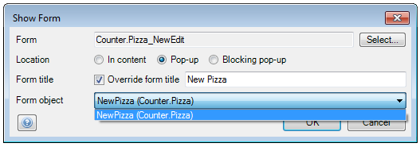

## Description

This section describes how to open a form and pass an object to it using a microflow.

## Instructions

 **Open the microflow, or if necessary create a new one. If you do not know how to add documents to your project, please refer to [this](add-documents-to-a-module) article.**

The microflow will have to pass an object to the form it opens, so make sure that this object is either created in the microflow, or passed to it.

 **Add a 'Show form' activity to the microflow. If you do not know how to add activities to a microflow please refer to [this](add-an-activity-to-a-microflow) article.**

 **Double-click on the 'Show form' activity to start configuring it.**

 **Press the 'Select' button next to 'Form' and select the form you want the microflow to open in the menu that appears.**

 **You can use the radio buttons at 'Location' to choose if you want the form to open in the content or as pop-up, and whether or not the pop-up should be blocking.**

 **If you want the form to have a custom title, place a check mark next to 'Override form title' and enter the custom title.**

 **Finally at 'Form object' use the drop-down menu to select the object you want to pass to the form.**

