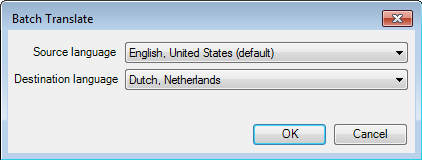
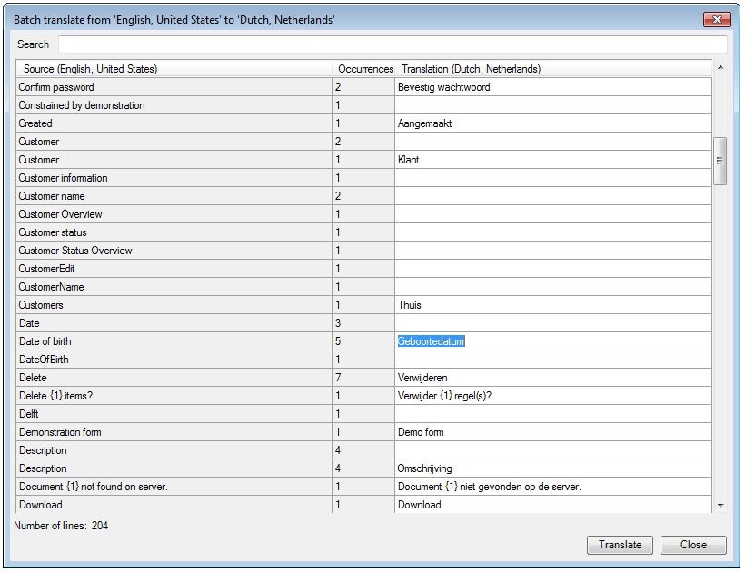

## Description

This section describes how to translate texts for your multi-language project using the batch translate function.

## Instructions

 **Click on 'Batch translate' in the toolbar.**

 **Use the drop-down menus in the window that appears to select the source and destination language for the batch translate.**

 **The new window will list the phrases and words in your project in the source language, as well as their number of occurrences in your project.**

You can search for specific phrases or words using the 'Search' field.

 **Click on a corresponding field in the 'Translation' column and enter the translation for the word or phrase.**

 **Once you are done translating, click on the 'Translate' button to finish.**
