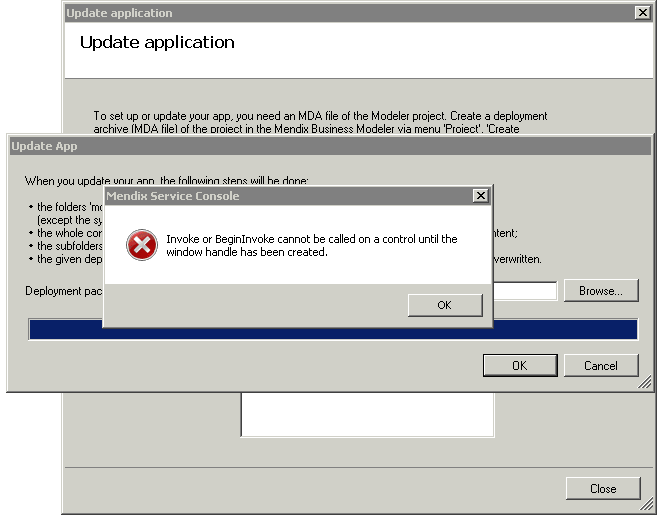
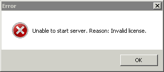

 _Error while updating an app (1)_
Sometimes, shortly after the update process began, a popup tells you that the directory was not empty. Normally, before the app is updated, a backup is created and the current app files are removed. Sometimes, not all files can be removed, due to a lock by a Windows Explorer window or another process. Please install Mendix Service Console 4.1 or later to reduce the chance this error occurs.
However, it does not matter that some files are not removed. All needed files are overwritten by the new app version. From version 4.1 and up, the update process will go further after showing this error.

 _Error while updating an app (2)_
On some Windows server installations, the app update process shows an error just before the end of the process.

Please upgrade the Mendix Service Console to version 4.1 or later.

 _Unable to start server_
Sometimes, each time you start a specific app, the following error occurs:

This occurs even if you have never activated a license. Normally, when the license is not valid, the app starts in trial mode. This popup should never be shown, unless there is a deeper cause. Maybe the database is corrupt, for instance you have migrated a database from a Mendix 4 app to a Mendix 3 app. Try starting the app on a new database.

 _Security errors while starting service_
When the system gives such errors while starting the service, make sure the configured service user has sufficient rights to the folders of the Mendix application. Sometimes you have to fill in the domain name with the user name, thus DOMAIN_NAME\user_name instead of user_name.

 _Type-initialization_
Sometimes the Event Viewer shows a message like this:

EventType clr20r3, P1 mendixservice.exe, P2 1.0.3810.25652, P3 4c0cf0d8, P4 mendixservice, P5 1.0.3810.25652, P6 4c0cf0d8, P7 2, P8 6, P9 system.typeinitialization, P10 NIL.

Make sure that the user account for the service has enough rights to the folders containing the Mendix Service executables and the subfolders x86 and x64.
