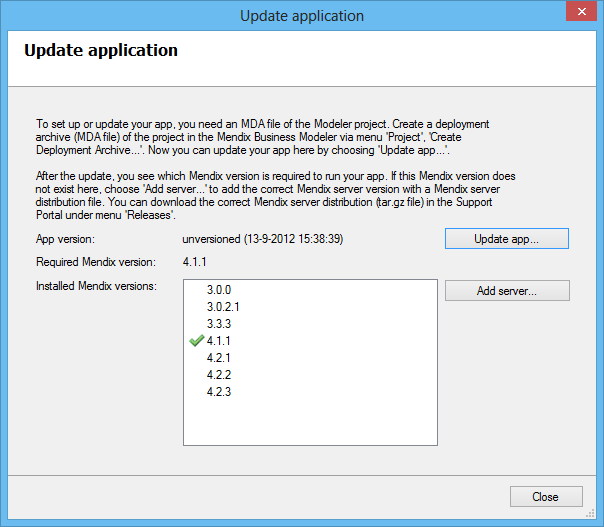

<This preliminary documentation is subject to change. It will be finished as soon as possible.>

## Update the Application

For updating a new version of the project software you'll first need to generate an deployment package(.mda) file from the modeler. Once the deployment package is copied to the server you can select it using the button 'Update app...'.
The Service Console analyses the deployment package and shows the required Platform version, and checks the version if it is available on the server.

## Update the Platform Version

The Mendis Service Console supports running multiple Mendix applications and versions on a single server. The list of Installed Mendix versions shows all platform versions that have been installed.
The server version that is checked is the version that is used by the actual application.

