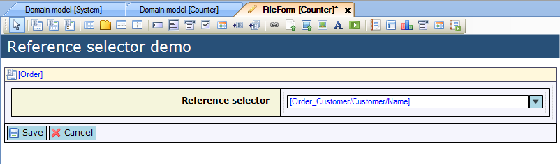

## Description

This section describes how to use a microflow to determine the selectable objects in a reference selector.

## Instructions

 **Create the form and add the reference selector. If you do not know how to add documents to a project please refer to [this](add-documents-to-a-module) article; if you do not know how to add widgets to a form, please refer to [this](add-a-widget-to-a-form) article.**

 **Connect an attribute of an entity which is associated with the data view or template grid entity to the reference selector . You can do this by selecting the reference selector and then dragging this attribute from the Connector window to the reference selector. Another option is to right-click on the reference selector and choose 'Select attribute...' or click the '...' button next to 'Attribute path' in the Properties window, and then in the menu that appears select the attribute.**

 **Right-click on the reference selector and choose 'Select data source microflow...' or click on the '...' button next to 'Microflow' in the properties menu.**

 **In the new menu, choose the microflow you want to use and press 'Select'.**

This microflow should return the list of objects which should be selectable in the reference selector.

 **If you want to change settings for the microflow, right-click on the reference selector and choose 'Edit data source microflow settings...' or click the '...' button next to 'Microflow settings' in the Properties window. In the menu that appears, you can change settings on which objects should be passed to the microflow, as well as change the microflow which is used to determine the selectable objects for the reference selector.**

