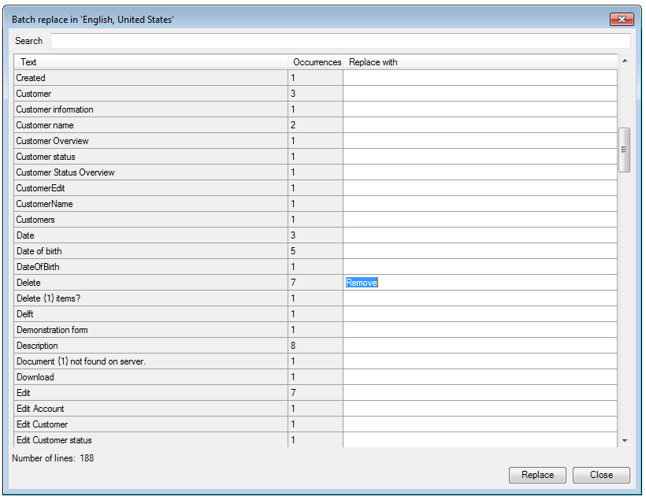

## Description

This section describes how to use the batch replace function to replace words or phrases in your project.

## Instructions

 **Click on the 'Batch replace' button.**

 **The new window that appears will list the phrases and words in your project, as well as their number of occurrences.**

You can search for specific phrases or words using the 'Search' field.

 **Click on a corresponding field in the 'Replace with' column, and enter the word or phrase you would like to replace the original with.**

 **Once you are finished entering replacement phrases and words, click on the 'Replace' button to finish.**
