This how-to is based on the video "Build a simple HRM app: Create, manage and deploy the app", which is part of the [Getting Started videos](http://gettingstarted.mendixcloud.com/link/courses/gettingstarted).

This is the first how-to in a series of five on how to create a simple HRM application. In this how-to you will learn how to create, deploy and manage your Mendix application.

**After completing this how-to you will know:**

*   How to create an app.
*   How to manage an app.
*   How to deploy an app.

## 1. Preparation

Before you can start with this how-to, make sure you have completed the following prerequisites.

*   [Create a Mendix account](https://www.mendix.com/try-now/?utm_source=documentation&utm_medium=community&utm_campaign=signup).

## 2\. Create your app

1.  Go to the **Mendix launchpad** (home.mendix.com) and login if you are not already logged in.
    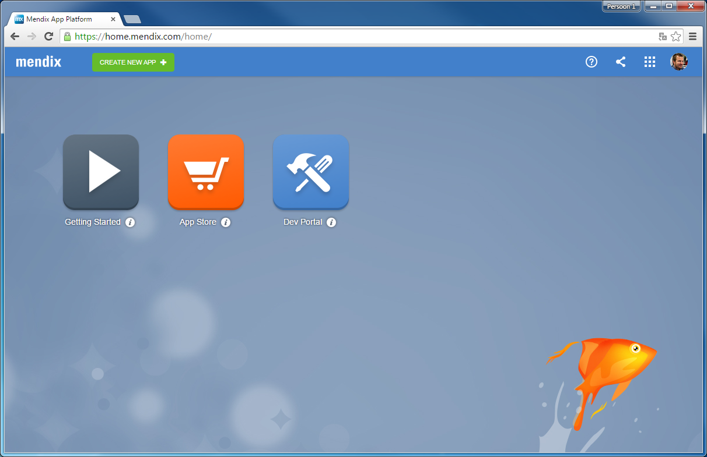

    The launchpad is the central starting point to use, share and build apps.
2.  Click on the **Dev Portal** app.
    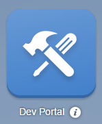

    The Dev Portal is your starting point for Mendix Development. Here you can collaborate and manage the lifecycle of your app(s).
3.  Click **CREATE NEW APP**.
    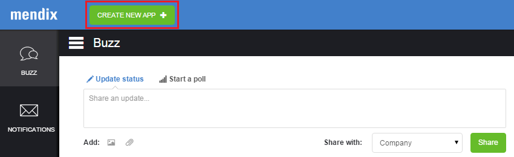 
4.  Select a **theme**. We use _Blue Wave_ in this how-to. Click [here](https://www.mendix.com/blog/the-eye-catching-mendix-ui-framework/) to learn more about themes.
    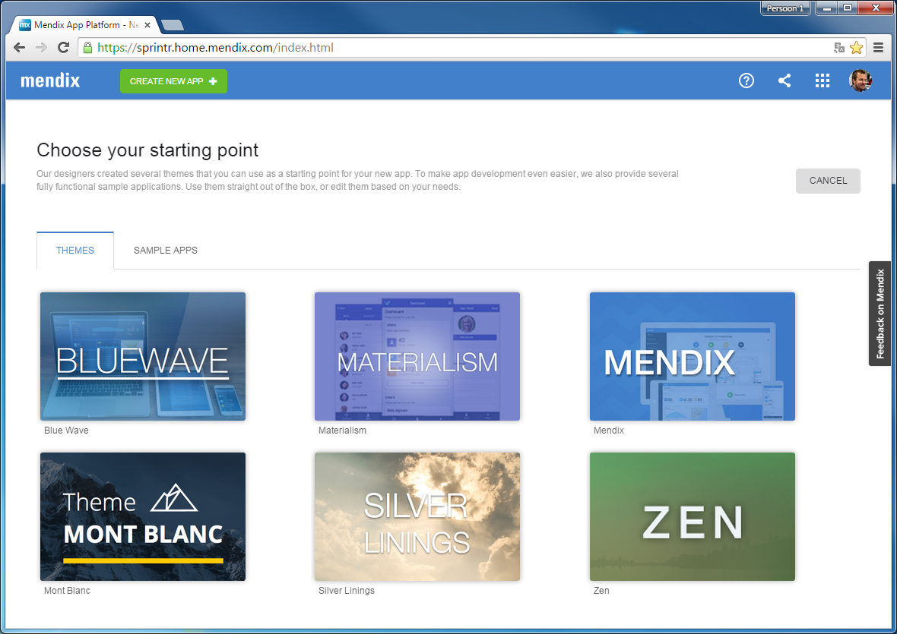 
5.  Click **USE THIS THEME**.
     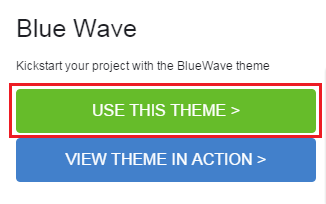
6.  Enter the name of your application.
    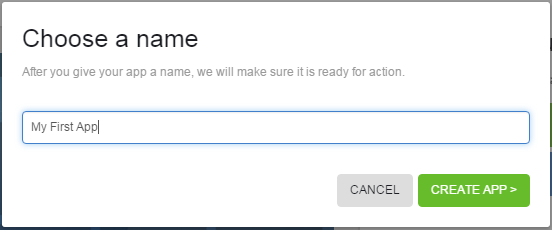 
7.  Click **CREATE APP**.

    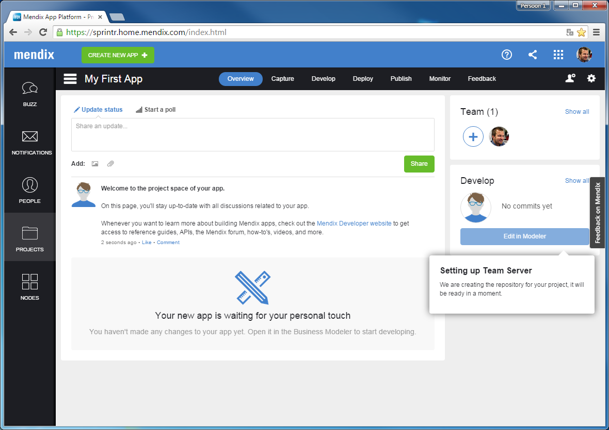

    Your app is created! You will see the overview page of your application. In the middle you can see and share ideas and collaborate with your teammembers. On the right side you can see your teammembers and invite new teammembers to join the project.

## 3\. Manage your app

1.  Click on **Capture**.
    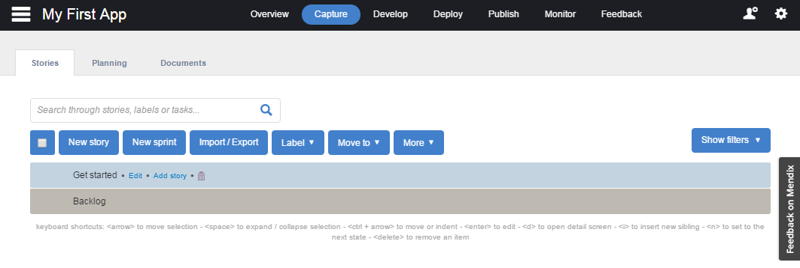
    On this page you can plan the development of your app by adding sprints and stories. Click [here](/developerportal/howto/managing-your-application-requirements-with-mendix) to learn how to manage your application requirements in Mendix by creating and configuring sprints and stories.
2.  Click on **Develop**.
    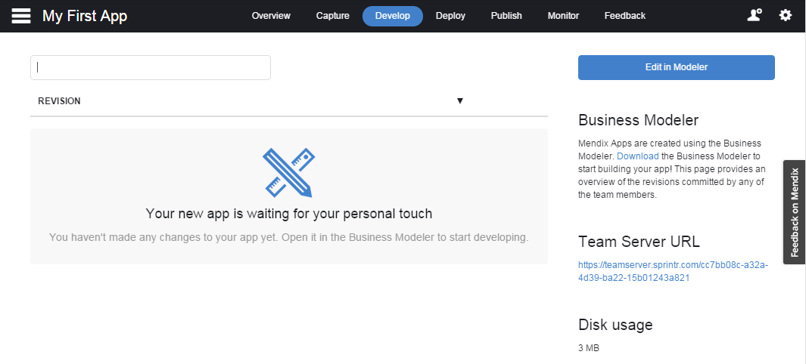
    On this page you can see the latest revisions to your app, done through the use of version control.
3.  Click on **Deploy**. 
    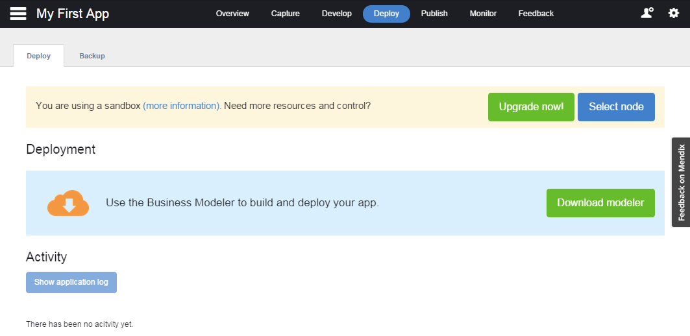
    On this page you can see the status of your free sandbox or your licensed cloud node. By default every app gets a free sandbox. In this how-to you will deploy your app to the sandbox. When you create an app in the Dev Portal, the development content is stored in the team server repository.
4.  Click on **Download Modeler**.
    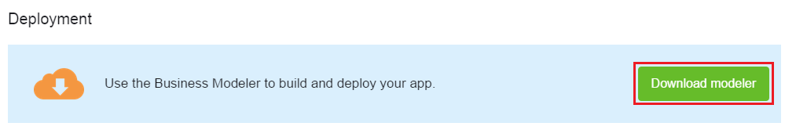 
5.  Click on **Download** and install the Modeler (5.18 or higher).
    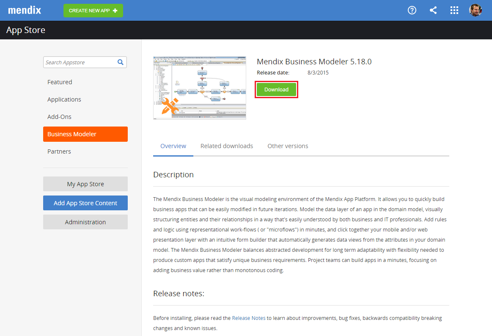 
6.  Go back to the **Dev Portal**.
7.  Click on **Overview**.
    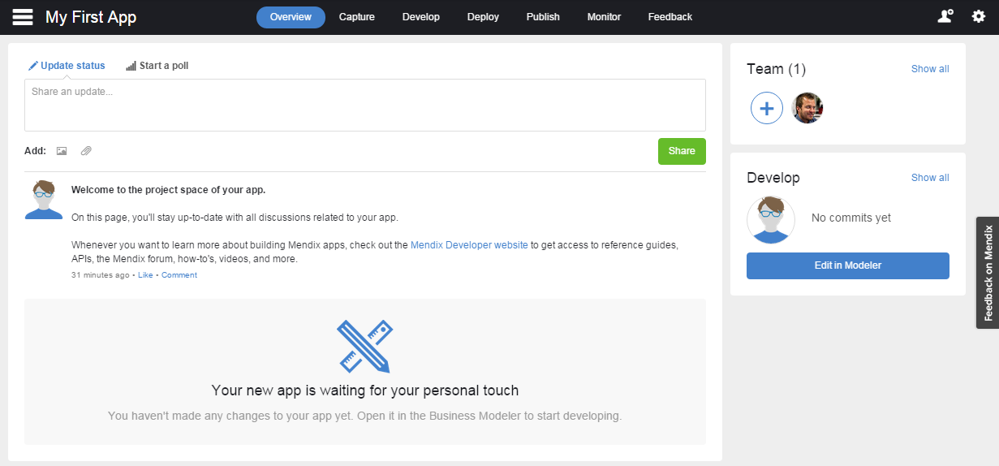 
8.  Click on **Edit in Modeler** to start working on your app.
    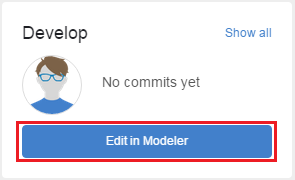

    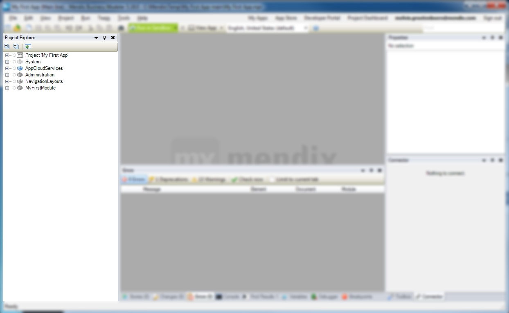
    Your app will be loaded into the Modeler. On the left side in the Modeler you can find the Project Explorer. The Project Explorer lists all of the developer content of your app. Here you can add pages, logic and other content.

    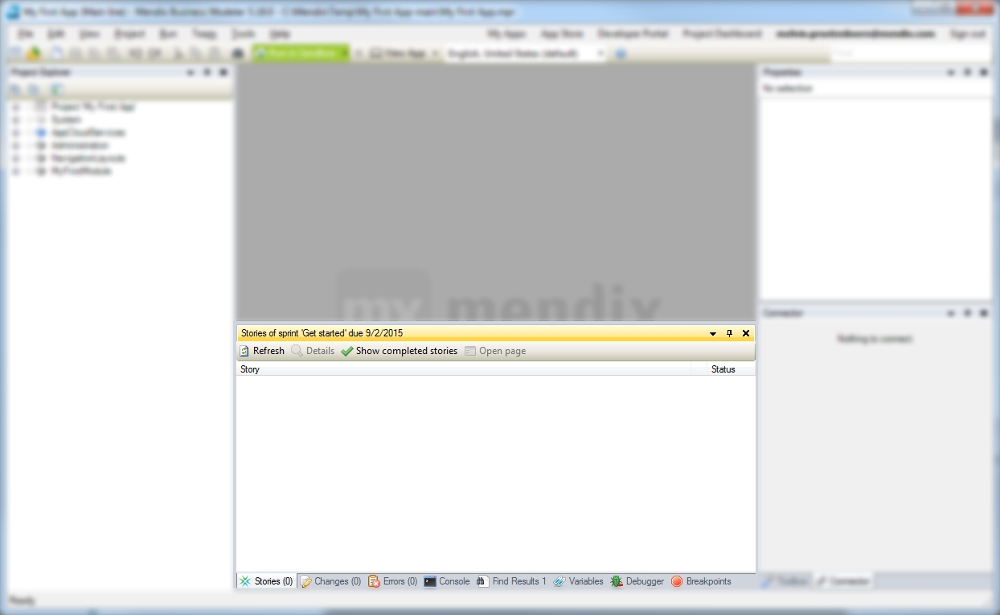

    The Stories Tab in the Modeler displays the stories of the current sprint that you added on the Capture page in the Dev Portal. Any changes you make will instantly be visible in the Modeler as well as on the Capture page.

## 4\. Deploy your app

Let's deploy your app to a sandbox in the Mendix cloud, so others can view and test your app right away.

1.  Click on **Run in Sandbox**.
    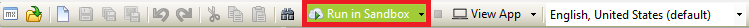
2.  Click on **View App**.
    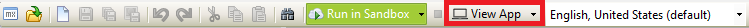

    The default browser will open and your app will be shown.
    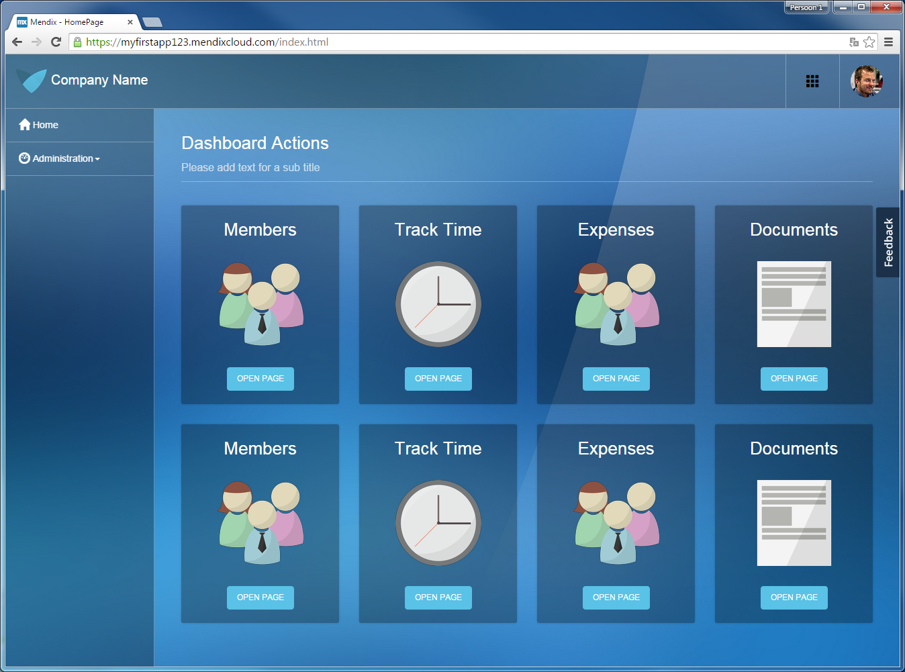

Wow! You deployed your first app! Click [here](build-a-simple-hrm-app-2-first-steps-in-building-a-rich-gui) to go the second how-to on how to create a simple HRM application and learn the first steps in building a rich GUI.

## 5\. Related content

*   [Build a simple HRM app 2: First steps in building a rich GUI](build-a-simple-hrm-app-2-first-steps-in-building-a-rich-gui)
*   [Build a simple HRM app 3: Show related data in the GUI](build-a-simple-hrm-app-3-show-related-data-in-the-gui)
*   [Build a simple HRM app 4: Enrich the GUI with Filter Options](build-a-simple-hrm-app-4-enrich-the-gui-with-filter-options)
*   [Build a simple HRM app 5: Smarten up your app with business logic](build-a-simple-hrm-app-5-smarten-up-your-app-with-business-logic)

Learn more about this topic using the following helpful links:
s
*   [Build a simple HRM app 2: First steps in building a rich GUI](build-a-simple-hrm-app-2-first-steps-in-building-a-rich-gui)
*   [The Eye-Catching Mendix UI Framework](https://www.mendix.com/blog/the-eye-catching-mendix-ui-framework/)
*   [Managing your Application Requirements with Mendix](/developerportal/howto/managing-your-application-requirements-with-mendix)
