This how-to is based on the video "Build a simple HRM app: First steps in building a rich GUI", which is part of the [Getting Started videos](http://gettingstarted.mendixcloud.com/link/courses/gettingstarted).

This is the second how-to in a series of five on how to create a simple HRM application. In this how-to you will learn how to build pages to manage employees in your application.

**After completing this how-to you will know:**

*   How to create a domain model.
*   How to build pages.

## 1. Preparation
Before you can start with this how-to, make sure you have completed the following prerequisites.

*   [Build a simple HRM app 1: Create, manage and deploy the app](build-a-simple-hrm-app-1-create-manage-and-deploy-the-app)

## 2\. Create a domain model

The domain model is a data model that describes the information in your application domain in an abstract way. It is central to the architecture of your application. The domain model consists of entities and their relations represented by associations.

1.  Open the **Domain Model** of the MyFirstModule module.
    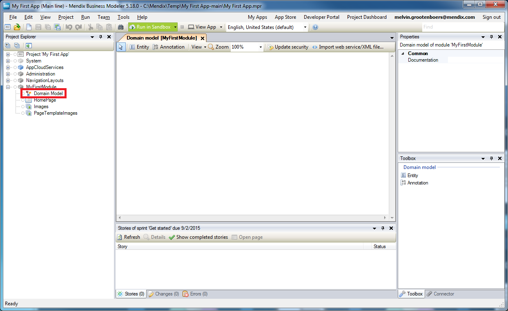 
2.  Click on **Entity** to create a new entity. Click [here](/refguide5/entities) to learn more about entities.
    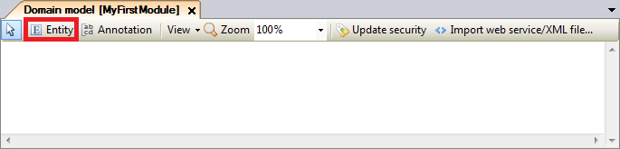 
3.  Double-click on the new entity.
    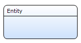
4.  Enter _Employee_ in the **Name** field.
    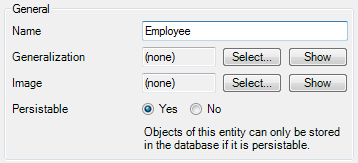
5.  Click on **New** to add a new attribute. Click [here](/refguide5/attributes) to learn more about attributes.
    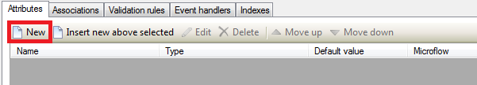
6.  Enter _Name_ in the **Name** field.
    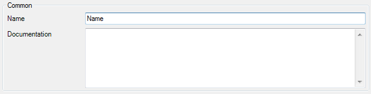
7.  Select **String** as the **Type** dropdown.
    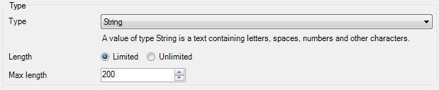
8.  Click **OK**.

9.  Repeat steps 4 through 7 for the following attributes:

    <table><thead><tr><th class="confluenceTh">Name</th><th class="confluenceTh">Type</th></tr></thead><tbody><tr><td class="confluenceTd">Address</td><td class="confluenceTd">String</td></tr><tr><td class="confluenceTd">City</td><td class="confluenceTd">String</td></tr><tr><td class="confluenceTd">State</td><td class="confluenceTd">String</td></tr><tr><td colspan="1" class="confluenceTd">Phone</td><td colspan="1" class="confluenceTd">String</td></tr><tr><td colspan="1" class="confluenceTd">Email</td><td colspan="1" class="confluenceTd">String</td></tr><tr><td colspan="1" class="confluenceTd">DateOfBirth</td><td colspan="1" class="confluenceTd">Date and time</td></tr></tbody></table>

    The entity will look like this:
    

## 3\. Build a page

Pages define the end user interface of a Mendix application. Every page is based on a layout. A page fills the 'gaps' defined by a layout with widgets such as the data view and the data grid.

### 3.1 Add a page

1.  Right-click on the **MyFirstModule** module.
2.  Click on **Add > Page**.
    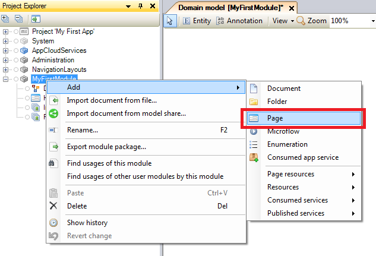 
3.  Enter _Employee_Overview_ in the **Page name** field.
4.  Click on **Master Detail**.
5.  Select **Master detail big**.
6.  Select _Sidebar_Left_ in the **Navigation layout** dropdown.
    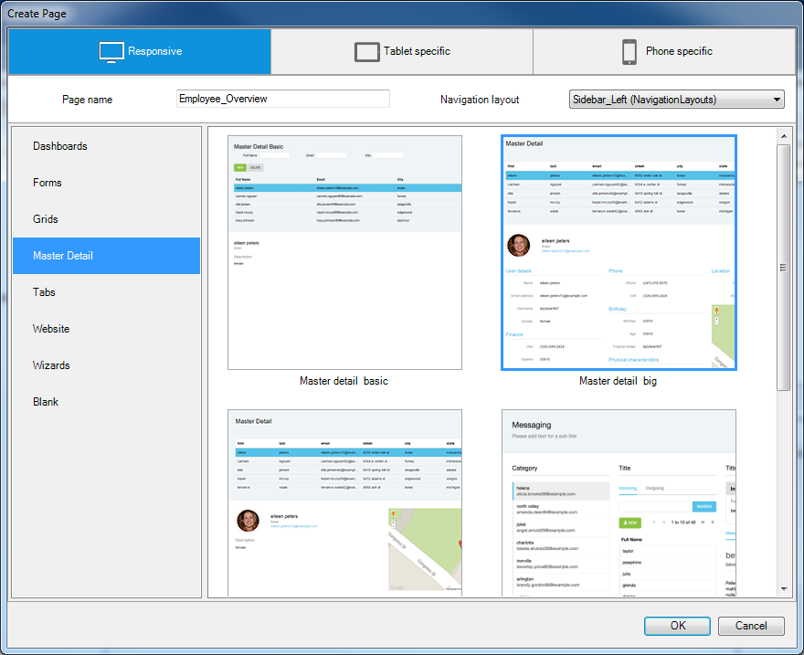 
7.  Click **OK**.
8.  Click on the data grid below the label Master Detail.
9.  Drag-and-drop the entity **Employee** from the connector to the data grid.
    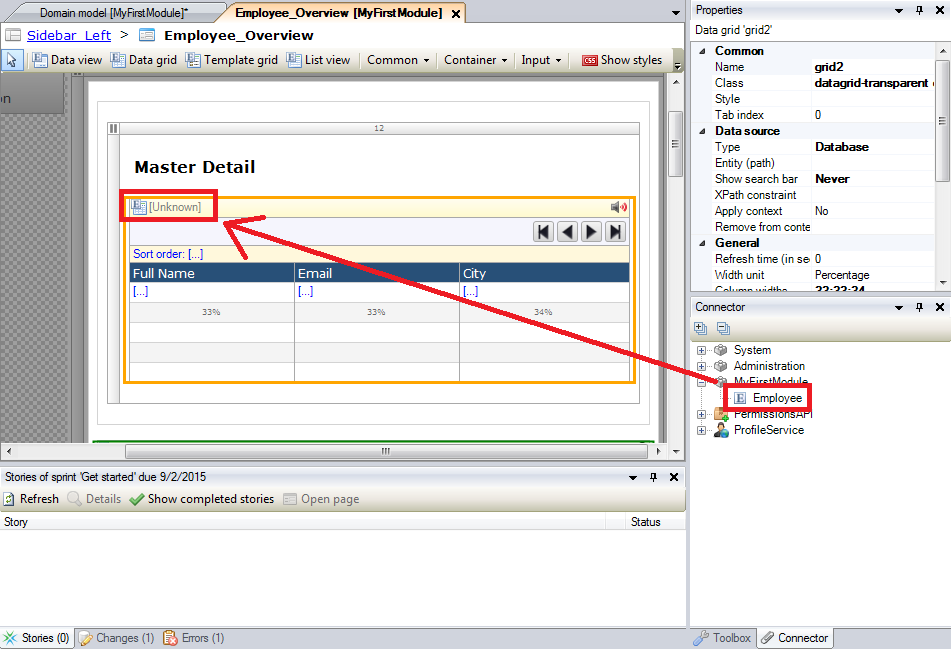
10.  Deselect the **Auto-Fill** option.
     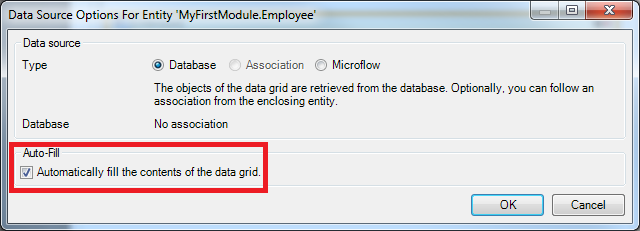
11.  Click **OK**.

### 3.2 Add attributes to your page

1.  Double-click on the **Full Name** column.
2.  Click on the **Select** button.
     
3.  Select the attribute **Name**.
    
4.  Click **Select** to select the attribute.
5.  Click **OK**.
6.  Repeat steps 1 through 5 for the following columns with corresponding attributes:

    <table><thead><tr><th class="confluenceTh">Caption Column</th><th class="confluenceTh">Attribute</th></tr></thead><tbody><tr><td class="confluenceTd">Email</td><td class="confluenceTd">Email</td></tr><tr><td class="confluenceTd">City</td><td class="confluenceTd">City</td></tr></tbody></table>
7.  Double-click the first text box below the image.
    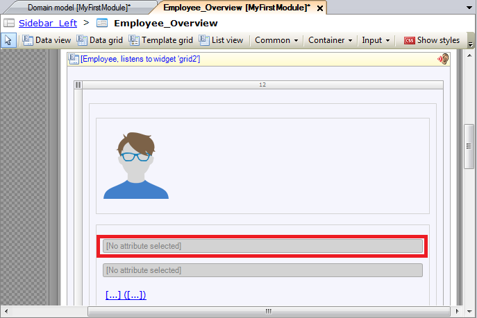

8.  Click **Select** to select an attribute.
    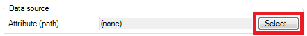 
9.  Select attribute **Name**.
10.  Click **Select** to select the attribute.
11.  Click **OK**.
12.  Repeat steps 7 through 11 for the second text box and select attribute **Email**.
13.  Delete the link button.
    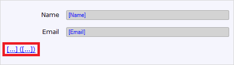
14.  Click on the **Name** text box in the user details container.
    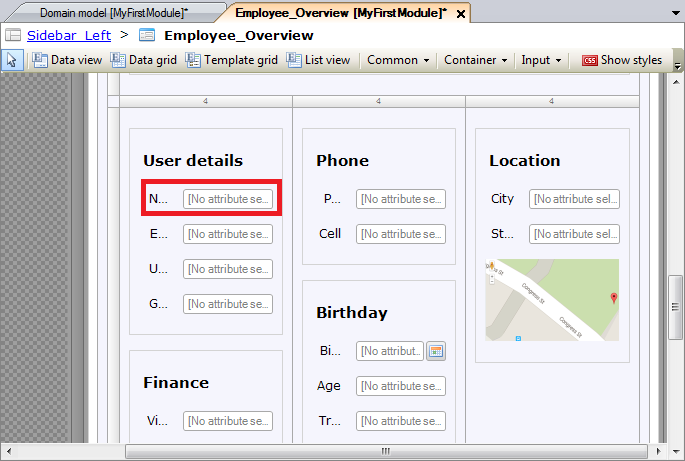 
15.  Drag-and-drop the attribute **Name** from the connector to the Name field in the User details container.
    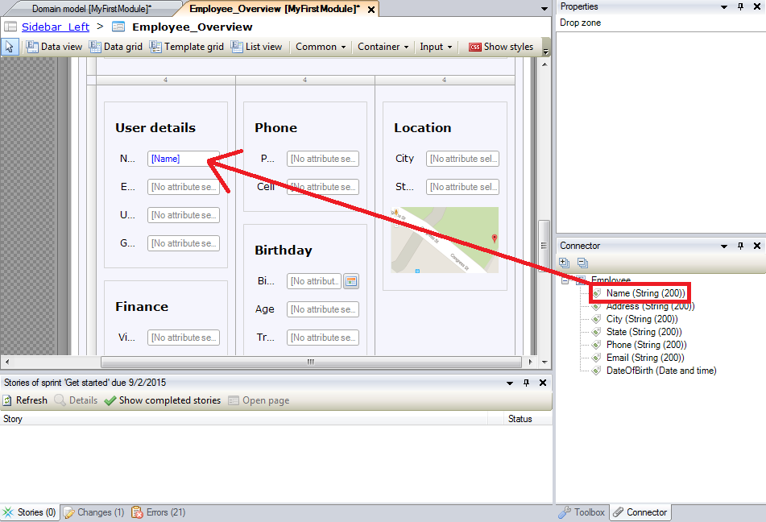 
16.  Drag and drop the following attributes to their corresponding:

<table><thead><tr><th class="confluenceTh">Attribute</th><th class="confluenceTh">Field</th><th colspan="1" class="confluenceTh">Container</th></tr></thead><tbody><tr><td class="confluenceTd">Email</td><td class="confluenceTd">Name</td><td colspan="1" class="confluenceTd">User details</td></tr><tr><td class="confluenceTd">Phone</td><td class="confluenceTd">Phone</td><td colspan="1" class="confluenceTd">Phone</td></tr><tr><td class="confluenceTd">DateOfBirth</td><td class="confluenceTd">Birthday</td><td colspan="1" class="confluenceTd">Birthday</td></tr><tr><td colspan="1" class="confluenceTd">City</td><td colspan="1" class="confluenceTd">City</td><td colspan="1" class="confluenceTd">Location</td></tr><tr><td colspan="1" class="confluenceTd">State</td><td colspan="1" class="confluenceTd">State</td><td colspan="1" class="confluenceTd">Location</td></tr></tbody></table>

17.  Delete the containers and input fields that are not being used.
    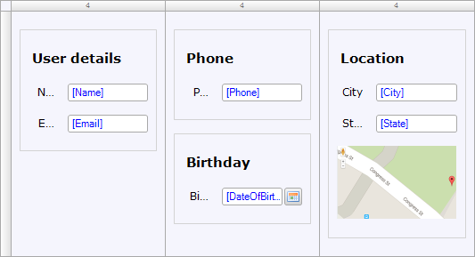 

### 3.3 Add buttons to your page

To create or delete employees, you need to add a button to the data grid.

1.  Right-click on the grid control bar of the data grid.
2.  Click on **Add button > New**.
    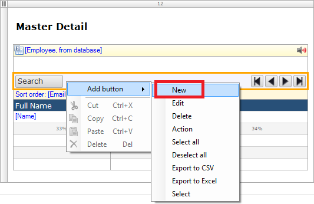 
3.  Right-click on the grid control bar of the data grid.
4.  Click on **Add button > Delete**.
     

### 3.4 Generate a page

1.  Right-click on the **New** button.
2.  Click on **Generate page**.
    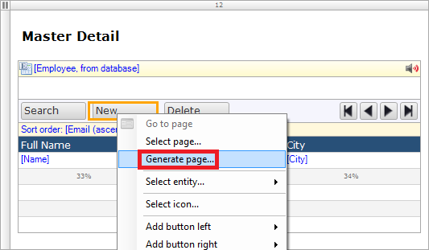 
3.  Enter _Employee_NewEdit_ in the **Page name** field.
4.  Select **Form basic horizontal**.
5.  Select _PopupLayout_ in the **Navigation layout** dropdown.
    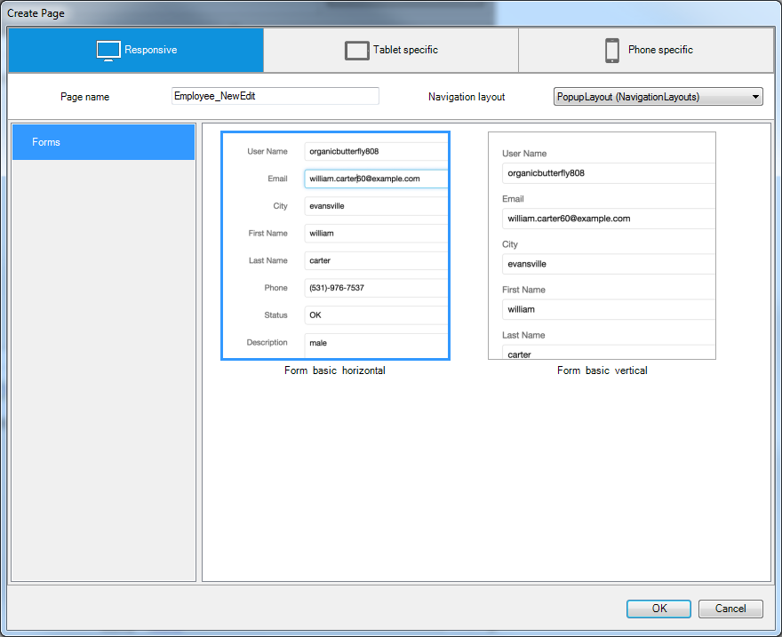 
6.  Click **OK**.
    The new page will be shown in the project explorer.
    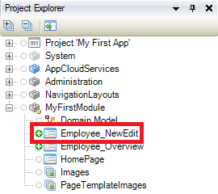

### 3.5 Create a menu item for your page

To view a page in your app, you need to add a menu item so you can navigate to the page.

1.  Open the **Navigation** of the project.
    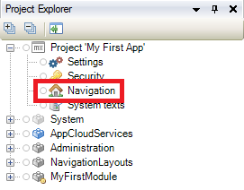 
2.  Click **New item** to add a new menu item.
    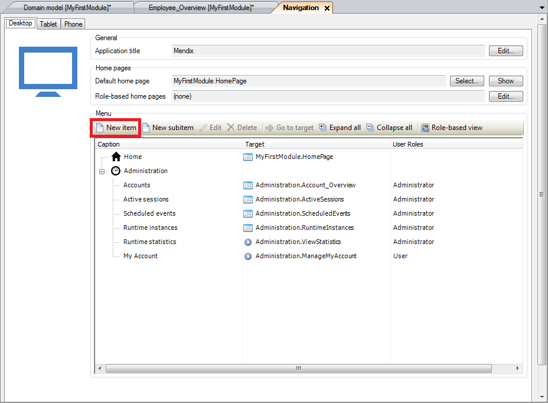 
3.  Enter _Employees_ in the **Caption** field.

4.  Click **Select** to select a target.
    
5.  Select the **Employee_Overview** page of the MyFirstModule module.
    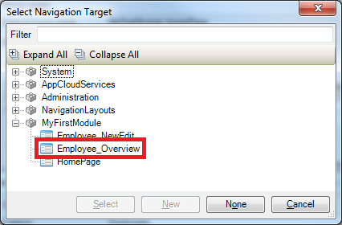
6.  Click **Select**.
7.  Click **OK**.
    The Employee Overview page will be shown in the navigation list.
    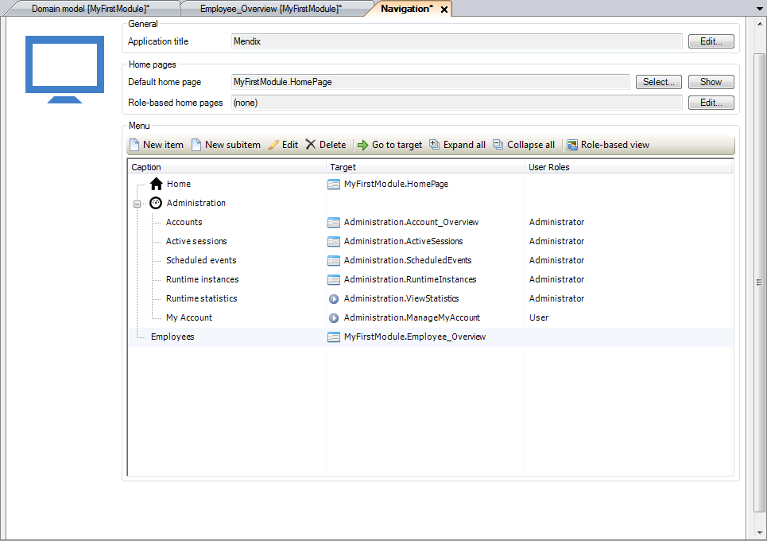 

## 4\. View your app  

1.  Click on **Run in Sandbox**.
    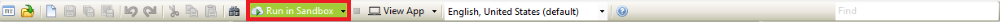
2.  Click on the **Save and continue** button.
3.  Click on **View App**.
    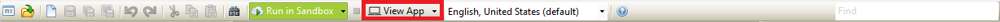

    At the left side of your app the menu item _Employees_ is shown.
    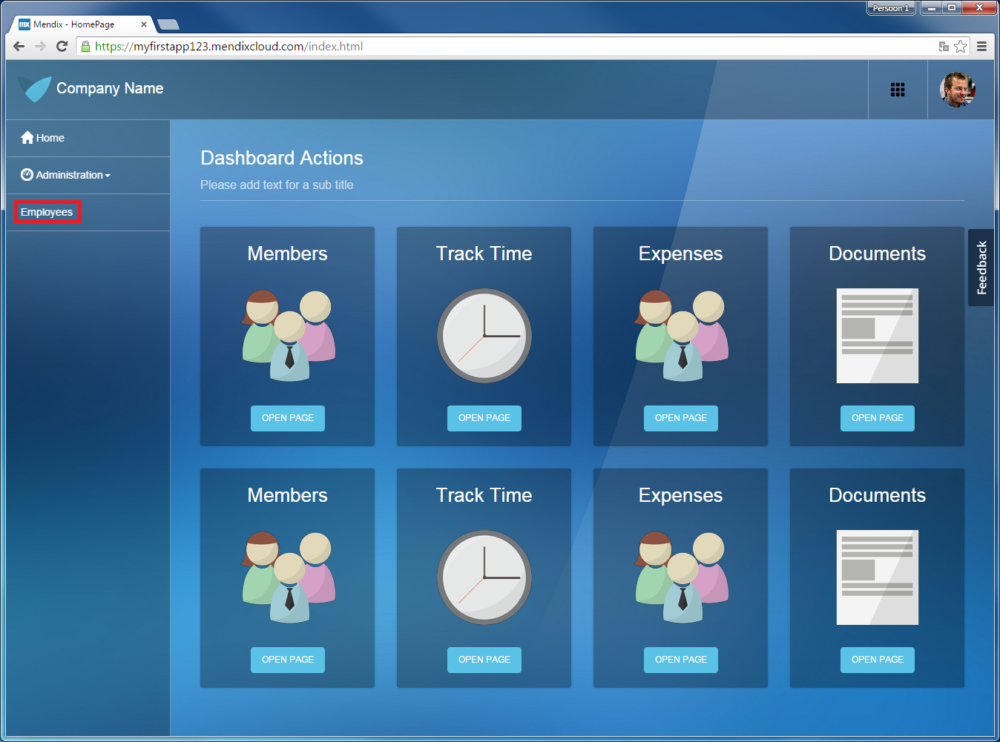 
4.  Click on **Employees**.
    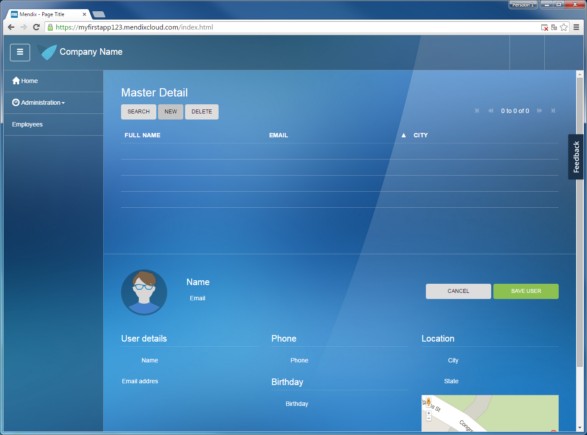

You can now add and edit employees! Click [here](build-a-simple-hrm-app-3-show-related-data-in-the-gui) to go the third how-to on how to create a simple HRM application and learn how to show related data in the GUI.

## 5\. Related content

*   [Build a simple HRM app 1: Create, manage and deploy the app](build-a-simple-hrm-app-1-create-manage-and-deploy-the-app)
*   [Build a simple HRM app 3: Show related data in the GUI](build-a-simple-hrm-app-3-show-related-data-in-the-gui)
*   [Build a simple HRM app 4: Enrich the GUI with Filter Options](build-a-simple-hrm-app-4-enrich-the-gui-with-filter-options)
*   [Build a simple HRM app 5: Smarten up your app with business logic](build-a-simple-hrm-app-5-smarten-up-your-app-with-business-logic)

Learn more about this topic using the following helpful links:

*   [Domain Model](/refguide5/domain-model)
*   [Entities](/refguide5/entities)
*   [Pages](/refguide5/page)
*   [Setting Up the Navigation Structure](setting-up-the-navigation-structure)
*   [New button](/refguide5/new-button)
*   [Delete button](/refguide5/delete-button)
