This how-to explains how you can consume a (third party) web service to integrate your Mendix application with, and reuse functionality and data from other applications. Web services are the preferred way of integrating a Mendix application with external systems. They can be used to retrieve data, send updates and perform operations. In Mendix, calling a web service is something you do in a microflow using the Call Web Service action.

## 1\. Importing a web service using the wizard

This how-to section will first describe the powerful wizard which enables you to integrate in a few clicks, creating an imported web service, related data entities, xml-mapping and microflow to trigger the actual web service.

1.  Open your domain model and click **Import web service/XML file...** in the toolbar. 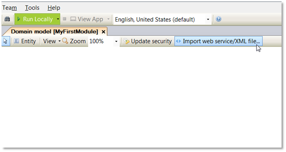
    This will open a straightforward wizard dialog which enables and guides you through importing the result of a web service (or an XML file). As a result it will generate: (1) Domain model entities to store the results, (2) an XML-to-domain mapping that maps the incoming XML to Mendix objects, (3) an imported web service (or XML schema) document and (4) a microflow that calls  the web service (or imports an XML file) (optional).
2.  Select **Web service operation** and click **Next**.
    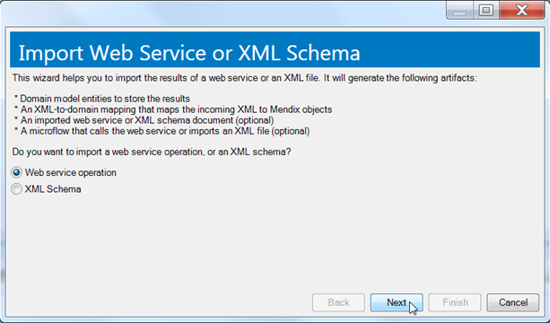
3.  Select **Create new imported web service** and click **Next.
    **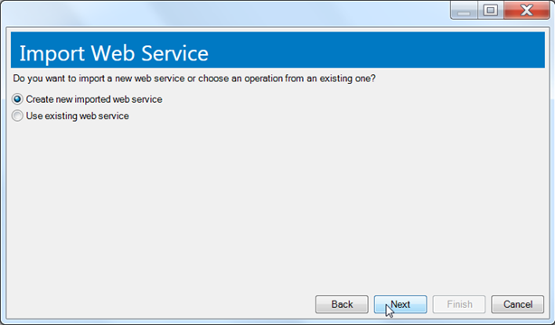
4.  At **WSDL source** under **Web service description**, select the WSDL to be used for this imported web service. You can either choose to use a URL, or load a file from your computer.
    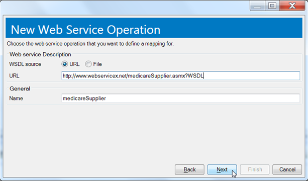
5.  Click **Next** to fetch the services and operations in the WSDL.
6.  You can now review the services and operations available to the imported web service. Select a web service operation and click **Next**.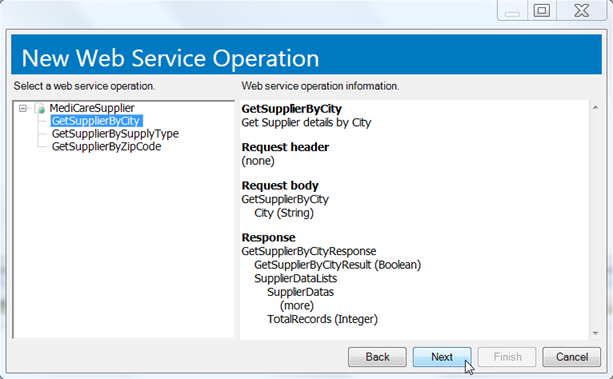
7.  Optionally select the elements that you would like to map as returnvalues of the web service and click **Next**.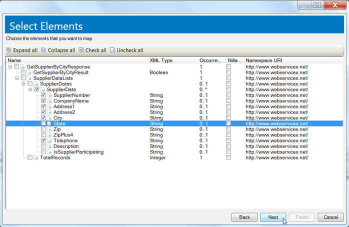
    The final step in this wizard provides you with the option to create a microflow in which the imported web service is called and the option to add icons to the generated entities.
8.  Click **Finish** to create the web service.
    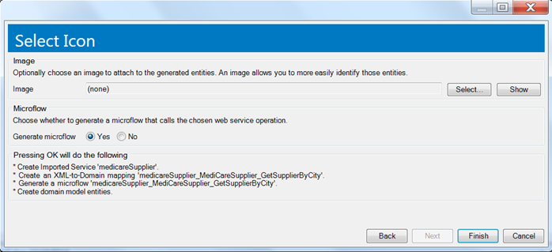

### 1.1 Outcome

When finished the wizard will add to your model, based upon the options selected:

*   The Imported Service
*   An XML to domain mapping
*   A microflow in which the web service operation is called
*   Domain model entities. By default the Mendix Modeler creates non-persistent entities.

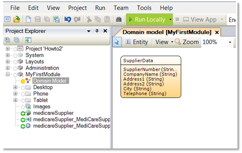

## 2\. Importing a webservice directly

An alternative to using the described Wizard is importing a web service document directly into your project.

1.  Add an **Imported web service** to your project.
2.  Double-click on the imported web service in the Project Explorer to start configuring it.
3.  You can change the name of the published web service at **Name**, whereas **Documentation** allows input of text describing the design purpose of the web service.
    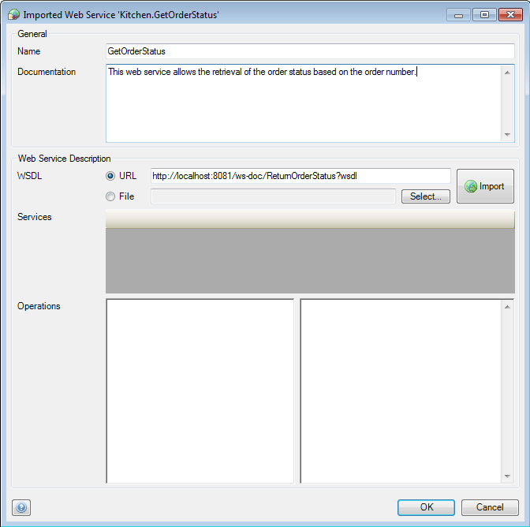
4.  At **WSDL** under **Web service description**, enter the WSDL to be used for this imported web service. You can either choose to use a URL, or load a file from your computer. After this, click **Import** to fetch the services and operations in the WSDL.
5.  You can now review the services and operations available to the imported web service in the bottom sections of the window.
    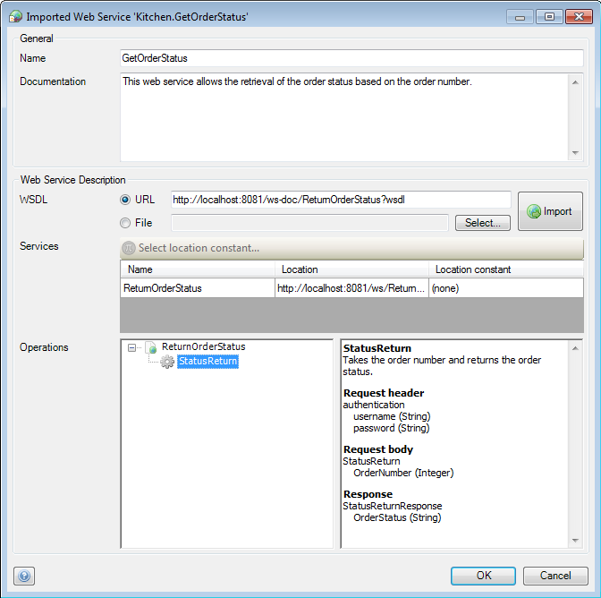

## 3\. Configuring the web service call

1. If you have not used the web service wizard, or have not used the option within this wizard to automatically create a microflow, you have to create a microflow which you will use to call the imported web service.
    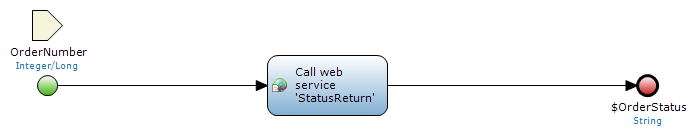

    Make sure the microflow either creates the variables required as arguments for the web service call, or has those passed to it.

2. If you are creating your own microflow add the **Call web service** activity to the microflow.
    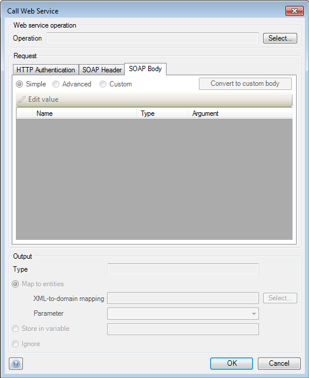
3.  Click **Select...** to bring up a window allowing you to choose the operation you want to use for this web service call.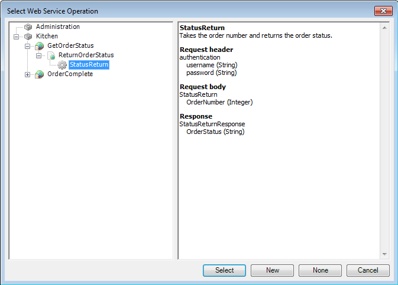
4.  In the **Request** section you can configure the SOAP body, which contains the parameters needed to execute the web service request. The radio buttons allow you to choose the type of SOAP body to use. Use the **Edit value** button to change the Domain-to-XML mapping or the variables from the microflow used as input arguments.
    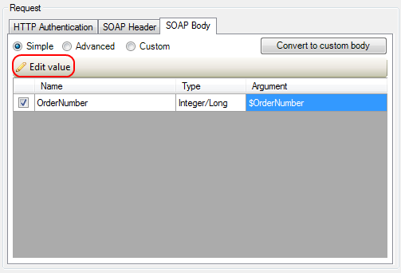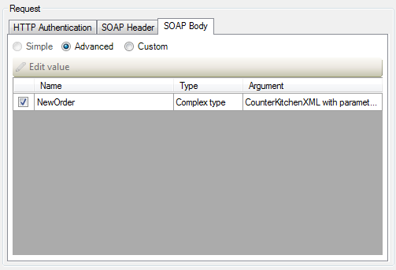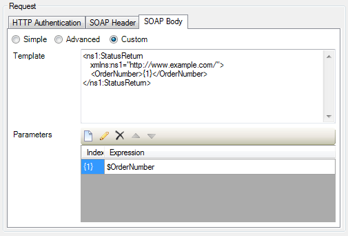
    Use the **Simple** option if the imported web service requires only primitive arguments. If the web service call needs a list of objects, or if domain model entities need to be mapped to XML elements, the **Advanced** setting can be used. Finally, **Custom** allows for the definition of a custom XML body with parameters.
5.  If the imported web service requires authentication, use the **SOAP Header** tab to enter the authentication information using the **Edit value** button.
    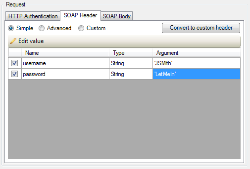
    Again there are three input options. The **Simple** option can be used if only static values or variables from the microflow need to be passed to the imported web service. If a Domain-to-XML mapping is needed for authentication, the **Advanced** option should be used. Finally, the **Custom** option allows for the definition of a custom XML header with the possibility to specify parameters.
6.  Use the **HTTP Authentication** tab to enter HTTP authentication information if the Mendix Runtime should use this before calling the web service.
    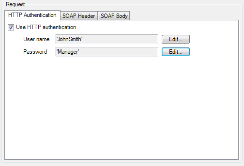
7.  Finally, in the **Output** section, you can configure the handling of the return from the web service call. If the return is a primitive, you can store it in a variable which you can name at **Store in variable**. If the return is a complex XML structure, you can use an XML-to-Domain mapping to map the XML elements to domain model entities. You can also choose to ignore the return.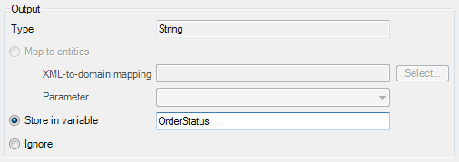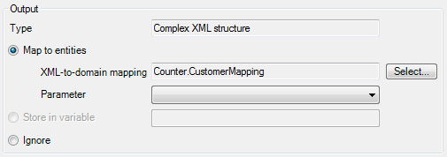
8.  Your imported web service is now ready to be used in your application.
