With the REST services module from the Mendix Appstore, the full power of JSON-based REST APIs is available to Mendix developers. The module serves three goals: consuming services, publishing services and synchronizing data between (Mendix) apps by combining consume and publish. In this how-to, you will consume a JSON-based REST services by integrating with the API of the world famous Rijksmuseum which allows us to search for art.

**After this how-to you will know:**

*   How to create a GET REST Service
*   How to create a POST REST Service

## 1. Preparations

In this chapter you will download the REST module from the App store and test your service in the browser first. The service tested in this how-to is the API of the Rijksmuseum to search for art. You will be consuming the following endpoint https://www.rijksmuseum.nl/api/en/collection/?key=<key>&format=json&q=<search query>.

{}

To use this service you need to create an account at [https://www.rijksmuseum.nl](https://www.rijksmuseum.nl/) to obtain an API key at their website. You can also perform the steps of this how-to using your own REST service.

{}

1.  Open the **Mendix Modeler**.
2.  Open the **App Store**.
3.  Download the latest **REST Services** module from the App Store.
    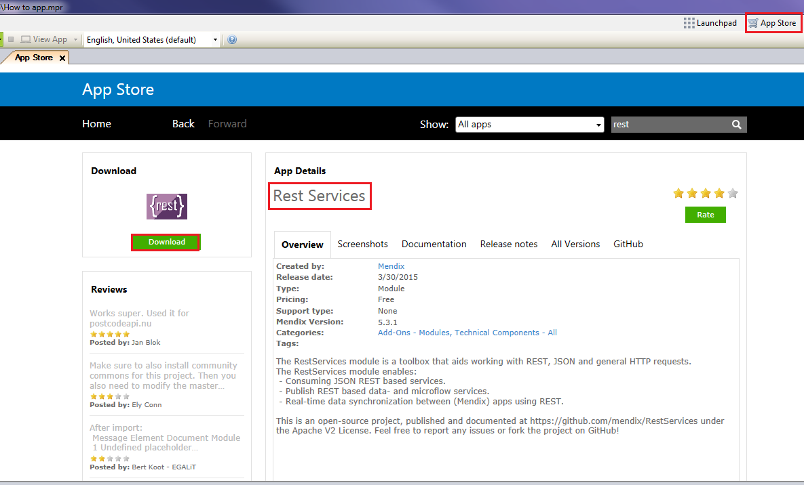
4.  Download the latest **Community Commons Functions Library** module from the App Store.
    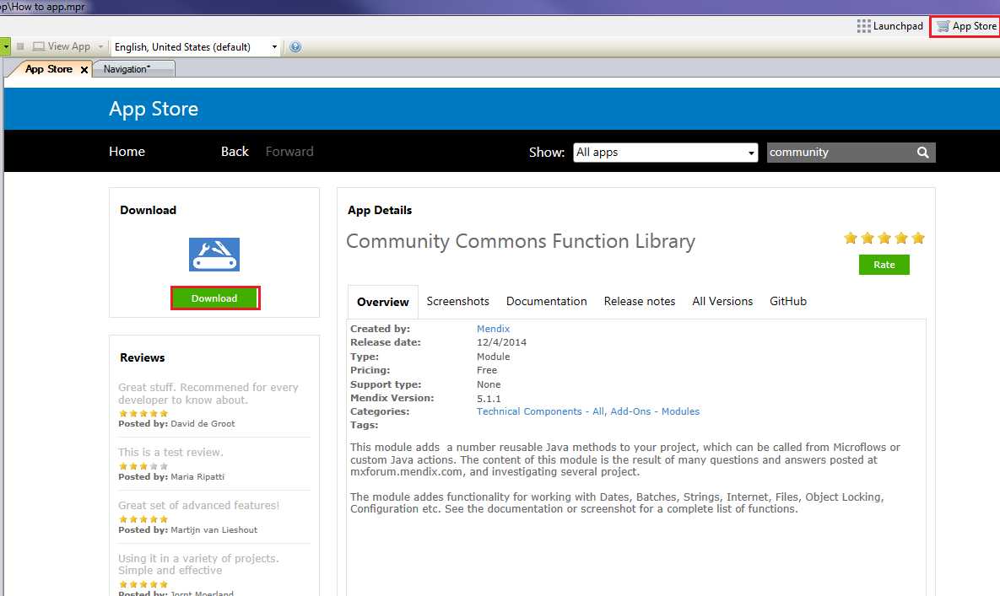
5.  Test your service in the browser by filling in both fields in the URL stated above (you can use _Van Gogh_ as example search query), this should result in something similar to the following JSON fragment: 
    

## 2\. Creating a Data Model for the REST Service

In this chapter you will define a data model to consume this service. You will create a Query entity to store the search request, and a Results object to store the result. Then you will add all interesting pieces of the result JSON to your domain model, in such a way that it reflects the structure of the JSON response, according to the JSON deserialization rules described [here](https://github.com/mweststrate/RESTServices#json-deserialization).

{ = Object

[{ = List of objects

[ = List: To be able to map a list of String-/Float-/Boolean values, you need to set a many to many association to the **Primitive** entity in your **RestServices** module, or a subclass of the **Primitive** entity.

1.  Create a non-persistable **Query** object and name the attribute the same as the query parameter (case sensitive).
    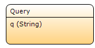
2.  Create a non-persistable **Results** object to store the result and link it to the **Query** entity to be able to display the results in the interface.
    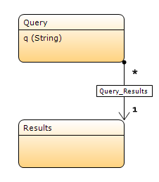
    Create your entity structure based on the JSON structure, starting from the **Results** entity. Make sure you rename the association to the name of the JSON object.

3.  Create a non-persistable entity called **ArtObject** with two attributes:
    - **title**
    **- principalOrFirstMaker**
4.  Create a **many to many** (*-*) association between the **Results** entity and the **ArtObject** entity.
5.  Rename to association to **artObjects**.
    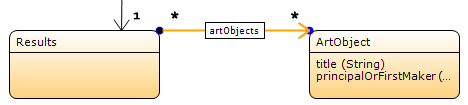
6.  Create a non-persistable entity called **Image **with one attribute called **url** (string).

7.  Create a **one to many** (1-*) association between the **ArtObject **entity and the **Image** entity and call it **webImage**.
    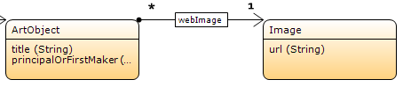
8.  Create a non-persistable entity called **ProductionPlace**.

9.  Make a Generalization to **RestServices.Primitive**.
10.  Create a **many to many** (*-*) association between the **ArtObject **entity and the **ProductionPlace **entity and call it **productionPlaces**.
    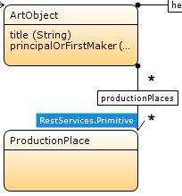

Your Domain Model should look similar to this:

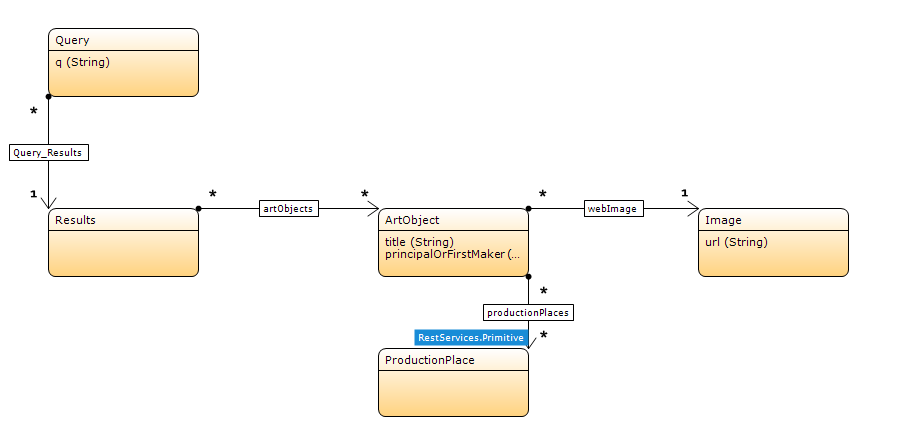

{}

The Association name needs to match the name in the JSON exactly. The name of the entity can be anything you want.

{}

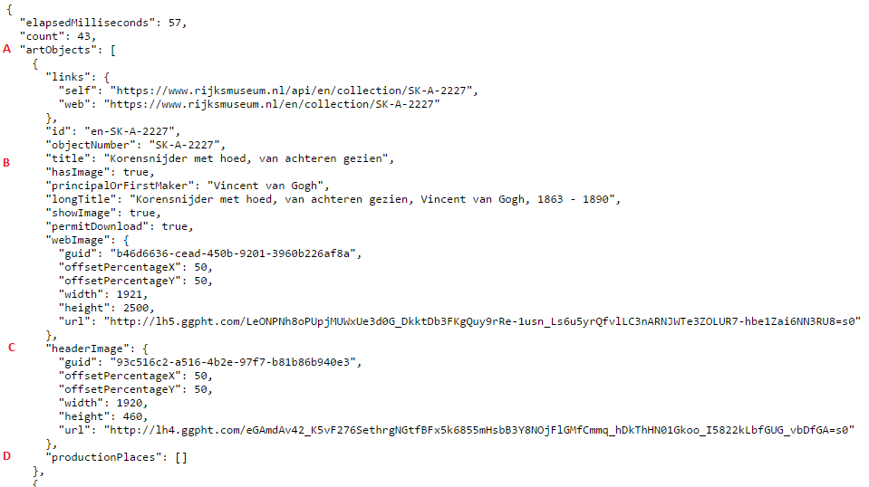 

A: List of objects, association: **artObjects**

B: Attribute **title** of **ArtObject** entity (you can name the entity anything you want, attribute has to be exactly the same)

C: Single object, association: **headerImage**

D: List of strings, association: **productionPlaces**

## 3\. Creating the results page

In the previous section you have created a domain model to map the JSON structure to. In this chapter you will create a page that allows users to enter a search query, show the results in a data grid over the provided association, and add a button that will execute the search for you.

### Using a Microflow as Data Source

1.  Create a new page called **SearchArt**.
2.  Add a **data view** with Data source Type **Microflow**.
    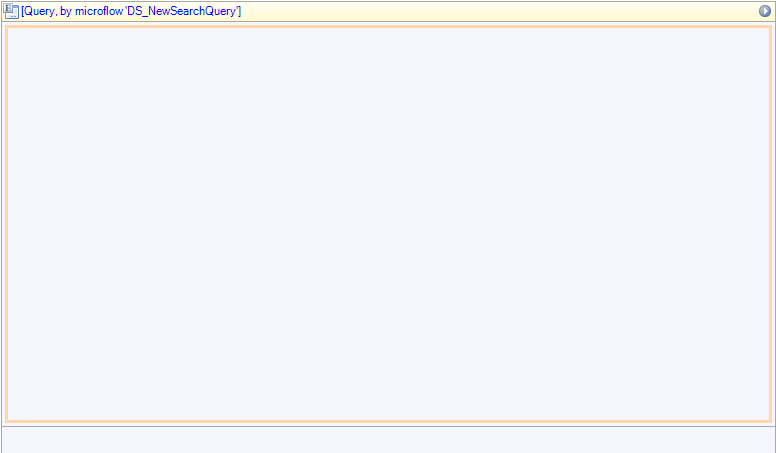
    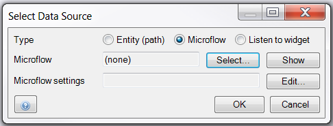
3.  Click **Select...**.
4.  Create a new Microflow and call it **DS_NewSearchQuery**.
5.  Add a **Create object** activity.
6.  Select the **Query** entity.
    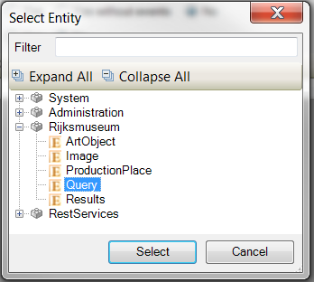
7.  Name it _NewQuery_ and click **OK**.
8.  Open the properties of the End Event and select Type: Object.
    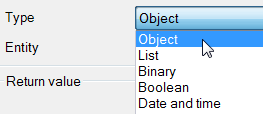
9.  Select the **Query** entity.
10.  Under **Return value** enter _$NewQuery_ and click **OK**.
    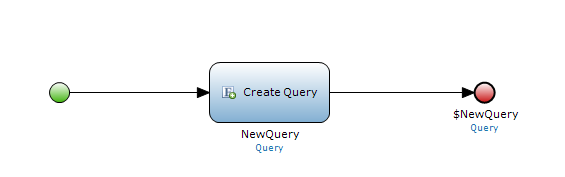
11.  Save the Microflow.

### Creating the Search and Result pages

1.  Go back to the **SearchArt** page.
2.  Add a **Group Box** to the page.
3.  Add a new **table** with three columns.
4.  In the first column enter **Search the Rijksmuseum**.
5.  Add the **Query > q** attribute to the middle column.
6.  Add a Microflow button to the last column.
    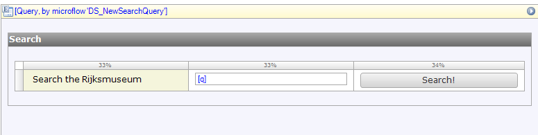
7.  Add a nested **Results** data view inside the **Query** data view and add a nested **ArtObject** template grid inside the **Results** data view. 
    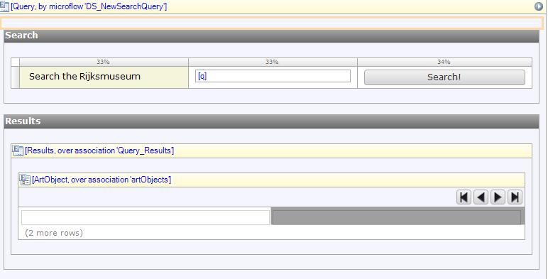
8. Add the following fields to the **ArtObject** template grid.
    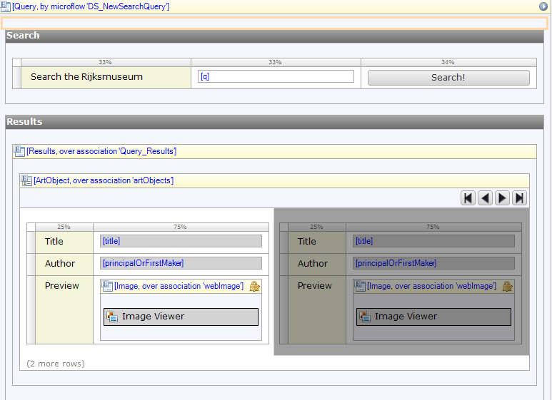

    You can download the **Image Viewer** widget from the Appstore, and add the **url** attribute to the **Image attribute** at the properties section.

    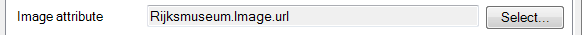

9. Add the created page to your navigation.

## 4\. Consuming the Service using a Get Request

In the previous section you have created a page that allows users to enter the search query, show the results in a data grid over the provided association, and add a button that will execute the search for you. In this section you will consume the service in the Search microflow, using the Get request to retrieve data.

1.  Create a **microflow** with **Query** as input parameter and link it to the **Search** button.
    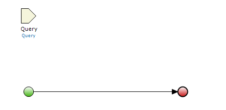
2.  Create a new **Results** object and add the **request** Java Action to the microflow. 

    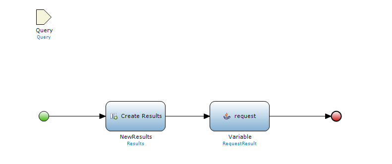
3.  Add a **request** Java Action with the following details:

    <table><thead><tr><th class="confluenceTh">Name</th><th class="confluenceTh">Argument</th></tr></thead><tbody><tr><td class="confluenceTd">method</td><td class="confluenceTd">RestServices.HttpMethod.GET</td></tr><tr><td class="confluenceTd">url</td><td class="confluenceTd">'<a href="https://www.rijksmuseum.nl/api/en/collection/?key=" class="external-link" rel="nofollow">https://www.rijksmuseum.nl/api/en/collection/?key=</a>' + &lt;API_Key&gt; + '&amp;format=json'</td></tr><tr><td class="confluenceTd">optRequestData</td><td class="confluenceTd">$Query</td></tr><tr><td colspan="1" class="confluenceTd">optResponseData</td><td colspan="1" class="confluenceTd">$newResults</td></tr><tr><td colspan="1" class="confluenceTd">sendWithFormEncoding</td><td colspan="1" class="confluenceTd">false</td></tr></tbody></table>

    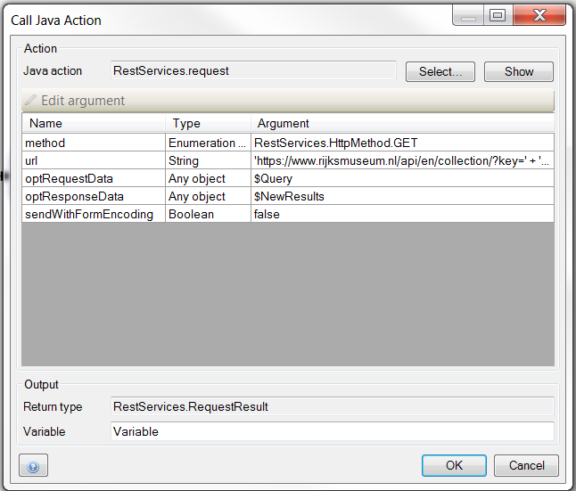

    You have now requested the data from Rijksmuseum and the data has been mapped to your **Results**- and associated entities.

4.  Add a Change object activity and link the **NewResults** object to the **Query** object. This will show the search results on the page.
    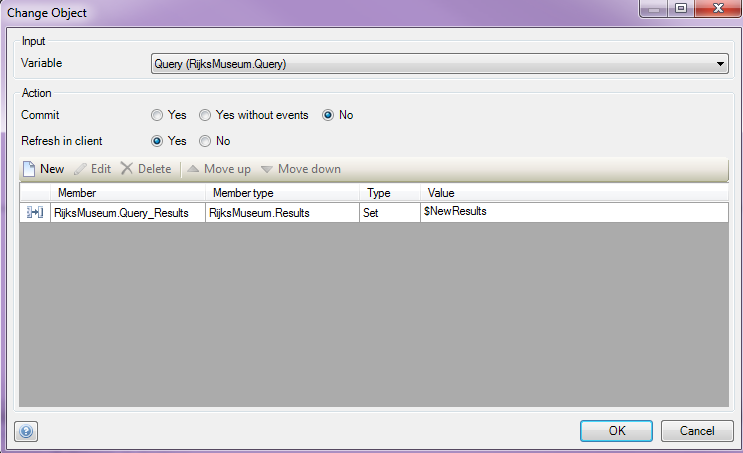
    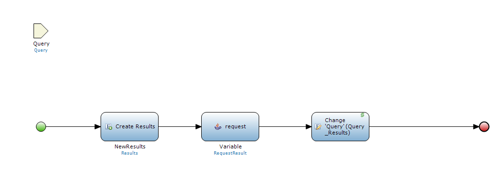
5.  Run your application and search for _van Gogh_. You will see the following results:
    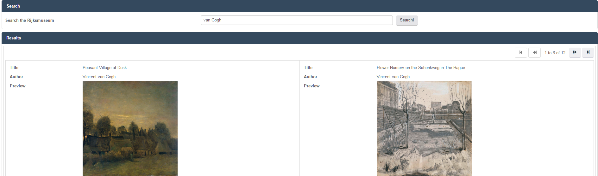

## 5\. Consuming the REST service with a POST request

In the previous sections you have retrieved data from the Rijksmuseum with a GET request. In this section you will create a microflow to hypothetically send data back to the Rijksmuseum. There is no POST service available, but this example demonstrates how you would setup a POST request if there was.

1.  Open the **SearchArt** page.
2.  Add a **Microflow button** to the search page and name it _Update_. 
3.  Add an **Edit button** to the **ArtObject** template grid so you can change data of the result. 

    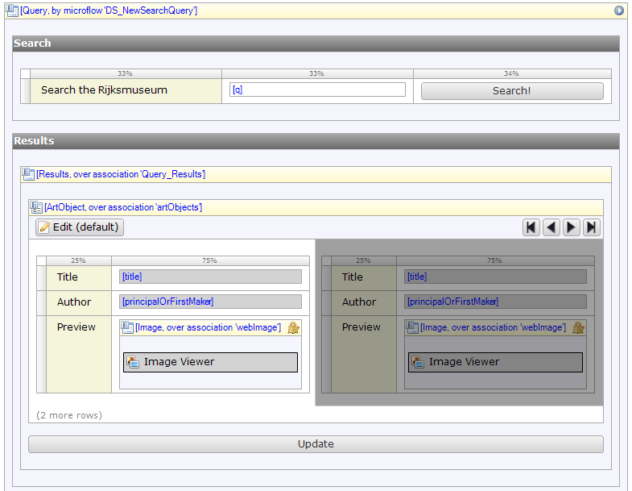
4.  Create a **Microflow** for the Update button and add the following:

    *   Input Parameter: Results
    *   Java action: Request

        <table><thead><tr><th class="confluenceTh">Name</th><th class="confluenceTh">Argument</th></tr></thead><tbody><tr><td class="confluenceTd">method</td><td class="confluenceTd">RestServices.HttpMethod.POST</td></tr><tr><td class="confluenceTd">url</td><td class="confluenceTd">'<a href="https://www.rijksmuseum.nl/api/en/collection/?key=" class="external-link" rel="nofollow">https://www.rijksmuseum.nl/api/en/collection/?key=</a>' + &lt;API_Key&gt; + '&amp;format=json'</td></tr><tr><td class="confluenceTd">optRequestData</td><td class="confluenceTd">$Results&nbsp;(ideally you would name it Request)</td></tr><tr><td colspan="1" class="confluenceTd">optResponseData</td><td colspan="1" class="confluenceTd">Add here the entity you can map the response to (if a response is available from the service)</td></tr><tr><td colspan="1" class="confluenceTd">sendWithFormEncoding</td><td colspan="1" class="confluenceTd">false</td></tr></tbody></table>

        **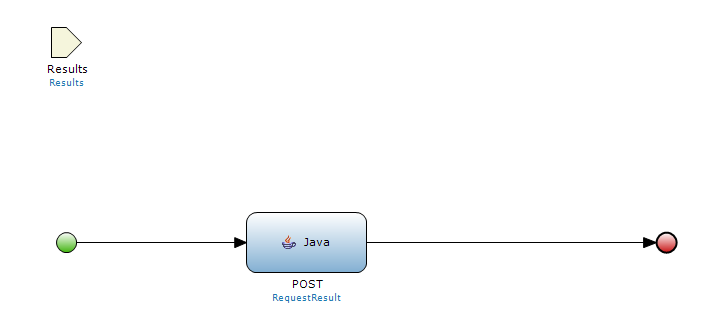**

        If you now change data of one of the objects linked to the **Results** object you are passing on to the microflow, the POST request will update the other system accordingly.

## 6\. Related content

*   [Expose a web service](exposing-a-web-service)
*   [Consume a simple web service](consuming-a-simple-web-service)
