In this how-to we will go through how to create a custom theme with the Mendix UI Framework. For this tutorial the website from Amazon will be used as an example.

**After completing this how-to you will know:**

*   How to create a new App
*   How to setup Scout and the [Mendix UI Framework](https://ux.mendix.com/)
*   How to change custom variables
*   How to create a custom theme based on [Amazon](https://www.amazon.com/)

## 1. Preparation

Before you can start with this how-to, please make sure you have completed the following prerequisites.

*   Download the latest [Mendix Modeler](https://appstore.mendix.com/) (> 5.18.0)
*   Download [Scout](http://mhs.github.io/scout-app/) ([or use a different compiler](http://sass-lang.com/install))
*   Download a preferred text editor like [Sublime Text](http://www.sublimetext.com/)

## 2\. Create a new App in the Mendix Modeler

In this chapter we will create a new app and select a theme from the New App selector.

1.  Open the **Mendix Modeler**.
2.  Create a **New App** from the **My Apps** screen in the Mendix Modeler.

    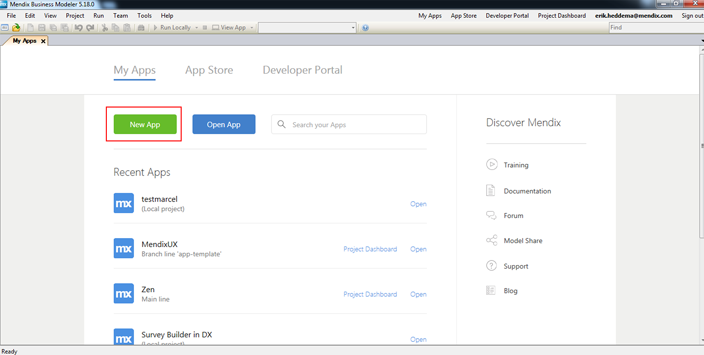
3.  Select the Mendix theme for your app.

    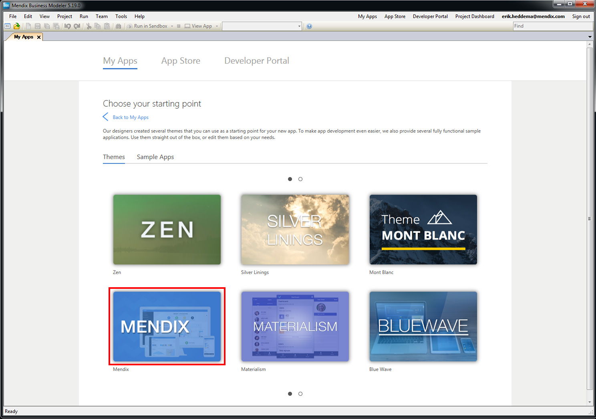

4.  You can now deploy (F5) your app.

    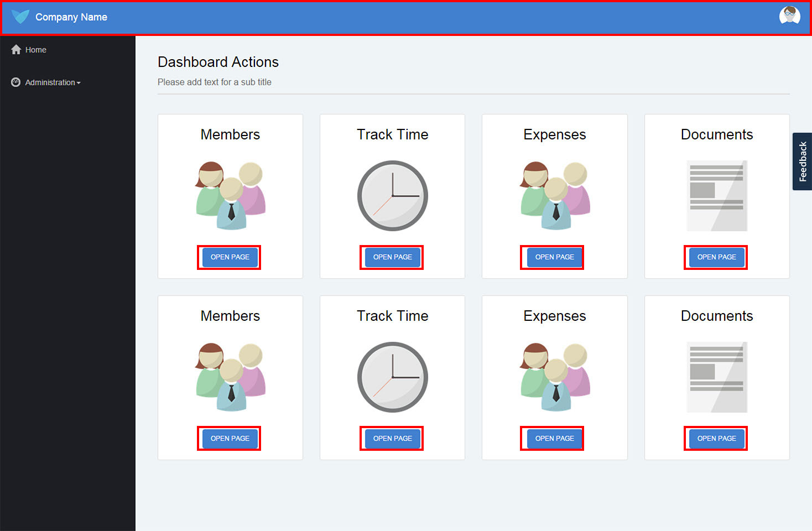 

## 3\. Configure Scout

**Windows 10 users need to use the following workaround. Click [here](scout-and-windows-10-workaround)for the workaround.**

To be able to make changes to the theme we suggest to use [Sass](http://sass-lang.com/) instead of traditional CSS. The Mendix UI Framework uses **Sass**, which relies on Ruby. However, you can install [Scout](http://mhs.github.io/scout-app/) to run Sass in a self-contained Ruby environment, letting you effortlessly manage all of your Sass projects with a handful of clicks. This way you don't have to worry about using the terminal. You can still do this if you are familiar with Sass and terminal.

1.  Open your **App Project Folder** in Scout by clicking on the plus button in the left sidebar all the way at the bottom.

    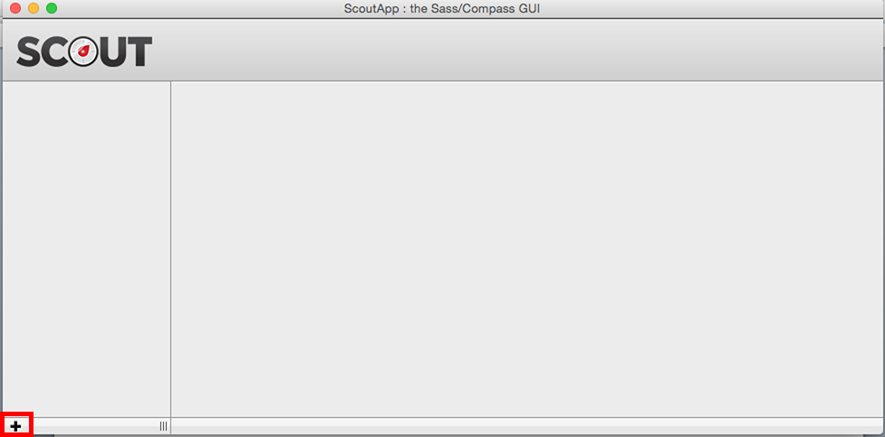
2.  Select the **project directory** from your newly created App.

    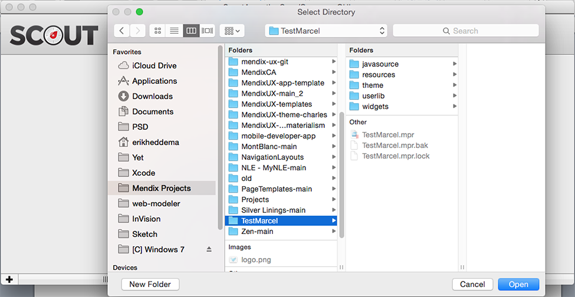
3.  Choose the **Input** and **Output** folder by clicking on **Choose**.

    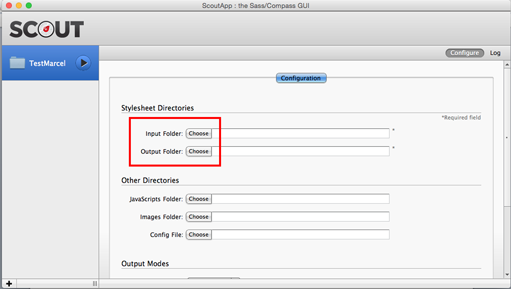
4.  Select the **styles/sass** folder for your **Input** folder.
    Input path should be: C:\Mendix Projects\Mendix-App\theme\styles\sass

     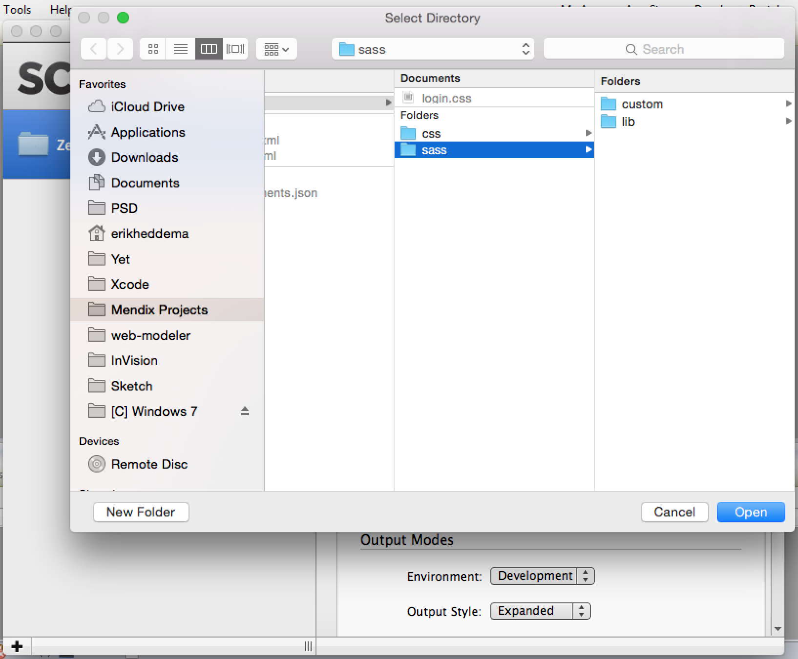
5.  Select the **styles/css** folder for your **Output** folder.
    Input path should be: C:\Mendix Projects\Mendix-App\theme\styles\css

     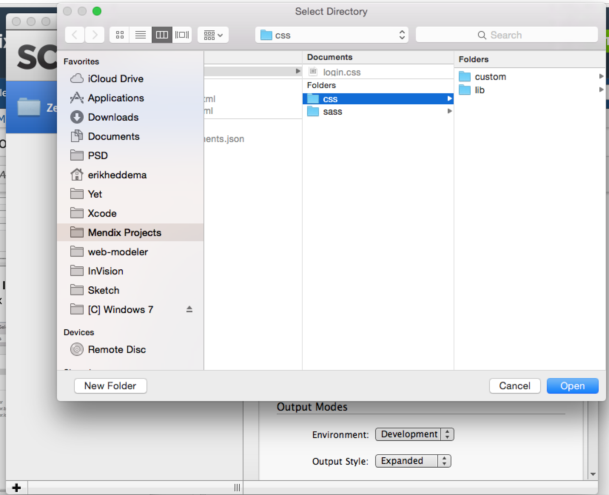
6.  After selecting the Input and Output folder you can press **Play** in the left sidebar next to your Project Folder name. Scout is now set to compile the changes so we can create a custom theme.

    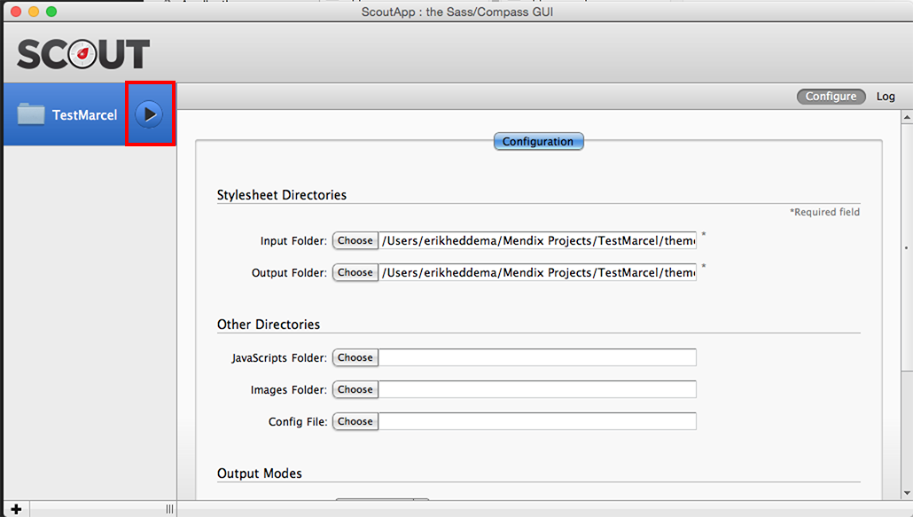 

## 4\. Configure your text editor

1. Open the **Project Directory** from your App in your desired text editor.

    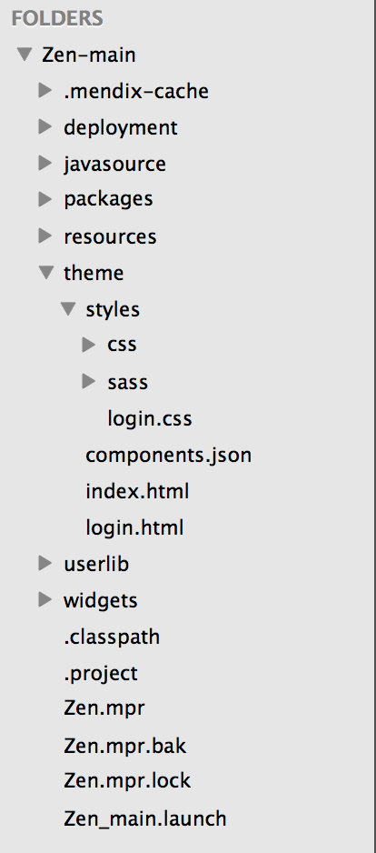
2. The **theme** folder is where you can find the theme that was selected when creating a New App. The folder **theme\styles\custom** will be used to make our own changes.
3.  Open up the file **custom-variables.scss**. This file contains default variables that we can use to easily change basic colors. Think of variables as a way to store information that you want to reuse throughout your stylesheet.

    **Step 1** contains default colors like primary, success, danger and so on. These colors are used for buttons, labels, links, text and other elements.
    **Step 2** contains colors and heights for your navigation bar, sidebar and layout.
    **Step 3 **contains the default layout spacing.

    And below these three steps there are topics like Typography, Forms, Buttons, Grids, Tabs, Mobile and other sections.

     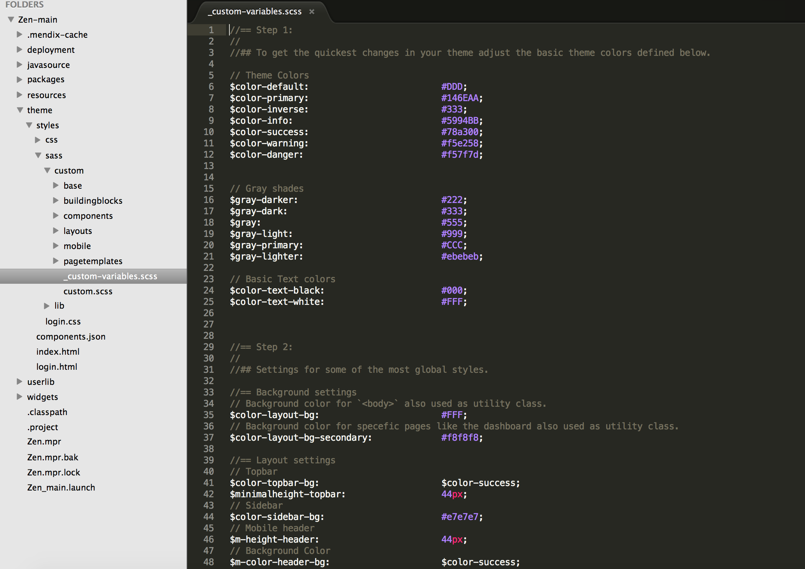 

## 4\. Create custom theme

In this tutorial we are going to create a custom theme based on the website from [Amazon](https://www.amazon.com/)[. In the first part we will be focusing on the **_custom-variables.scss** file. ](http://www.hallmark.com/)

1.  Change the **color-primary **to modify the topbar and buttons

    

    To change the topbar background-color and primary buttons we have to adjust the following line in the **_custom-variables.scss** file that can be found in **theme\styles\custom**. 

    **Line 10: $color-primary:  #4280cb;**

    Why do we want to change this color? How do we know that this color is used for our topbar and primary buttons and other CSS elements? For example when you search for **color-primary** in the **_custom-variables.scss** file we will find the following two lines:

    * Line 42: $color-topbar-bg:  $color-primary;
    * Line 231: $color-btn-bg-primary:  $color-primary; 

    **If you look in your custom-variables file you would notice that a lot more CSS elements use $color-primary variable, all these elements will be changes. So with changing one variable you are able to modify a lot of elements in your theme. This saves a lot of time maintaining your theme.

    In our App the **color-primary** has the color blue while Amazon primary color is dark blue **#232f3e**. We can now adjust the **$color-primary **on line 10 to the Amazon color what is **#232f3e**.

    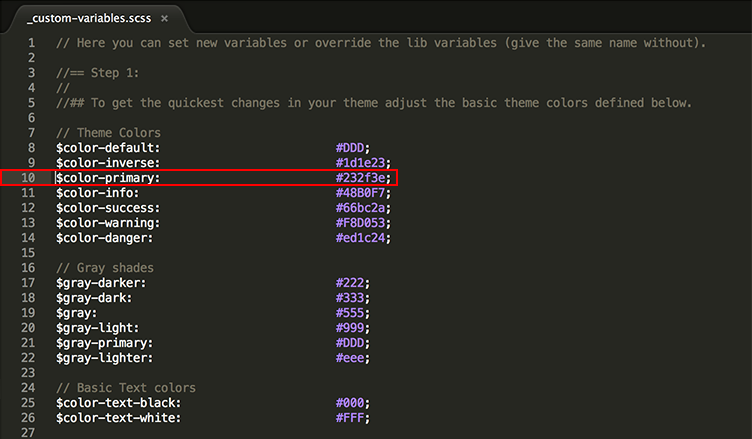 

    When you save your file after changing **color-primary** you will see the following change in **Scout** as in the example below. Scout detected a change to the **_custom-variables.scss** file and compiles the CSS files. If you don't want to use Sass you could just use these CSS files.

    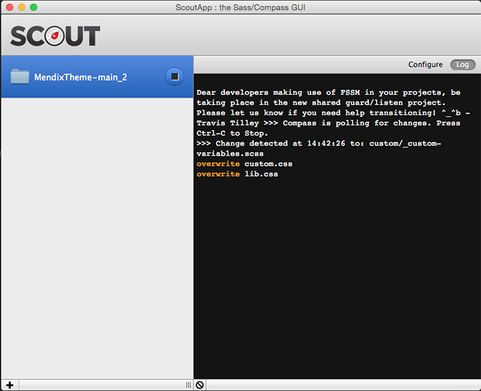 

    Now **re-deploy** your App and the following change should be visible in the browser:

                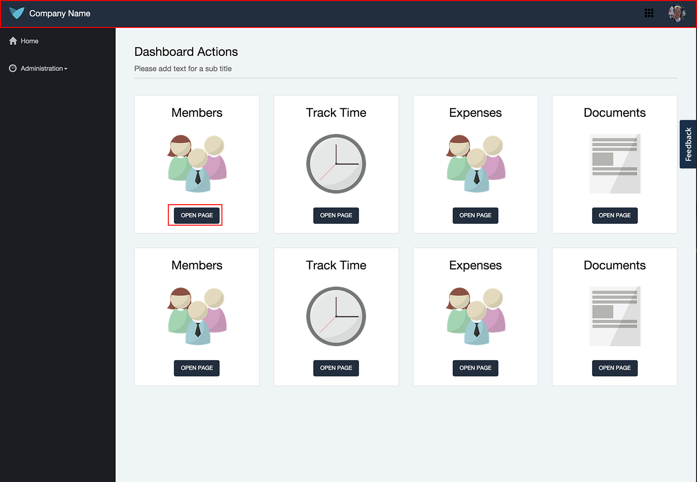

    As you see in the screenshot the background-colors for the topbar and primary buttons have been changes.
2.  **Change the secondary background color**

    Our custom App has a gray background while the Amazon website has a white background. We can easily change this by editing the following line in **custom-variables** file.

    _// Background color for specific pages like the dashboard also used as utility class_
    **<u>Line 38:</u> $color-layout-bg-secondary: #EFF4F7;**

    The variable **$color-layout-bg-secondary** is used for several page templates. For example in the file **theme\styles\sass\pagetemplates\responsive\_page-dashboard.scss**, the **$color-layout-bg-secondary** is used as a default background color for all dashboard templates. Because of this variable we can easily change all our background-colors to white.

    We can now adjust the **$color-layout-bg-secondary** on line 38 to the background color what should be **#FFF.**

           

3.  **Change the sidebar and navigation colors**

    Just like we did before, we can now adjust our sidebar and navigation. Our app is now very dark so it would be wise to change the sidebar background-color. We can use the gray background-color that Amazon uses on their homepage.

    // Sidebar
    <u>Line 45:</u> $color-sidebar-bg: $color-inverse;

    Change to **$color-sidebar-bg: #f9f9f9;**. Now when you search for **$color-sidebar-bg**, the Navigation part will show in the _custom-variables file. As you may notice is that the navigation also gets the same variable as the background-color, **$color-sidebar-bg**. So we won't have to change the background-color here. Now re-deploy the application and you should see the following screenshot.

    

    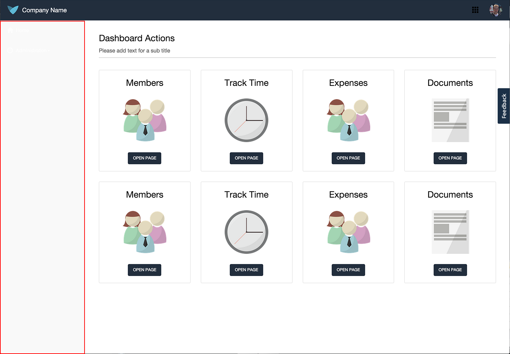

    We now have a different background color but the navigation text is impossible to read because they are white. For the sake of the tutorial we are going to make the text color, text hover color, text active and the sub text items color darker by using the variable **$color-inverse**. Color inverse is usually the darkest variable in a theme. Normally you could also have a different hover color of course.

    // Text colors
    * <u>Line 396:</u> $color-navsidebar-text: $color-text-white-secondary;
    * <u>Line 397:</u> $color-navsidebar-text-hover: $color-text-white;
    * <u>Line 398:</u> $color-navsidebar-text-active: $color-text-white;

    Change to **$color-navsidebar-text: $color-inverse** and also do this for the hover and active variable.

    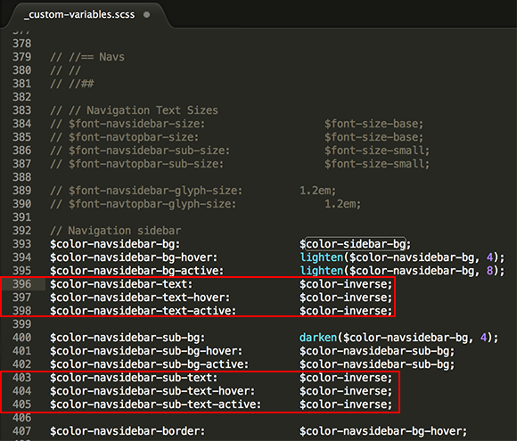

    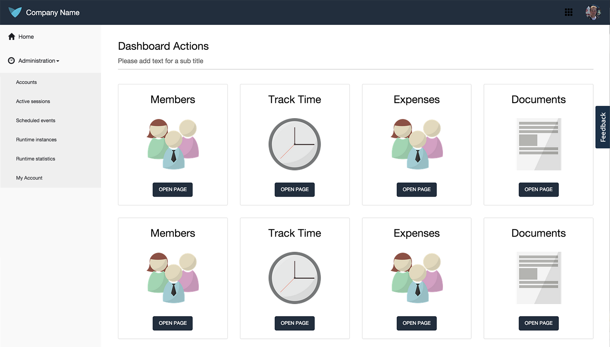

    We hope this gives you an understanding how the basics of variables work and the theme structure. In the next chapter we will change the Logo in the Mendix Modeler and do a small theming adjustment.
4.  Change the logo in the Mendix Modeler

    Use the following logo to replace our "Company Name" in the topbar.

    

    In the Mendix Modeler, go to the Layout "Sidebar_Full_Responsive" and replace the image. Leave the caption blank because the caption "amazon" is in the new image. Re-deploy the application and we have a shiny new logo.

    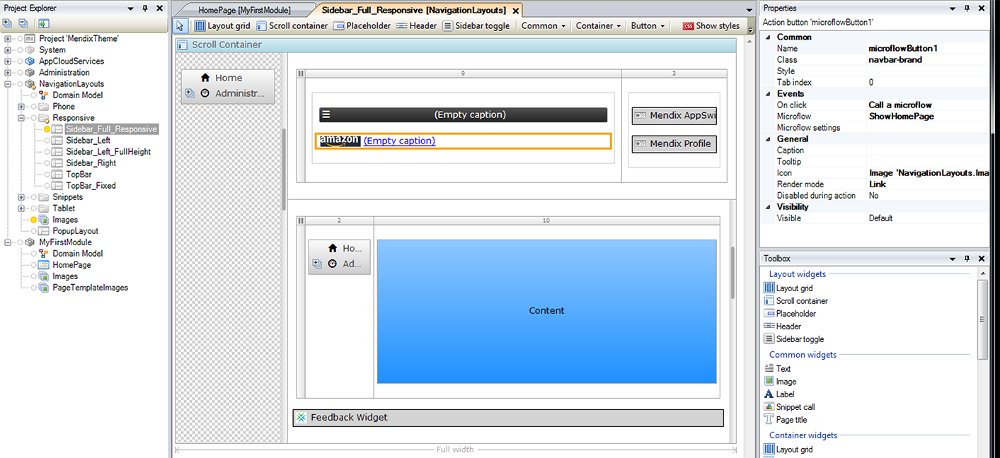

    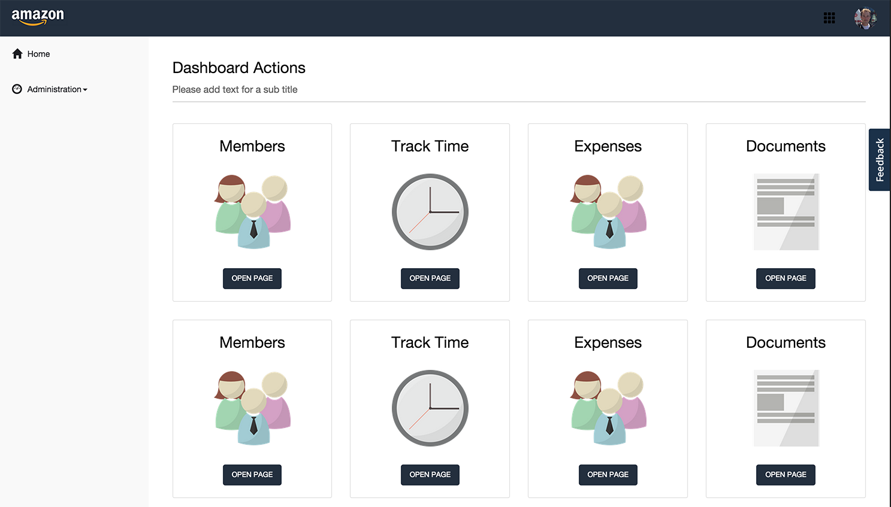

## 6\. Related content

*   [Scout and Windows 10 Workaround](scout-and-windows-10-workaround)
*   [Scout and Windows 10 Workaround](/howto6/scout-and-windows-10-workaround)
*   [Filtering Data on an Overview Page](filtering-data-on-an-overview-page)
*   [Layouts and Snippets](layouts-and-snippets)
*   [Layouts and Snippets](/howto6/layouts-and-snippets)
*   [Filtering Data on an Overview Page](/howto6/filtering-data-on-an-overview-page)
*   [Setup Mendix UI Framework with just CSS](setup-mendix-ui-framework-with-just-css)
*   [Setting Up the Navigation Structure](setting-up-the-navigation-structure)
*   [Creating your first two Overview and Detail pages](creating-your-first-two-overview-and-detail-pages)
*   [Setup Mendix UI Framework](setup-mendix-ui-framework)
