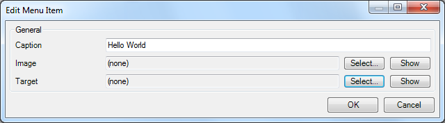
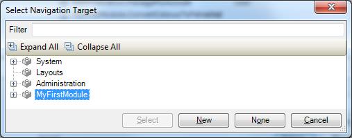
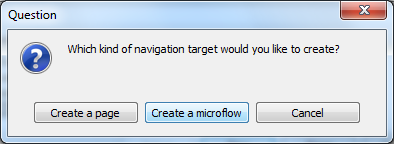
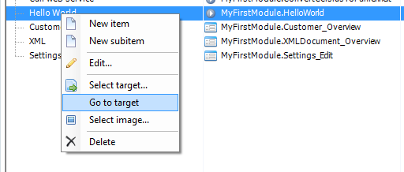
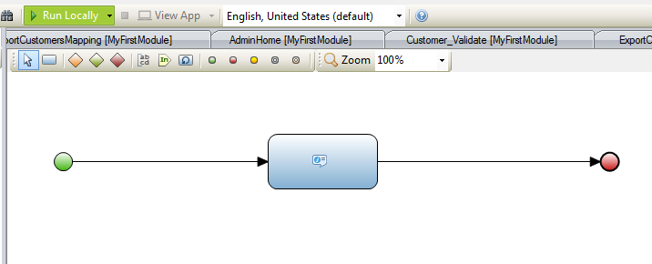
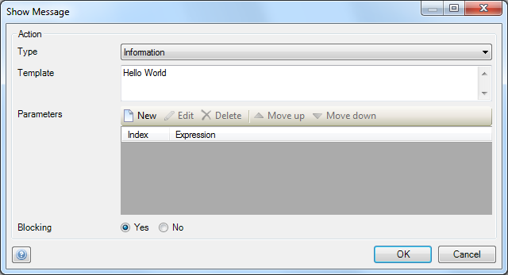
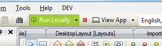

Mendix uses visual models to define the logic of your application, we call those models Microflows. A Microflow is a visual way of expressing what traditionally would be written in code. This how-to explains how you can create a very simple 'Hello World' Microflow.

## 1\. Creating a Menu Item

Microflows can be triggered in many different ways, as explained [here](triggering-logic-using-microflows). For this how-to you'll be using a menu item to trigger the new Microflow.

1.  Open the **navigation editor** and add a menu item in the desktop navigation settings.
    
2.  Enter a caption like _Hello World_.
3.  Click **Select...** at the Target section to open the navigation target selector.
    
4.  Select a module and click the **New** button.
    
5.  Click **Create a microflow** to connect a new Microflow to this menu item.
6.  Name the Microflow _HelloWorld_.
7.  Save the new menu item by clicking **OK**.

## 2\. Edit the New Microflow

1.  To open the new Microflow, right click the navigation item created in the previous step and select **Go to target** from the context menu.

    You should see an empty Microflow like this:
    
2.  Open the toolbox. It should be on the bottom right of the Mendix Modeler.
    
3.  If you can't find the toolbox, you can re-open it from the view menu.
    
4.  Drag a **Show Message** action from the toolbox to the line between the green start and red end event. This inserts a show message action activity.
    
5.  Double click the message activity to open the properties editor.
    
6.  Enter **Hello World** as Template value and click **OK**.
7.  Run the application locally and click **View App** to see the application in your default browser.
    
8.  Locate the new navigation item in the menu bar and click it to see the message.

## 3\. Related content

*   [Defining access rules using XPath](defining-access-rules-using-xpath)
*   [Triggering Logic using Microflows](triggering-logic-using-microflows)
*   [Creating a Custom Save Button](creating-a-custom-save-button)
*   [Extending Your Application with Custom Java](extending-your-application-with-custom-java)
