This how-to explains how you can create a basic data layer for your application with Mendix. Every application can have multiple modules and each module has its own domain model. All the domain models together define the data layer of the application. The domain model consists of entities and associations. An entity is a blueprint for objects in your application, like 'Customer' and 'Order'. Associations define the relation between two entities. As soon as you deploy the application, Mendix takes care of the underlying database for you. This means you won't have to create tables and write queries yourself.

## 1\. Creating entities and attributes

This section will explain how to create entities and their attributes.

1.  Open the **Domain Model**.
    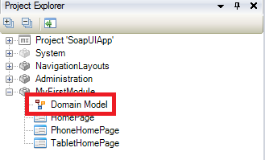
2.  Click **Entity** in the menu bar.
    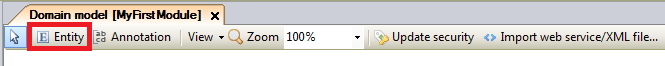 
3.  Click once in the domain model editor to create an entity.
    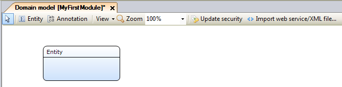 
    By default the Mendix Modeler creates a persistent entity. This means that the application's database will be able to store objects of this type of entity.
4.  You can **start typing directly** to change the name of the entity into **Customer.
    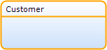 **
5.  Right click the entity and select **Add** > **Attribute**.
    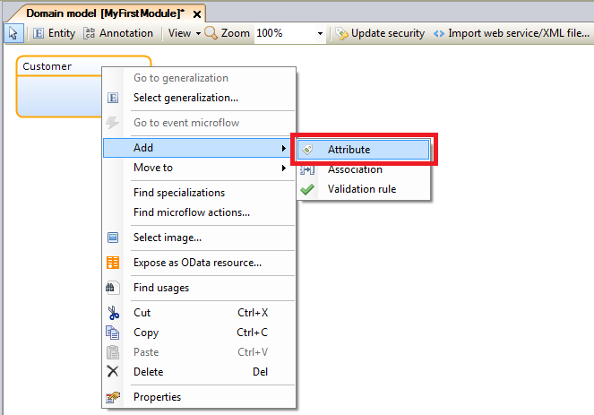
6.  Enter _Name_ as name of the new attribute.
7.  Select _String_ as data type.
    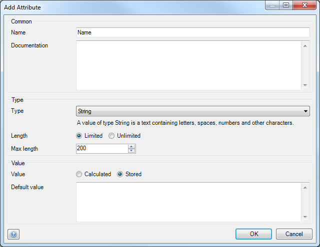
8.  Repeat these steps to create a complete entity that looks similar to this:
    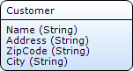
9.  Create a second entity that looks like this:
    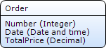

## 2\. Enumerations

An enumeration is a predefined list of values that can be used as attribute type. This only allows users of the application to select any of the predefined values for this attribute. A good example for an enumeration is order status. Let's add an enumeration and extend the Order entity with an enum value based attribute.

1.  Right click a module and select **Add** > **Enumeration**.
    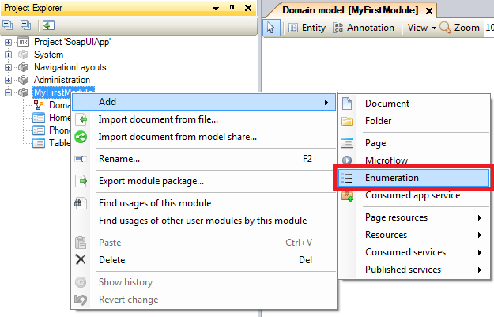
2.  Enter _OrderStatus_ as name and click **OK**.
    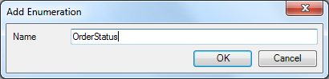
3.  Click **New** to add a new enumeration value.
    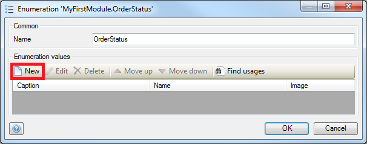
4.  Enter _Open_ as **caption** and click **OK**.
    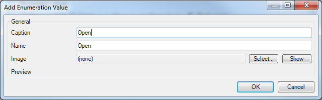
5.  Repeat those steps for the remaining values; **Processing**, **Complete**. You should have the following values:
    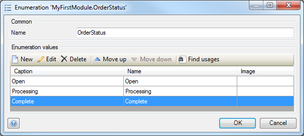
6.  Click **OK** to save the enumeration.

    Now let's create an enum value based attribute in the Order entity.
7.  Right click the **Order** entity and select **Add** > **Attribute**.
    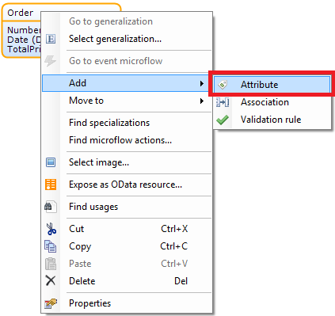
8.  Enter _OrderStatus_ as **Name.**
9.  Select _Enumeration_ as **Type.**
10.  Select enumeration _OrderStatus_ and click **Select**.
    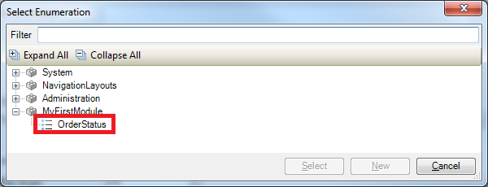
11.  Select _Open_ as **Default** value.
    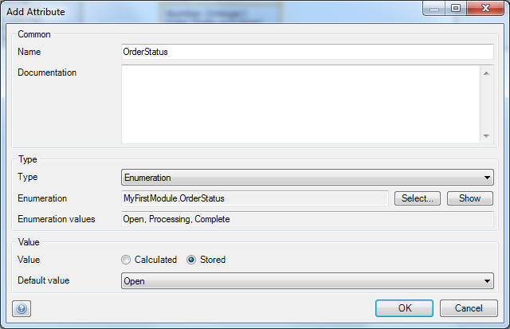
12.  Click **OK** to save the new attribute. The Order entity should look like this:
    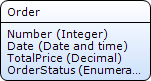

## 3\. Creating associations

Once the entities are created, you can start creating associations.

1.  Draw a line from the border of one entity to the border of the other entity to create an association. Always start at the entity that would have more instances in the system than the other one. In this case draw an association from **Order** to **Customer**, because you probably want to store more orders than customers in your application.
    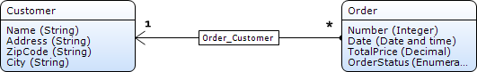

## 4\. Multiplicity

This section will explain how to change the multiplicity of associations. By default the domain model editor creates an association with 1-to-many multiplicity. In the above case a customer can have multiple orders and an order can only have one customer. If the desired multiplicity is not available in this list, you have probably drawn the association the wrong way. You should remove the association and draw it again the other way around.

1.  Double click the association **Order_Customer** to open its properties.
    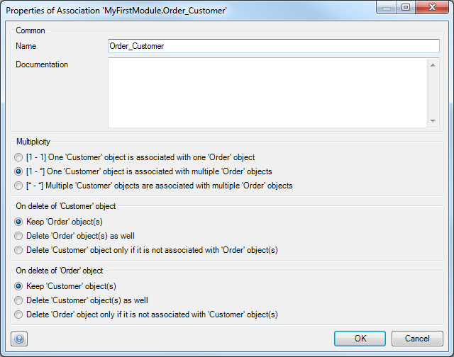
2.  To change the association to **1-to-1 multiplicity**, select the first option of the multiplicity property. In this case it means that a customer can only have one order and vice versa.
    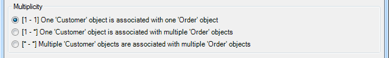
3.  To change the association to **many-to-many multiplicity**, select the third option of the multiplicity property. In this case it means that a customer can have multiple orders and an order can have multiple customers.
    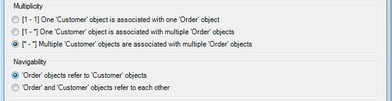

## 5\. Delete Behavior

This section will explain how to set the delete behavior of associations. You can configure delete behavior for both sides of the association.

1.  Double click the association **Order_Customer** to open its properties.
2.  To configure cascading delete, select the second option at the delete behavior properties. This means that all the orders of a customer will also be removed if the customer is deleted.
    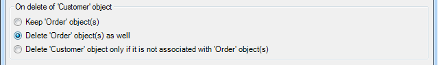
3.  To configure delete prevention, select the third option at the delete behavior properties. This means that a customer can only be deleted if no orders refer to this customer. The error message will be shown to a user that tries to delete a customer that has orders.
    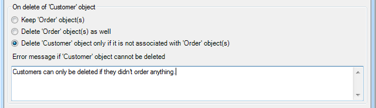

## 6\. Related content

*   [Working with images and files](working-with-images-and-files)
*   [Creating a basic data layer](creating-a-basic-data-layer)
*   [Denormalize Data to Improve Performance](denormalize-data-to-improve-performance)
*   [Setting up data validation](setting-up-data-validation)
*   [Working With Object Events](working-with-object-events)
*   [Creating your first two Overview and Detail pages](creating-your-first-two-overview-and-detail-pages)
*   [Setting up data validation](setting-up-data-validation)
