This tutorial is a quick introduction on how to build a custom widget to extend your Mendix application. We’re using the famous “Hello World” example to get you started. At the end of this tutorial you will have a basic understanding of the structure and setup of a Mendix widget.
The Mendix front end uses the DOJO framework to implement widgets. Each Mendix widget in MX5 is essentially a DIJIT widget that inherits from mxui.widget._WidgetBase. For more information on DIJIT widgets and their life cycle see the widget life cycle documentation.

**What will you learn from this how-to?**

*   How to set up a development environment
*   How it all works
*   How to create your first widget from the "AppStoreWidgetBoilerplate"
*   How to set up your Mendix test project
*   How to test the Custom Widget at run-time

# Table of contents

## 1\. Preparation

Before you start building your own widget make sure you have the following programs installed:

*   [Mendix Modeler](https://appstore.home.mendix.com/index3.html?v=7#1421997409316) (version 5.x)
*   Adobe Brackets and the Widget Development Plugin for Adobe Brackets. [You can find a How- to about this software here](getting-started-with-the-widget-development-plugin-for-adobe-brackets).

## 2\. How does it all work?!

We have created a set of illustrations that explain what a custom widget is and how it behaves in the Mendix platform.

### 2.1 What is a Mendix custom widget?

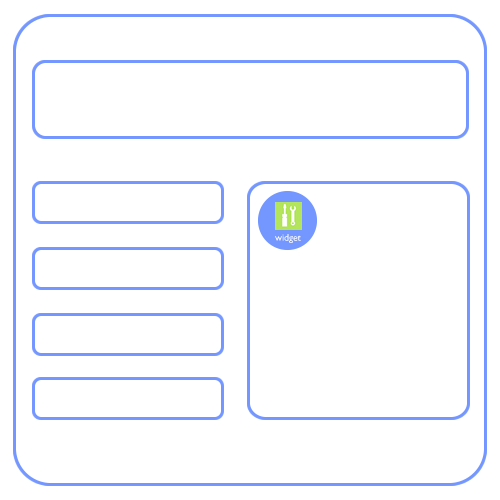 

A Mendix custom widget is a part of the user interface in your Mendix app.
It enables functionality and interaction with the end- users of your Mendix app.
And a Mendix custom widget can alter the interface, data, images and the way the Mendix app works. 

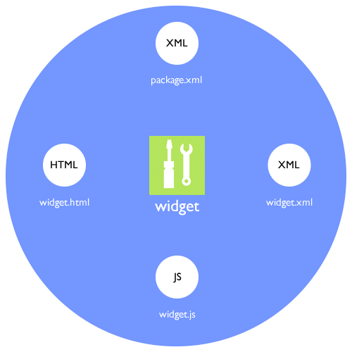 

A Mendix Custom Widget is also a folder packaged as a _".zip"_ file, renamed to an _".mpk"_ file. It contains JavaScript, HTML, CSS, and XML files that can be read by the Mendix Modeler. The following files are required to create a widget:

*   A package.xml file.Define the HTML, XML, CSS, and JavaScript files that make up the custom widget inside the Mendix business modeler.
*   A widget.xml file. This file contains properties you can set in Mendix to configure the widget.
*   A widget.js file. The JavaScript core of your widget.
*   A widget.html file. The HTML template of your widget.

### 2.2 The Development Life Cycle of a Custom Widget

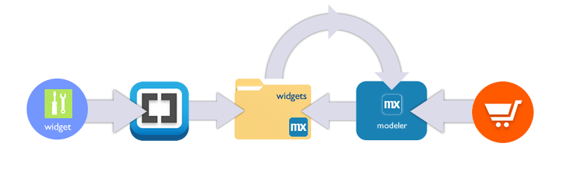 

1.  Code your widget with Adobe Brackets (using the Widget Development Plugin).
2. Package and deploy the widget in Adobe Brackets to the "widgets" folder of your test project by pressing this:
    .
3. Widgets downloaded from the AppStore are also placed inside the "widgets" folder.
4. Within the Mendix business modeler, to synchronise the project directory, press this:
    
5. Within the Mendix business modeler you will need to set the properties of your custom widget and the widgets you imported.
6. If you have changed the properties of your widget you will have to update your widgets before being able to set properties again.
7. Within the Mendix business modeler press,  to start the Mendix application locally or rerun the Mendix application:
    
8. In Chrome or Firefox you can debug the JavaScript code created for your widget.

### 2.3 The Run Time Life Cycle of a Custom Widget

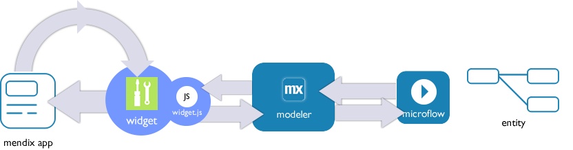

1.  A widget is responsible for a part of the user interface of a Mendix application.
2.  The widget.js file contains logic to get data from a microflow into the widget.
3.  The widget is then responsible for handling the data, (re)creating the user interface its responsible for.
4.  The widget also needs to handle interactivity from the web- browser and end- user .
5.  Updates on entities where the widget is attached to can trigger a re- rendering of the part of the user interface.
6.  Never try to connect widgets to each other through HTML! ... Use entities and micro- flows for that and leave the interface, its management of events and rendering of widget to how the normal run time life cycle of a widget is. 
7.  In case Mendix has send data and with an update has no data the widget should ALWAYS return to its original state without data!

**What happens when the widget is first initialized?**

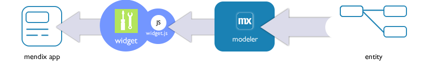

1.  Mendix client side sends a request to build the widget.
2.  If the widget is configured to receive an entity from the modelerit will receive it. The widget will get the entity in the update JavaScript function (described later on).
3. It is up to the widget to do something with the Mendix entity. The Mendix entity in JavaScript is called a "context" object.

**Making the widget intelligent**

It is important to know that a custom widget knows nothing when it starts working in the Mendix client side code!
You have to make a proper starting point to begin with. So make your widget configurable for a particular situation within your app.
Do this as generic as possible for re- using the widget in another place in your Mendix apps. 

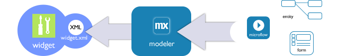

{}

A property will contain the end result of something that is configured/provided by Mendix. You must always create a starting situation where you gather what you need before you continue with logic inside your widget and/or inside the Mendix platform.

{}

**How to load data in your custom widget**


1.  The widget needs to request the modeler to execute a Microflow.

    
2. The Microflow executes, gathers data from entities, and sends it back to the widget. A Microflow is a server-side action.
3. It is up to the widget to do something with the data.

## 3\. Creating a Custom Widget with Adobe Brackets

Start building your own Mendix custom widget by creating a copy of the "[AppStoreWidgetBoilerplate](https://github.com/mendix/AppStoreWidgetBoilerplate)". The [AppStoreWidgetBoilerplate](https://github.com/mendix/AppStoreWidgetBoilerplate) contains all the files and folders you need for our "Hello World" example widget. The Widget Development Plugin turns Adobe Brackets into an IDE that provides easy access to downloading and altering the AppStoreWidgetBoilerplate.

1.  Open **Adobe Brackets**.
2.  Go tot **File** and select **New Widget** from the menu. *
    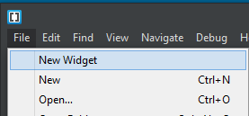
    The name of the widget is very important because it will be used in Mendix. It is strongly recommended to use the [CamelCase](http://en.wikipedia.org/wiki/CamelCase) naming convention. Each new widget should at least have an author, version number, copyright, license, package name, widget name and path defined before you can click continue. The location directory must alsoexist **and you must have access rights to the folder**. 

    Information about the settings:

    *   The **author, license, package name,** and **name** should only contain a-z and A-Z characters.

    *   The **copyright** should only contain a-z , A-Z and 0-9 characters.

    *   The **version** should only contain 0-9 and / or a . characters.

    *   The **location** should only contain a valid directory path.

3.  Provide the following values:

    <table><thead><tr><th class="confluenceTh">Field</th><th class="confluenceTh">Value</th></tr></thead><tbody><tr><td class="confluenceTd">Author</td><td class="confluenceTd">Enter your name</td></tr><tr><td colspan="1" class="confluenceTd">License</td><td colspan="1" class="confluenceTd">Apache 2 / MIT</td></tr><tr><td colspan="1" class="confluenceTd">Copyright</td><td colspan="1" class="confluenceTd">My Company B.V. 2015</td></tr><tr><td class="confluenceTd">Version</td><td class="confluenceTd">1.0</td></tr><tr><td colspan="1" class="confluenceTd">Package name</td><td colspan="1" class="confluenceTd">HelloWorldPackage</td></tr><tr><td class="confluenceTd">Name</td><td class="confluenceTd">HelloWorld</td></tr><tr><td colspan="1" class="confluenceTd">Location</td><td colspan="1" class="confluenceTd">Select a folder on your local drive</td></tr></tbody></table>

    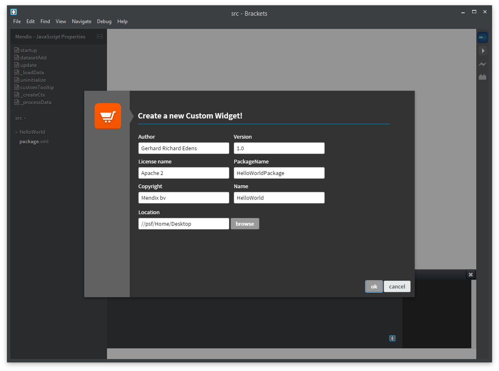

    The location directory is now automatically opened inside Adobe Brackets.

    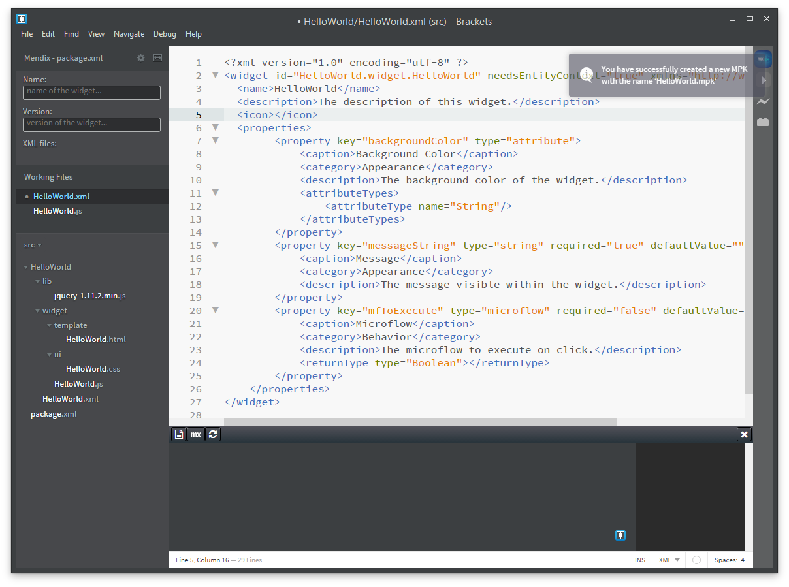
4.  Go to the **location directory** you entered in the Widget Creation screen.
5.  Open the **test** directory.
    *   You will find the Mendix test project for the custom widget: **test.mpr**
    *   There is also a folder called **widgets**When you download a widget from the AppStore it will be placed in this folder. It is where any custom widget package should go. 

    The _".mpk"_ package will need a specific folder structure in order for it to be unpacked properly when deploying. Below is an example of the folder structure of the "Hello World" widget you just created with the Widget Development Plugin.
    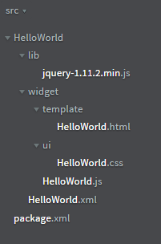

    You will now load the widget in the Mendix business modeler
6.  Create an **MPK** file by pressing  or clicking the **PLAY** button on the right side.
    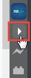
    You are informed that the widget is created.
    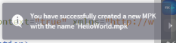

    The newly created MPK package is placed in the **test/widgets **directory.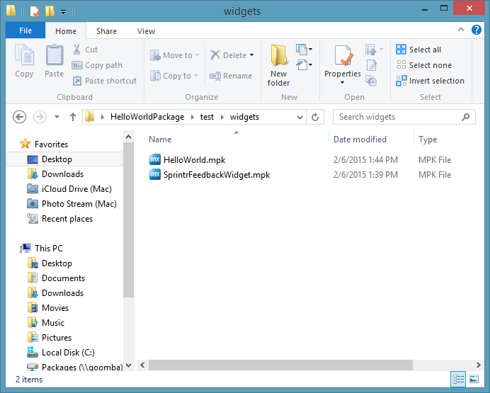
7. Open the test project by opening **Test.mpr** from the **test** directory. You can also use  or click the  button in the Mendix panel in Brackets.
    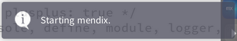
    
    The test project is created in Mendix 5.6.0\. It's possible that Brackets will ask you to select a modeler version. Select the version of your installed Mendix business modeler.

    

**If you experience problems creating the widget using the Brackets plugin, there might be a problem with your user-right. Try to open the Brackets editor as an Administrator (Right-click on the Brackets-shortcut and choose "Run as Administrator"**

## 3\. Exploring the Custom Widget XML Files

### 3.1 The package XML file

The name “package.xml” already suggests that this file is related to the package. It is used by the modeler to find the widget files and unpack your widget. Within the "AppStoreWidgetBoilerplate" you already get a working example of the "package.xml" file for your newly created widget. This "package.xml" file is configured with the settings you entered in the Create New Widget dialog.

1.  Open **HelloWord/src**/**package.xml** in Brackets:

    ```xml
    <?xml version="1.0" encoding="utf-8" ?>
    <package xmlns="http://www.mendix.com/package/1.0/">
    	<clientModule name="HelloWorld" version="1.0" xmlns="http://www.mendix.com/clientModule/1.0/">
    		<widgetFiles>
    			<widgetFile path="HelloWorld/HelloWorld.xml"/>
    		</widgetFiles>
    		<files>
    			<file path="HelloWorld/widget/"/>
    		</files>
    	</clientModule>
    </package>
    ```

    The **package.xml** is an XML file, so it needs to start the file with the proper [Document Type Definition](http://en.wikipedia.org/wiki/Document_type_definition).

    ```xml
    <?xml version="1.0" encoding="utf-8" ?>

    ```

    The first element used in the package.xml is **package**. It contains the xmlns attribute (the XML namespace). The value of this attribute is the same for every widget. The tag will look like this:

    ```xml
     <package xmlns="http://www.mendix.com/package/1.0/">
    ```

    The next element inside the package element is **clientModule**. It contains 3 attributes:

    *   name -> Most commonly this is the same as the name of your .mpk
    *   version -> Although currently unused by the Modeler, it would be wise to keep track of the version of your widget package here
    *   xmlns -> clientModule uses a different namespace

        The tag looks like this:

        ```xml
         <clientModule name="HelloWorld" version="1.0" xmlns="http://www.mendix.com/clientModule/1.0/">
        ```

        Inside the **clientModule** element you define the specific paths to the widget XML files. This means that, for each individual widget, you need an XML file, and the path to each file should be specified here. Mendix uses the **widgetFile **XML element with **path** as an attribute and the relative path to the widget XML file as the value of this attribute. These elements are grouped using the **widgetFiles** element. 

        There is one widget in your package (the “HelloWorld” widget), so the tags should look like this: 

        ```xml
        <widgetFiles>
        	<widgetFile path="HelloWorld/HelloWorld.xml"/>
        </widgetFiles>
        ```

        The next thing to specify are the folders that will be added to your deployment directory. In most cases you need to use the path to the top level folder. In some cases you need to use specific paths to avoid adding unnecessary files. The XML tags for this are pretty straightforward and will also go inside the **clientModule** element:

        ```xml
        <files>
        	<file path="HelloWorld/widget/" />
        </file>
        ```

### 3.2 The widget XML file

The AppStoreWidgetBoilerplate also comes with a pre- configured widget xml file. The Mendix Modeler uses the widget XML file to create the property input fields, which show up when you add your widget to a form.

1.  Open **HelloWorld/src/widget/helloworld.xml** in Brackets:

    ```xml
    <?xml version="1.0" encoding="utf-8" ?>
    <widget id="HelloWorld.widget.HelloWorld" needsEntityContext="true" xmlns="http://www.mendix.com/widget/1.0/">
      <name>HelloWorld</name>
      <description>The description of this widget.</description>
      <icon></icon>
      <properties>
            <property key="backgroundColor" type="attribute">
                <caption>Background Color</caption>
                <category>Appearance</category>
                <description>The background color of the widget.</description>
                <attributeTypes>
                    <attributeType name="String"/>
                </attributeTypes>
            </property>
            <property key="messageString" type="string" required="true" defaultValue="">
                <caption>Message</caption>
                <category>Appearance</category>
                <description>The message visible within the widget.</description>
            </property>
            <property key="mfToExecute" type="microflow" required="false" defaultValue="">
                <caption>Microflow</caption>
                <category>Behavior</category>
                <description>The microflow to execute on click.</description>
                <returnType type="Boolean"></returnType>
            </property>
    	</properties>
    </widget>
    ```

    The first element in the file is **widget**. It contains 3 attributes:

*   **id** ->  This is the widget’s JavaScript class: The path to the js file, starting at the root folder, separated by dots. Note that this is case-sensitive. For more information take a look at [Dojo’s documentation on modules](http://dojotoolkit.org/documentation/tutorials/1.8/modules/).
*   **needsEntityContext** -> This is a Boolean and it tells the Mendix Modeler whether or not your widget needs to be placed inside a dataview.
*   **xmlns** -> we’ve seen this attribute before in our package XML. The value of this attribute is the same for every widget XML file.

    The entity context needs to be set the true because you're going to use a Mendix entity object in the widget. That means the tag will look like this:

    ```xml
     <widget id="HelloWorld.widget.helloworld" needsEntityContext="true" xmlns="http://www.mendix.com/widget/1.0/">
    ```

    Inside the widget element are 3 child elements that are pretty straightforward:

*   **name** -> This element is used to add the name of the widget. This is how it will show up among the “Add-ons” in the Mendix Modeler (if you’ve done the introduction course, you’re familiar with this button).
    _<name>Hello world</name>_
*   **description** -> This element  is used to add a brief description of the widget. What is the widget for?
    _<description>This is my new fancy Hello World widget and it does really cool stuff! (like printing a sentence on the screen, woo!)</description>_
*   **icon** -> This element is used to define the widget's icon. Every element or widget in the Mendix Modeler has its own icon. It is a [Base64](http://en.wikipedia.org/wiki/Base64) representation of the image, so that it can be used in an XML file.
    _<icon>*add the Base64 string here*</icon>

    _Next you will define the widget properties. Any properties you define in your widget XML file can be set using the Mendix Modeler and they will be passed to your JavaScript file, so you can use them in your widget. To define properties in XML you will have to use the “property” element. Since you’re making a list, the individual property elements will be grouped inside a “properties” element, like this:

    ```xml
    <properties>
      <property key="backgroundColor" type="attribute">
              <caption>Background Color</caption>
              <category>Appearance</category>
              <description>The background color of the widget.</description>
              <attributeTypes>
                  <attributeType name="String"/>
              </attributeTypes>
          </property>
          <property key="messageString" type="string" required="true" defaultValue="">
              <caption>Message</caption>
              <category>Appearance</category>
              <description>The message visible within the widget.</description>
          </property>
          <property key="mfToExecute" type="microflow" required="false" defaultValue="">
              <caption>Microflow</caption>
              <category>Behavior</category>
              <description>The microflow to execute on click.</description>
              <returnType type="Boolean"></returnType>
          </property>
    </properties>
    ```

    All property elements define at least 2 attributes: **key** and **type**. The value of **key** is the name of the property in your widget, so use a descriptive name. The value of **type** refers to the type of the property, for example “string” or “integer”. Some additional attributes are optional, like “isDefault” and “required”. However, based on the type, you may have to define certain attributes so the Mendix Modeler gets all the information it requires. An XSD is provided in each AppStoreWidgetBoilerplate to help you define what you need to set at certain property types.

    Your Hello World widget needs an input string, which doesn't need any additional attributes defined.

    ```xml
     <property key="messageString" type="string">
    ```

    Every property element contains at least 3 child elements. As with the attributes, based on the type of the property, you may have to define additional child elements. A string only needs the 3 following:

*   caption -> This element is used to add the name of the property. This is how it will show up in the Properties list in the Mendix Modeler.
    _<caption>Hello World string</caption>_
*   category -> This element defines in what category this property will be shown in the Properties list in the Mendix Modeler. Common categories are “Behavior”, “Appearance” and “Data source”.
    _<category>Data source</category>_
*   description - > This element is used to add a useful description of the property, so the end user knows what it’s for.
    _<description>Add the string you want to print on your screen here (e.g.: Hello World!).</description>_

## 4\. Exploring the JavaScript file

The widget package contains a package.xml file and a helloworld.xml file. Now all you need is some action. Mendix uses the [Dojo framework](http://dojotoolkit.org/), and custom Mendix widgets are based on [Dijit](http://dojotoolkit.org/reference-guide/1.6/dijit/). Dijit is Dojo’s widget framework.

1.  Open **HelloWorld/** **src/widget/HelloWorld.js** in Brackets and take a look at the source:

    ```js
    /*jslint white:true, nomen: true, plusplus: true */
    /*global mx, define, require, browser, devel, console, document, jQuery */
    /*mendix */
    /*
        HelloWorld
        ========================
        @file      : HelloWorld.js
        @version   : 1.0
        @author    : Gerhard Richard Edens
        @date      : Tue, 21 Apr 2015 13:00:38 GMT
        @copyright : Mendix b.v.
        @license   : Apache 2
        Documentation
        ========================
        Describe your widget here.
    */
    // Required module list. Remove unnecessary modules, you can always get them back from the boilerplate.
    define([
        'dojo/_base/declare', 'mxui/widget/_WidgetBase', 'dijit/_TemplatedMixin',
        'mxui/dom', 'dojo/dom', 'dojo/query', 'dojo/dom-prop', 'dojo/dom-geometry', 'dojo/dom-class', 'dojo/dom-style', 'dojo/dom-construct', 'dojo/_base/array', 'dojo/_base/lang', 'dojo/text', 'dojo/html', 'dojo/_base/event',
        'HelloWorld/lib/jquery-1.11.2.min', 'dojo/text!HelloWorld/widget/template/HelloWorld.html'
    ], function (declare, _WidgetBase, _TemplatedMixin, dom, dojoDom, domQuery, domProp, domGeom, domClass, domStyle, domConstruct, dojoArray, lang, text, html, event, _jQuery, widgetTemplate) {
        'use strict';
        var $ = jQuery.noConflict(true);

        // Declare widget's prototype.
        return declare('HelloWorld.widget.HelloWorld', [_WidgetBase, _TemplatedMixin], {
            // _TemplatedMixin will create our dom node using this HTML template.
            templateString: widgetTemplate,
            // Parameters configured in the Modeler.
            mfToExecute: "",
            messageString: "",
            backgroundColor: "",
            // Internal variables. Non-primitives created in the prototype are shared between all widget instances.
            _handles: null,
            _contextObj: null,
            _alertDiv: null,
            // dojo.declare.constructor is called to construct the widget instance. Implement to initialize non-primitive properties.
            constructor: function () {
                this._handles = [];
            },
            // dijit._WidgetBase.postCreate is called after constructing the widget. Implement to do extra setup work.
            postCreate: function () {
                console.log(this.id + '.postCreate');
                this._updateRendering();
                this._setupEvents();
            },
            // mxui.widget._WidgetBase.update is called when context is changed or initialized. Implement to re-render and / or fetch data.
            update: function (obj, callback) {
                console.log(this.id + '.update');
                this._contextObj = obj;
                this._resetSubscriptions();
                this._updateRendering();
                callback();
            },
            // mxui.widget._WidgetBase.enable is called when the widget should enable editing. Implement to enable editing if widget is input widget.
            enable: function () {},
            // mxui.widget._WidgetBase.enable is called when the widget should disable editing. Implement to disable editing if widget is input widget.
            disable: function () {},
            // mxui.widget._WidgetBase.resize is called when the page's layout is recalculated. Implement to do sizing calculations. Prefer using CSS instead.
            resize: function (box) {},
            // mxui.widget._WidgetBase.uninitialize is called when the widget is destroyed. Implement to do special tear-down work.
            uninitialize: function () {
                // Clean up listeners, helper objects, etc. There is no need to remove listeners added with this.connect / this.subscribe / this.own.
            },
            // We want to stop events on a mobile device
            _stopBubblingEventOnMobile: function (e) {
                if (typeof document.ontouchstart !== 'undefined') {
                    event.stop(e);
                }
            },
            // Attach events to HTML dom elements
            _setupEvents: function () {
                this.connect(this.colorSelectNode, 'change', function (e) {
                    // Function from mendix object to set an attribute.
                    this._contextObj.set(this.backgroundColor, this.colorSelectNode.value);
                });
                this.connect(this.infoTextNode, 'click', function (e) {
                    // Only on mobile stop event bubbling!
                    this._stopBubblingEventOnMobile(e);
                    // If a microflow has been set execute the microflow on a click.
                    if (this.mfToExecute !== '') {
                        mx.data.action({
                            params: {
                                applyto: 'selection',
                                actionname: this.mfToExecute,
                                guids: [this._contextObj.getGuid()]
                            },
                            callback: function (obj) {
                                //TODO what to do when all is ok!
                            },
                            error: lang.hitch(this, function (error) {
                                console.log(this.id + ': An error occurred while executing microflow: ' + error.description);
                            })
                        }, this);
                    }
                });
            },
            // Rerender the interface.
            _updateRendering: function () {
                this.colorSelectNode.disabled = this.readOnly;
                this.colorInputNode.disabled = this.readOnly;
                if (this._contextObj !== null) {
                    domStyle.set(this.domNode, 'display', 'block');
                    var _colorValue = this._contextObj.get(this.backgroundColor);
                    this.colorInputNode.value = _colorValue;
                    this.colorSelectNode.value = _colorValue;
                    html.set(this.infoTextNode, this.messageString);
                    domStyle.set(this.infoTextNode, 'background-color', _colorValue);
                } else {
                    domStyle.set(this.domNode, 'display', 'none');
                }
                // Important to clear all validations!
                this._clearValidations();
            },
            // Handle validations.
            _handleValidation: function (_validations) {
                this._clearValidations();
                var _validation = _validations[0],
                    _message = _validation.getReasonByAttribute(this.backgroundColor);
                if (this.readOnly) {
                    _validation.removeAttribute(this.backgroundColor);
                } else {
                    if (_message) {
                        this._addValidation(_message);
                        _validation.removeAttribute(this.backgroundColor);
                    }
                }
            },
            // Clear validations.
            _clearValidations: function () {
                domConstruct.destroy(this._alertdiv);
                this._alertdiv = null;
            },
            // Show an error message.
            _showError: function (message) {
                if (this._alertDiv !== null) {
                    html.set(this._alertDiv, message);
                    return true;
                }
                this._alertDiv = domConstruct.create("div", {
                    'class': 'alert alert-danger',
                    'innerHTML': message
                });
                domConstruct.place(this.domNode, this._alertdiv);
            },
            // Add a validation.
            _addValidation: function (message) {
                this._showError(message);
            },
            // Reset subscriptions.
            _resetSubscriptions: function () {
                var _objectHandle = null,
                    _attrHandle = null,
                    _validationHandle = null;
                // Release handles on previous object, if any.
                if (this._handles) {
                    this._handles.forEach(function (handle, i) {
                        mx.data.unsubscribe(handle);
                    });
                    this._handles = [];
                }
                // When a mendix object exists create subscribtions.
                if (this._contextObj) {
                    _objectHandle = this.subscribe({
                        guid: this._contextObj.getGuid(),
                        callback: lang.hitch(this, function (guid) {
                            this._updateRendering();
                        })
                    });
                    _attrHandle = this.subscribe({
                        guid: this._contextObj.getGuid(),
                        attr: this.backgroundColor,
                        callback: lang.hitch(this, function (guid, attr, attrValue) {
                            this._updateRendering();
                        })
                    });
                    _validationHandle = this.subscribe({
                        guid: this._contextObj.getGuid(),
                        val: true,
                        callback: lang.hitch(this, this._handleValidation)
                    });
                    this._handles = [_objectHandle, _attrHandle, _validationHandle];
                }
            }
        });
    });
    require(['HelloWorld/widget/HelloWorld'], function () {
        'use strict';
    });
    ```

    This looks like a lot of code but it is actually well organized. We will go through it step by step.

### 4.1 The bare minimum that makes up the DIJIT Widget

When you build a custom widget from the "AppStoreWidgetBoilerplate" it is based on an AMD - DIJIT widget. If you cut down to the core of the JavaScript file the following code is what you get.

```js
define([ ... ], function ( ... ) {
    'use strict';

    return declare( ... , [ ... ], {

    });
});
require(['HelloWorld/widget/HelloWorld'], function () {
    'use strict';
});
```

### 4.2 What does REQUIRE do?

An AMD - DIJIT Widget works with REQUIRE and DECLARE. REQUIRE will first load all the JavaScript files that make up your widget. DECLARE will make the widget available for Mendix.

DEFINE defines a set of JavaScript files needed to create the DIJIT widget. The following JavaScript files are explained.

To be able to create a DIJIT widget you will need the "dojo/_base/declare", "mxui/widget/_WidgetBase" and the "dijit/_TemplateMixin" JavaScript.

```js
'dojo/_base/declare', 'mxui/widget/_WidgetBase', 'dijit/_TemplatedMixin',
```

What you need next is extra DOJO and Mendix functionality to be able to create / alter HTML and add JavaScript events.

```js
'mxui/dom', 'dojo/dom', 'dojo/query', 'dojo/dom-prop', 'dojo/dom-geometry', 'dojo/dom-class', 'dojo/dom-style', 'dojo/dom-construct', 'dojo/_base/array', 'dojo/_base/lang', 'dojo/text',
```

Lastly you will need external libraries. By using 'dojo/text' you can load in any HTML template and CSS used in the Custom Widget.

```js
'jquery', 'dojo/text!HelloWorld/widget/template/HelloWorld.html'
```

### 4.3 What does DECLARE do?

After REQUIRE has done its job, it's up to DECLARE to provide a new custom widget to Mendix.
This is done with the following line of code:

```js
return declare('HelloWorld.widget.HelloWorld', [ _WidgetBase, _TemplatedMixin ], {
```

*   The "_WidgetBase" variable holds the 'mxui/widget/_WidgetBase'.
*   The "_TemplateMixin" variable holds the 'dijit/_TemplateMixin'.
*   Both modules are combined into a new JavaScript module with the name 'HelloWorld.widget.HelloWorld'.

### 4.4 Internal and external variables

Desktop widgets in Mendix 4 and earlier use a legacy method to declare their properties by wrapping them in an **inputargs** property. The inputargs object is used for two things: adding default values and type casting. Note that this only works in combination with mxui.widget.declare(). Widgets for MX4 and MX5 use _"dojo/declare"_, so the inputargs object doesn’t do anything there.
Even though it is no longer necessary in MX5, it helps to keep your input variables organized, so it’s still advised to add this.

```js
        // Parameters configured in the Modeler.
        mfToExecute: "",
        messageString: "",
        backgroundColor: "",
```

### 4.5 The constructor function

Every DIJIT widget has a function called "constructor". This functions is called to pre-set values to variables used inside your widget.

```js
        // Internal variables. Non-primitives created in the prototype are shared between all widget instances.
        _handle: null,
        _contextObj: null,
        _objProperty: null,
        // dojo.declare.constructor is called to construct the widget instance. Implement to initialize non-primitive properties.
        constructor: function () {
            this._objProperty = {};
        },
```
{}

**The code for executing a custom widget is shared among its instances.** This means that variables that you define with a value are shared across all instances. Be aware of this. If you want to define a value per instance you must do so by setting the value within the 'constructor' function.

{}{}

To clearly know which variables are internal and which are external, internal variables are defined with an '_' underscore. The same is done for internal and external functions. Internal functions also start with an '_' underscore.

{}

### 4.6 The postCreate function

For the initialization of the widget you will overwrite the DIJIT widget’s postCreate function. In some cases you’ll want to use the startup function, to make sure parsing and creation of any child widgets has completed (for more info read the [widget lifecycle](http://dojotoolkit.org/reference-guide/1.8/dijit/_WidgetBase.html)). DOJO warns that [the startup function might be called more than once](http://mail.dojotoolkit.org/pipermail/dojo-interest/2009-September/039477.html), so make sure you remember that if you use it in your widget.

```js
postCreate : function () {
...
```

Our postCreate function uses a DOM function from the [Mendix Client Api](http://apidocs.mendix.com/4/client/), although, if possible, you'll want to use functions provided by DOJO. DOM functions in the Mendix API are mainly for handling browser incompatibilities. This function adds the text, stored in the variable "messageString" that's passed into the widget through our XML, to your widget's domNode. 

```js
postCreate: function(){
	...
	this.domNode.appendChild(dom.create('span', { 'class': 'helloworld-message' }, this.messageString));
	...
} 
```
{}

As you can clearly see "messageString" that is set as a property in the widget.xml file is available at run time in the "this" scope of the widget. So "this.messageString" will be the result configured in the Mendix modeler.

{}

### 4.7 The update function

The Mendix _"mxui.widget._WidgetBase"_ module contains a function called **update** that must be overridden. The update function is fired when context is changed or initialized. A Mendix Custom Widget can be attached to a context object by placing the widget on the form inside a DataView.
The following image will visualize this:

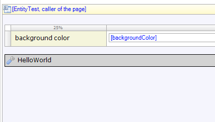 
The update function must always call a "callback" function. This "callback" function is always provided by the DOJO framework. 

```js
        // mxui.widget._WidgetBase.update is called when context is changed or initialized. Implement to re-render and / or fetch data.
        update: function (obj, callback) {
            console.log(this.id + '.update');
			...
            callback();
        },
```

Within "**this._contextObj**" we hold the object that is send to the update function.

```js
        // mxui.widget._WidgetBase.update is called when context is changed or initialized. Implement to re-render and / or fetch data.
        update: function (obj, callback) {
            ...
            this._contextObj = obj;
            this._resetSubscriptions();
            this._updateRendering();
            ...
        },
```
{}

An object send to the update function can also be null! In your widget code you must handle these exceptions. 

{}

### 4.8 The _updateRendering and _resetSubscriptions function

Within the update function we call the __updateRendering_ and __resetSubscriptions_ function.
The function __resetSubscriptions_ will create a subscription to any changes of an entity the widget is attached to_._
If there already is a subscription created, the function will first destroy the previous one.

The function __updateRendering_ will eventually render changes to the user interface.
Within the Hello World example it is responsible in setting the background color.
The __updateRendering_ function is also responsible in setting the widget back to its original state when it didn't have data!
It is important that a widget does that to create a normal flow of how an application reacts to changing data. 

You as a developer are responsible for that to happen.

```js
        _updateRendering: function () {
            this.domNode.style.backgroundColor = this._contextObj ? this._contextObj.get(this.backgroundColor) : "";
        },
        _resetSubscriptions: function () {
            // Release handle on previous object, if any.
            if (this._handle) {
                this.unsubscribe(this._handle);
                this._handle = null;
            }
            if (this._contextObj) {
                this._handle = this.subscribe({
                    guid: this._contextObj.getGuid(),
                    callback: this._updateRendering
                });
            }
        }
```

## 5.0 Adding the Custom Widget to a Mendix Project

The final step is to add your widget to your Mendix Project. The widget should now be available up under the Add-on menu.

1. Open the test project by opening **Test.mpr** in the **test** directory. You can also use
    
     in Brackets.

    The test project is created in Mendix 5.14.1\. It's possible that Brackets will ask you to select a modeler version. Select the Modeler Version of your installed Mendix version.

    

    Brackets will open the test project for you inside Mendix:

    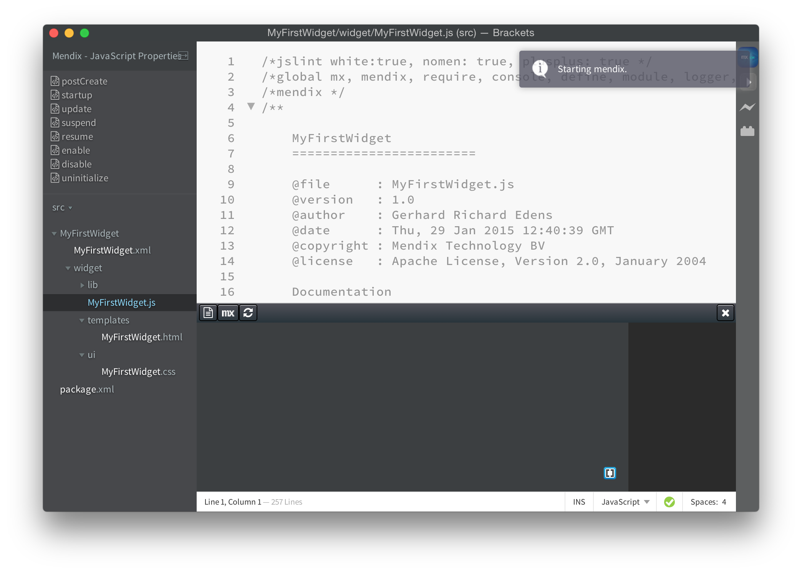

2. You will need to configure the test project. How this is done will be available in another how-to.

## 6\. Conclusion

This How-to has enabled you to create a "Hello World!" Custom Widget for the Mendix platform. Using Adobe Brackets as your main integrated development environment. The code examples inside the AppStoreWidgetBoilerplate will provide you the building blocks you need to interact with both the user interface and Mendix. 

## 7\. Related content

Some interesting books and articles you might want to read next to dive into the sourcecode of the AppStoreWidgetBoilerplate:

** Writing your own DOJO Widget**

Mendix Custom Widgets are based upon DOJO widgets. You will find the following BLOG post very useful.

[http://dojotoolkit.org/reference-guide/1.10/quickstart/writingWidgets.html](http://dojotoolkit.org/reference-guide/1.10/quickstart/writingWidgets.html)

** ** **The Mendix Client API 5.0**

To communicate with Mendix you need to use the Mendix JavaScript Client API. Read all about it at the following online documentation:

[https://apidocs.mendix.com/5/client/
](https://apidocs.mendix.com/5/client/)

** ** **Learning JavaScript Design Patterns - ** **by Addy ** **Osmani**

A very nice book that helps you understand what JavaScript is all about.

[http://addyosmani.com/resources/essentialjsdesignpatterns/book/](http://addyosmani.com/resources/essentialjsdesignpatterns/book/) 


*   [Getting started with the Widget Development Plugin for Adobe Brackets](getting-started-with-the-widget-development-plugin-for-adobe-brackets)
*   [Creating a chainable Custom Widget](creating-a-chainable-custom-widget)
*   [XML Reference Guide 5](/refguide5/xml-reference-guide)
*   [XML Reference Guide 6](/refguide6/xml-reference-guide)
*   [Creating a Basic Hello World Custom Widget](creating-a-basic-hello-world-custom-widget)
*   [The Mobile Slider Custom Widget](the-mobile-slider-custom-widget)
