This how-to is an introduction on building a custom widget that is chainable in your Mendix application. At the end of this tutorial you will have a basic understanding of the structure and setup of a chainable Mendix custom widget.

**After this how-to you will know:**

*   How to create a chainable custom widget.
*   How to setup and configure your Mendix app to support this.

# Table of contents

## 1\. Preparation

Before you start building your own chainable custom widget make sure you have the following programs installed:

*   [Mendix Modeler](https://appstore.home.mendix.com/index3.html?v=7#1421997409316) (version 5.x)
*   Adobe Brackets and the Widget Development Plugin for Adobe Brackets. [You can find a how-to about this software here](getting-started-with-the-widget-development-plugin-for-adobe-brackets).

Also please read the "Hello World" how-to on created a new widget based on the "AppStoreWidgetBoilerplate". [You can find a how-to about setting up a "Hello World" custom widget here](creating-a-basic-hello-world-custom-widget).

## 2\. What are you going to build?

You are going to build a Mendix application and widget where you can select a "Car" with a certain "Coachwork" and "Color". Nothing special so far. To show you what we mean with a chainable widget, within the application you can't select a "Coachwork" if you do not have a "Car" selected. And you can't select a "Color" if you do not have a "Coachwork" selected. 

For this how-to we have created a chainable custom widget and Mendix application and made the project available from the following GitHub location:

[https://github.com/mendix/ChainableCustomWidget](https://github.com/mendix/ChainableCustomWidget)

**In this project the following user stories have been implemented: **

*   A uniquely logged in user can select a car of a certain type.
*   Once a user has selected a car, the coachwork _can be selected ( 3 doors / 5 doors  etc ... )_, but only if a car has been selected.
*   Once a user has selected a coachwork, the color of the car can be selected, but only select it if a color has been selected.
*   Every time a user changes a setting it must be stored in the database so that the user can continue at another point in time.
*   An overview of all the settings that users commit must be provided for a user that has administration rights.

### 2.1 Taking a look at the end result

You can see the end result by clicking on the following screenshots.

1.  A user can log into the application. _(username: demo / password: Asd123)_

    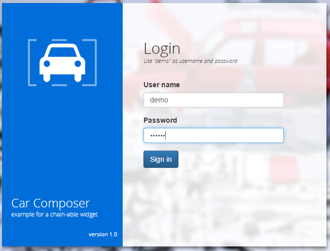

2.  As an end user you can only select a car first. 
    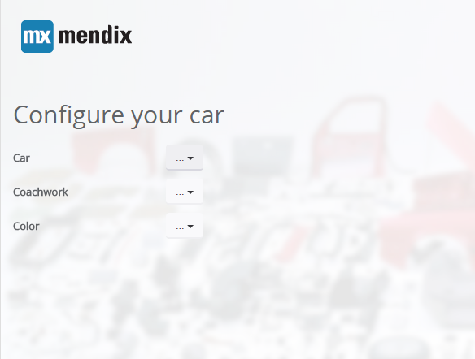_
    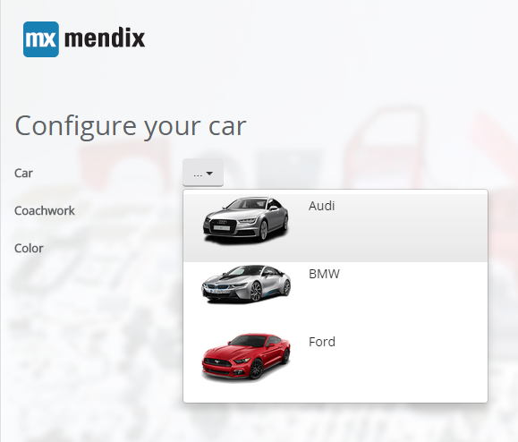

3.  Select a coachwork.

    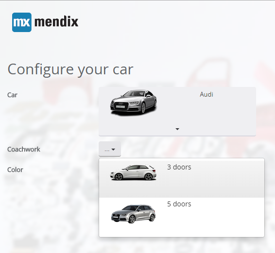

4.  Once you have selected a coachwork you can select a color.
    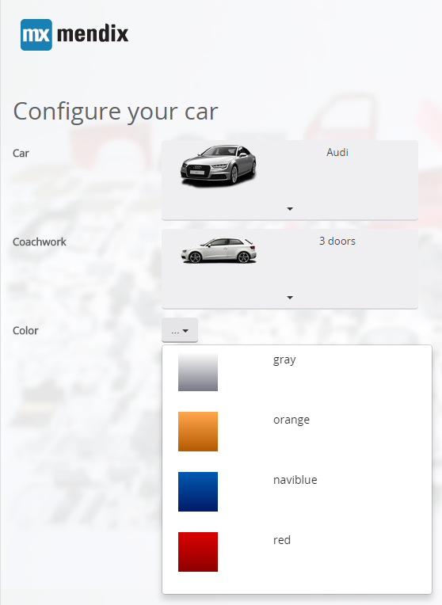
5.  In the back-office we see that all the settings for the demo user are stored.
    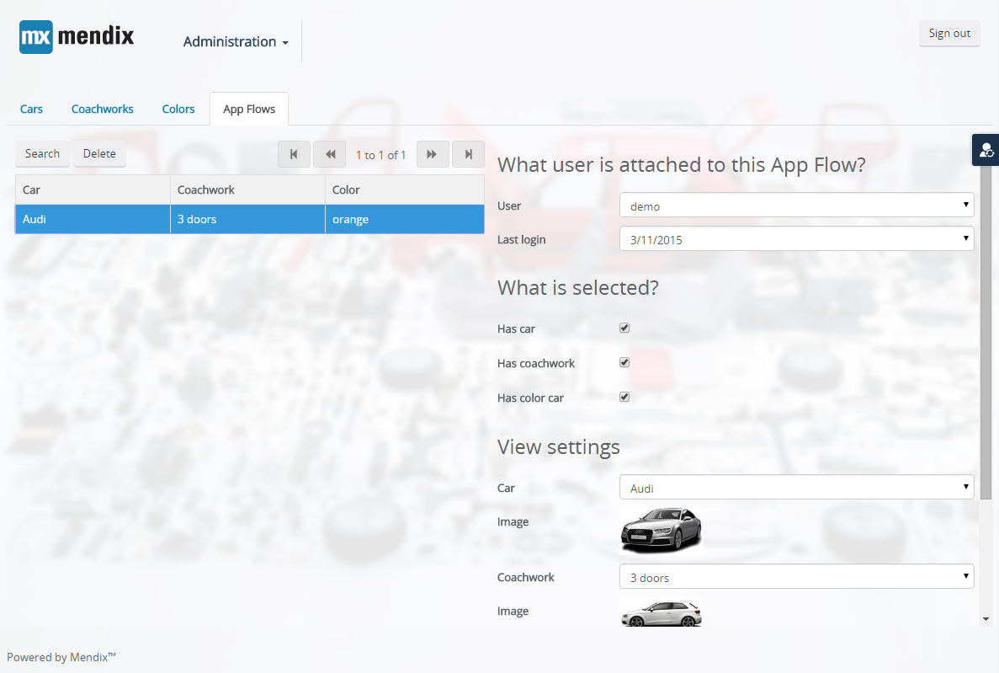

## 3\. What is inside the GitHub repository?

If you take a look at the GitHub repository you will see the following available:

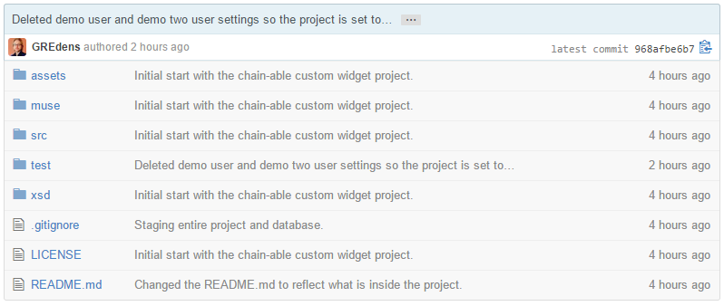

*   The "assets" directory contains icons for within the App Store and an icon for the chainable widget.
*   The "muse" directory is an Adobe Muse project to output the login page that is inside the Mendix Application.
    *   The project contains also two reusable MUCOW extensions for Adobe Muse projects to insert a Mendix login and Bootstrap.
*   The "src" directory contains the source files of the mendix custom widget.
*   The "test" directory is the Mendix application where the widget end result can be found. 
*   The "xsd" directory is there to give you an XSD to verify the properties that you define within your widget.xml file that become available inside your Mendix project.

## 4\. The domain model

Let's take a look at the domain model in the Mendix test project:

 
We have an "AppFlow", "Car", "Coachwork", "CarColor", "CarImage", "CoachworkImage" and "CarColorImage" entity.

*   A "Car" / "Coachwork" / "CarColor" all have a one on one relation to an image entity.
*   The image entities are a generalization of "System.Image", so you can store an image for a "Car" / "Coachwork" / "CarColor" entity.
*   The "AppFlow" entity is an entity that is used to store the state of the flow of the application for each individual user.
    *   The "AppFlow" entity has an association to "Administration.Account".
    *   The attribute "HasCar" / "HasCoachwork" / "HasColorCar" booleans are set by the widget if a selection has been made.
    *   The many to one association from "AppFlow" to "Car" / "CoachWork" / "CarColor" will actually save the reference to a "Car" / "Coachwork" / "CarColor" that a user has selected.

{}

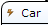

The icon before the name of the entity indicates that on this entity there are Microflows active on certain "event handlers".

For "Car" / "Coachwork" and "CarColor" the following Microflows are active:

*   There is a Microflow on the event handler "after / create" that will create an image.
*   There is also a Microflow on the event handler "before / delete" that deletes an image that was created for the entity.

For the "Car" entity the settings look like this:

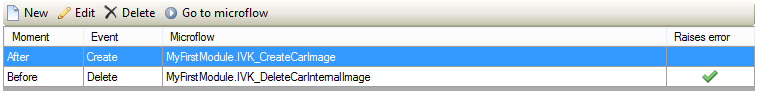

{}

## 5\. Configuration options of the widget

We will take a look at what you need to configure in your widget in order to make it chainable. Remember when building custom widgets that you always need to build a widget that is as generic as possible. This means that the widget you build must handle all user-stories that are defined.
That may be difficult in the beginning. But after building two or three custom widgets you will get the hang of it.

*   The first thing that the widget needs to know is if it may be active or not.
    For the widget that controls the selection of the "Car" entity this means that it must always be selectable.
    But for the "Coachwork" and "Color" entity this means setting certain options.
    *   "Always active" should be set to "No" for "Coachwork" and "Color"
    *   "Active on selected" should point to a boolean from the "AppFlow", this can be "HasCar", "HasCoachwork" or "HasColorCar".
    *   "Check if active" should be set to "Yes" for "Coachwork" and "Color"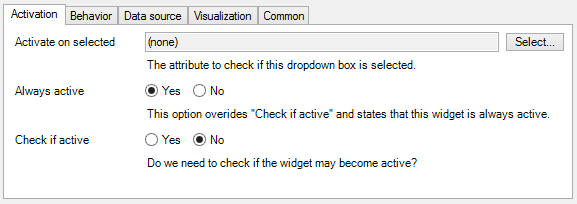
*   What will happen when you click on an item from the list of items that is returned from the Microflow that you have configured in the "Data source" tab.

    *   "Is selected" will be set to true, for the "Car" entity that means that "HasCar" will become true.
    *   The widget that controls "Coachwork" checks if "HasCar" is true and becomes active when it is true.
    *   "Save microflow" is also executed to actually commit the changes for "AppFlow". 
    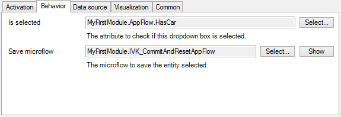
*   What will also happen when you click on the item?

    *   "Entity one on one"; is also filled with the selected entity from the list of entities that are received from the Microflow.
    *   "Entity to select"; Because the widget is generic you need to select the type of entity we can expect from the list that is returned from the Microflow.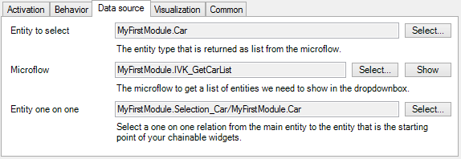
*   It all needs to look good so you also need to set the visualization of the widget.

    *   "Value to show" will use an attribute of the entity selected at the data source tab "Entity to select" to visualize the name of the entity that is show in chainable widget.
    *   "Image" is a reference to the image entity.
    *   The image width can be set to properly render the image inside the list in the chainable widget.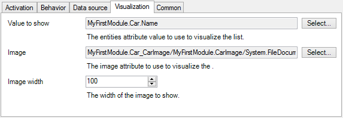

## 6\. The Microflows inside the project

Mendix has launched [model share](https://modelshare.mendix.com/) and we are now able to share our Microflows from the test project right here in this how-to. Take a closer look at what is inside the Mendix test project and why it is in there.  

### 6.1 Saving the state in the "AppFlow" entity.

This microflow will create an "AppFlow" for a particular logged in application user. If there already was an "AppFlow" entity created for a user it will return that "AppFlow".

<iframe width="100%" height="491px" frameborder="0" src="https://modelshare.mendix.com/models/ce3baab8-b611-4423-a049-d467db0d775c/chainable-custom-widget-project-creating-the-appflow-entity.?embed=true"></iframe>

We use this in the DataView where the chainable widgets are located:

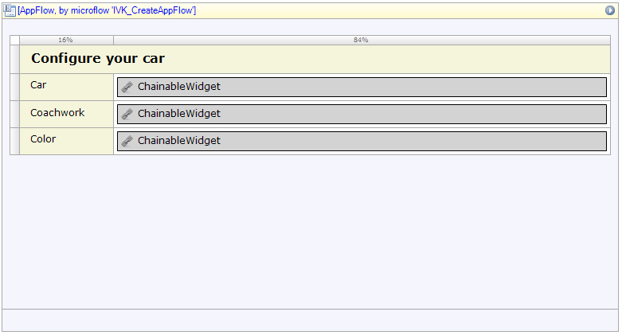

Each time a chainable widget wants to save a setting on the "AppFlow" entity it triggers a Microflow. This allows you to do extra steps before a setting is actually available to other (custom) widgets and the Mendix application. The widgets that select the "Coachwork" and "Color" will use the following Microflow:

<iframe width="100%" height="491px" frameborder="0" src="https://modelshare.mendix.com/models/bf677fa2-2fdb-4bf2-9b6b-9b045c6493af/chainable-custom-widget-project-commit-the-appflow-entity.?embed=true"></iframe>

There is an exception for the chainable widget that handles the Car selection. Selecting a Car will need a reset of the selection of a "Coachwork" and "Color". That is why this widget has another Microflow configured for that:

<iframe width="100%" height="491px" frameborder="0" src="https://modelshare.mendix.com/models/21462015-51cb-461c-91b8-743cd0e5f926/chainable-custom-widget-project-commit-the-appflow-entity-and-reset-its-associations?embed=true"></iframe>

### 6.2 Getting lists of entities for "Car" / "Coachwork" / "Color"

The following three Microflows are configured at each chainable custom widget to retrieve a list of entities it needs to show.

<iframe width="100%" height="491px" frameborder="0" src="https://modelshare.mendix.com/models/e54716bc-efbd-4bd5-ab44-5856605985e1/chainable-custom-widget-project-get-a-list-of-cars?embed=true"></iframe><iframe width="100%" height="491px" frameborder="0" src="https://modelshare.mendix.com/models/2296c444-2903-4757-8e9c-28a72d93586e/chainable-custom-widget-project-get-a-list-of-coachworks-from-a-selected-car?embed=true"></iframe><iframe width="100%" height="491px" frameborder="0" src="https://modelshare.mendix.com/models/f9506cda-a192-4ad3-8670-6d4cc46ed586/chainable-custom-widget-project-get-a-list-of-colors-attached-to-a-car.?embed=true"></iframe>

### 6.3 Saving images for "Car" / "Coachwork" / "Color".

The following three Microflows will create the images for each entity "Car" / "Coachwork" and "CarColor".

<iframe width="100%" height="491px" frameborder="0" src="https://modelshare.mendix.com/models/3e145efd-ab14-4068-9e1a-5916bb2df250/chainable-custom-widget-project-a-car-color-after-create-microflow.?embed=true"></iframe><iframe width="100%" height="491px" frameborder="0" src="https://modelshare.mendix.com/models/659e028c-46ad-47ed-98fa-53a26f6e9533/chainable-custom-widget-project-a-car-after-create-microflow.?embed=true"></iframe><iframe width="100%" height="491px" frameborder="0" src="https://modelshare.mendix.com/models/465b2355-2466-4d3e-8a0b-c291729edbc9/chainable-custom-widget-project-a-coachwork-after-create-microflow.?embed=true"></iframe>

### 6.4 Deleting images for "Car" / "Coachwork" / "Color"

The following three Microflows will delete the images for each entity "Car" / "Coachwork" and "CarColor".

<iframe width="100%" height="491px" frameborder="0" src="https://modelshare.mendix.com/models/cc02e4c8-b5db-418f-bf33-35752c3f956a/chainable-custom-widget-project-a-car-color-before-delete-microflow.?embed=true"></iframe><iframe width="100%" height="491px" frameborder="0" src="https://modelshare.mendix.com/models/bb7addc1-9cf1-4fdb-ae92-eddfded7b182/chainable-custom-widget-project-a-car-before-delete-microflow.?embed=true"></iframe><iframe width="100%" height="491px" frameborder="0" src="https://modelshare.mendix.com/models/8065e6d8-fc42-465e-9e56-0330250d34e9/chainable-custom-widget-project-a-coachwork-before-delete-microflow.?embed=true"></iframe>

And that's it for the logic of the application.

There is a unwritten rule in creating custom widgets for the Mendix platform, that you need to let (most of) the logic be done with the tools you have in Mendix. There is no other decent way of knowing what other widgets are doing in your application than to listen to changes on entities. Do not try to find this out by hacking the HTML output of the Mendix platform. This is bad practice. If you do want to know state of a widget that does not involve entity handling in your Mendix application, you can always create custom event handlers that widgets can listen to. But then you should make a widget have a "sender" and a "listener" mode. We will show an example of this in another how-to.

## 7\. General limitations of custom widgets

We need to tell you some important things about limitations in Mendix custom widgets. These limitations have made our choices to build the application this way. And they can help you a great deal in how you will setup your custom widgets in the future.

A Mendix **custom** widget can only handle one entity it receives from the DataView it is placed in.
The following example of creating a normal microflow button **does not** work inside a Mendix custom widget:

*   The following example shows two DataViews based upon Car and Coachwork

    
*   The Delete button is a microflow button from the Mendix framework.

    This has the following option:
    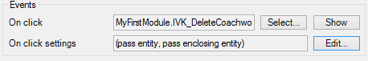 

    You can select a Microflow and pass an entity but also pass an enclosing entity, in this case the Microflow receives both the Car and Coachwork entity.
     

A Mendix **custom** widget can also **only pass one type of entity** as an input parameter in a Microflow. It can also send a list but not fill two different types of entities as input parameters of a microflow.

## 8\. Conclusion

This How-to has enabled you to create a chainable Custom Widget for the Mendix platform. Using Adobe Brackets as your main integrated development environment. The "AppStoreWidgetBoilerplate" as your starting point for custom widget development. And a fully configured Mendix test application.

## 9\. Related content

*   [Getting started with the Widget Development Plugin for Adobe Brackets](getting-started-with-the-widget-development-plugin-for-adobe-brackets)
*   [Creating a chainable Custom Widget](creating-a-chainable-custom-widget)
*   [XML Reference Guide](/refguide5/xml-reference-guide)
*   [Creating a Basic Hello World Custom Widget](creating-a-basic-hello-world-custom-widget)
*   [XML Reference Guide](/refguide6/xml-reference-guide)
*   [The Mobile Slider Custom Widget](the-mobile-slider-custom-widget)
