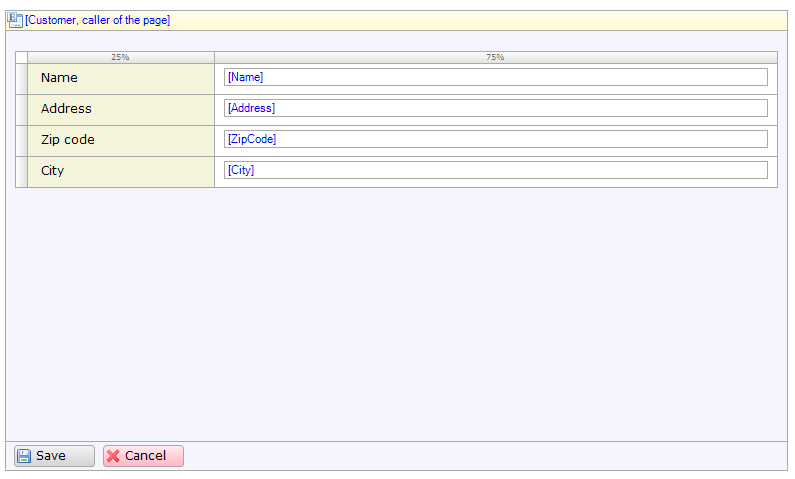
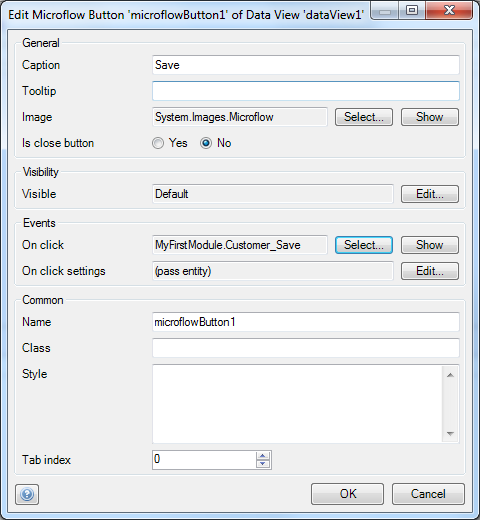
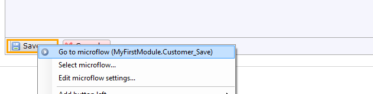
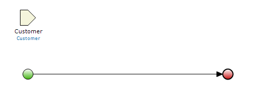
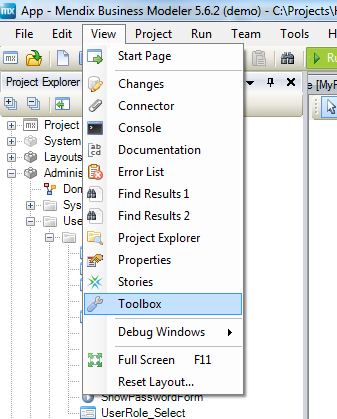
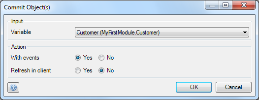
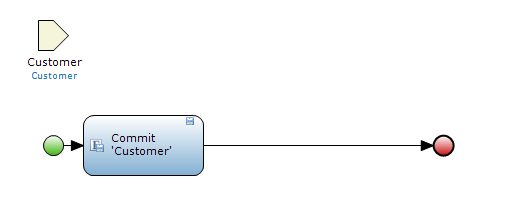
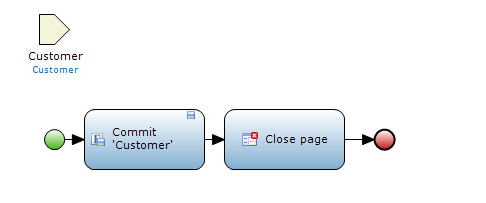
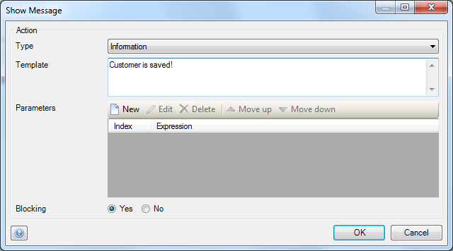
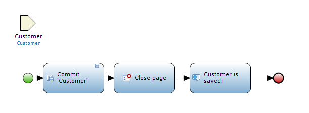

Mendix uses visual models to define the logic of your application, we call those models Microflows. A Microflow is a visual way of expressing what traditionally would be written in code. This how-to explains how you can create a custom save button on a detail page by utilizing Microflows.

## 1\. Preparation

Before you start with this how-to please complete the following prerequisites:

*   Create a basic domain model with [this how-to](creating-a-basic-data-layer)
*   Create overview and detail pages for the Customer object using [this how-to](creating-your-first-two-overview-and-detail-pages)
*   Create a menu item to access the customer overview page using [this how-to](setting-up-the-navigation-structure)

## 2\. Replacing the Default Save Button with a Custom one

1.  Open the **customer detail** page. It should look similar to this:
    
2.  Select the **Save** button and remove it by pressing the delete button.
3.  Right click the **Cancel** button and select **Microflow** from the **Add button left** menu.
    
4.  Double click the new Microflow button to open its **properties:**
    
5.  Change the caption to _Save._
6.  Change the image to an image of your choice.
7.  Click **Select...** in the **Events** section to add a new microflow with the name _Customer_Save_.
8.  Save the new Microflow button by clicking **OK**.

## 3\. Re-creating the Default Save Behavior

1.  Right click the new Microflow button and select **Go to microflow** to open the new Microflow
    

    The Microflow should look like this:
    
2.  Open the **toolbox.** It should be on the bottom right of the Mendix Modeler.
    
3.  If you can't find the toolbox, you can re-open it from the view menu.
    
4.  Drag a **Commit object(s)** action from the toolbox to the line between the green start and red end event. This inserts a commit action activity.
5.  Double click the new activity to open its **properties.**
    
6.  Select **Customer** as input variable and click **OK**. The Microflow should now look like this:
    
7.  Drag a **Close page** action from the toolbox to the line between the green start and red end event. This inserts a close page action activity.

    You have now re-created the default save behavior. The Microflow should look like this:
    

## 4\. Extending the Microflow with Your Own Functionality

1.  Drag a **Show message** action from the toolbox to the line between the start and end event. This inserts a show message action activity.
2.  Double click the new activity to open its **properties:**
    
3.  Select the type of message.
4.  Enter a message as **Template value**.
5.  Click **OK** to save the properties. The Microflow should now look like this:
    

## 5\. Related content

*   [Defining access rules using XPath](defining-access-rules-using-xpath)
*   [Triggering Logic using Microflows](triggering-logic-using-microflows)
*   [Creating a Custom Save Button](creating-a-custom-save-button)
*   [Extending Your Application with Custom Java](extending-your-application-with-custom-java)

Learn more using the following links:

*   [Button Widgets](/refguide5/button-widgets)
*   [Save button](/refguide5/save-button)
*   [Microflow Activities](/refguide5/activities)

